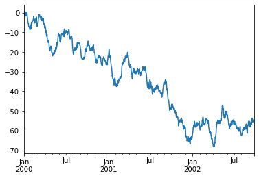
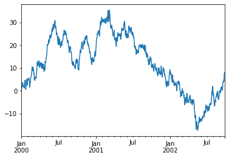
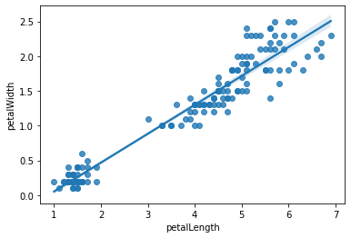

# Pandas 学习笔记

* 版本号： 0.3
* 创建时间： 2015年02月07日 星期六 10:26:33 CST
* 修改时间： 2021年11月18日
* 数据来源：
 * movies.csv http://boxofficemojo.com/daily/
 * iris.csv https://github.com/dsaber/py-viz-blog
 * titanic.csv https://github.com/dsaber/py-viz-blog
 * ts.csv https://github.com/dsaber/py-viz-blog

## 一些准备工作


```python
import numpy as np
import pandas as pd
from pandas import Series, DataFrame
import seaborn as sns
# 辅助函数
def get_movie_df():
    """
    获得 movie dataframe
    """
    return pd.read_csv('datas/movies.csv', sep='\t', encoding='utf-8',thousands=',',escapechar='$')

def get_titanic_df():
    return pd.read_csv('datas/titanic.csv')

def get_iris_df():
    return pd.read_csv('datas/iris.csv')

def get_random_df():
    return pd.DataFrame(
        np.random.randn(6, 4),
        index=pd.date_range('20200101', periods=6),
        columns=list('ABCD'))
```

## 安装使用
2020年1月更新:

* jupyter 已经进化出 `jupyter-lab` 了。

2018年更新:

ipython notebook 已更名为 jupyter notebook 。安装使用方法如下：
* 安装 anaconda ，anaconda 是一个 Python 发行版。装好后就已经包含 `pandas` 和 `jupyter notebook` 。
* 运行 `jupyter notebook` 命令就可以使用 jupyter notebook 。
* 要在 notebook 即时显示图表，可以使用在 notebook 中使用 `%matplotlib inline` 命令。

下面是以前的安装使用方法：

* 安装 pandas
```shell
sudo apt-get install build-essential python-dev
sudo apt-get install python-pandas python-tk
sudo apt-get install python-scipy python-matplotlib python-tables
sudo apt-get install python-numexpr python-xlrd python-statsmodels
sudo apt-get install python-openpyxl python-xlwt python-bs4
```    
if use virtualenv before install matplotlib should install libpng-dev, libjpeg8-dev, libfreetype6-dev

* 安装 ipython-notebook
```shell
sudo pip install "ipython[notebook]"
sudo pip install pygments
```
* 使用``ipython notebook``运行 ipython-notebook 。如果使用matplotlib内嵌进网页中,那么需要运行:`ipython notebook --matplotlib inline` ；或者在已经打开的 notebook 中运行 `%matplotlib inline` 命令。


```python
# 查看 pandas 的版本
# pd.__version__
# 查看当前环境涉及软件的版本
# pd.show_versions()
```

## DataFrame 速览

### 创建


```python
data = {
    'fruit': ['Apple', 'Apple', 'Apple', 'Grape', 'Grape', 'Grape'],
    'year': [2017, 2018, 2019, 2017, 2018, 2019],
    'price': [20.5, 21.3, 25, 10.1, 10.9, 9.98]
}
frame = DataFrame(data)
frame
```


<div>
<style scoped>
    .dataframe tbody tr th:only-of-type {
        vertical-align: middle;
    }

    .dataframe tbody tr th {
        vertical-align: top;
    }

    .dataframe thead th {
        text-align: right;
    }
</style>
<table border="1" class="dataframe">
  <thead>
    <tr style="text-align: right;">
      <th></th>
      <th>fruit</th>
      <th>year</th>
      <th>price</th>
    </tr>
  </thead>
  <tbody>
    <tr>
      <th>0</th>
      <td>Apple</td>
      <td>2017</td>
      <td>20.50</td>
    </tr>
    <tr>
      <th>1</th>
      <td>Apple</td>
      <td>2018</td>
      <td>21.30</td>
    </tr>
    <tr>
      <th>2</th>
      <td>Apple</td>
      <td>2019</td>
      <td>25.00</td>
    </tr>
    <tr>
      <th>3</th>
      <td>Grape</td>
      <td>2017</td>
      <td>10.10</td>
    </tr>
    <tr>
      <th>4</th>
      <td>Grape</td>
      <td>2018</td>
      <td>10.90</td>
    </tr>
    <tr>
      <th>5</th>
      <td>Grape</td>
      <td>2019</td>
      <td>9.98</td>
    </tr>
  </tbody>
</table>
</div>


生成时指定 columns 和 index ，index 的长度要与行数相匹配


```python
frame2 = DataFrame(
    data,
    columns = ['year', 'month', 'fruit', 'price'],
    index = ['one', 'two', 'three', 'four', 'five', 'six']
)
frame2
```


<div>
<style scoped>
    .dataframe tbody tr th:only-of-type {
        vertical-align: middle;
    }

    .dataframe tbody tr th {
        vertical-align: top;
    }

    .dataframe thead th {
        text-align: right;
    }
</style>
<table border="1" class="dataframe">
  <thead>
    <tr style="text-align: right;">
      <th></th>
      <th>year</th>
      <th>month</th>
      <th>fruit</th>
      <th>price</th>
    </tr>
  </thead>
  <tbody>
    <tr>
      <th>one</th>
      <td>2017</td>
      <td>NaN</td>
      <td>Apple</td>
      <td>20.50</td>
    </tr>
    <tr>
      <th>two</th>
      <td>2018</td>
      <td>NaN</td>
      <td>Apple</td>
      <td>21.30</td>
    </tr>
    <tr>
      <th>three</th>
      <td>2019</td>
      <td>NaN</td>
      <td>Apple</td>
      <td>25.00</td>
    </tr>
    <tr>
      <th>four</th>
      <td>2017</td>
      <td>NaN</td>
      <td>Grape</td>
      <td>10.10</td>
    </tr>
    <tr>
      <th>five</th>
      <td>2018</td>
      <td>NaN</td>
      <td>Grape</td>
      <td>10.90</td>
    </tr>
    <tr>
      <th>six</th>
      <td>2019</td>
      <td>NaN</td>
      <td>Grape</td>
      <td>9.98</td>
    </tr>
  </tbody>
</table>
</div>


### 查看数据

通过类似字典标记的方式或属性的方式,可以将 `DataFrame` 的列获取为一个 `Series` 。
IPython 提供了类似属性的访问(即frame2.year)和tab补全。
frame2[column] 适用于任何列的名,但是 frame2.column 只有在列名是一个合理
的 Python 变量名时才适用。
注意,返回的 Series 拥有原 DataFrame 相同的索引,且其 name 属性也已经被相应地
设置好了。


```python
frame2['fruit']
```


    one      Apple
    two      Apple
    three    Apple
    four     Grape
    five     Grape
    six      Grape
    Name: fruit, dtype: object


```python
frame2.year
```


    one      2017
    two      2018
    three    2019
    four     2017
    five     2018
    six      2019
    Name: year, dtype: int64


```python
frame2.loc['two']
```


    year      2018
    month      NaN
    fruit    Apple
    price     21.3
    Name: two, dtype: object


### 修改数据


```python
frame2.month = 11
frame2
```


<div>
<style scoped>
    .dataframe tbody tr th:only-of-type {
        vertical-align: middle;
    }

    .dataframe tbody tr th {
        vertical-align: top;
    }

    .dataframe thead th {
        text-align: right;
    }
</style>
<table border="1" class="dataframe">
  <thead>
    <tr style="text-align: right;">
      <th></th>
      <th>year</th>
      <th>month</th>
      <th>fruit</th>
      <th>price</th>
    </tr>
  </thead>
  <tbody>
    <tr>
      <th>one</th>
      <td>2017</td>
      <td>11</td>
      <td>Apple</td>
      <td>20.50</td>
    </tr>
    <tr>
      <th>two</th>
      <td>2018</td>
      <td>11</td>
      <td>Apple</td>
      <td>21.30</td>
    </tr>
    <tr>
      <th>three</th>
      <td>2019</td>
      <td>11</td>
      <td>Apple</td>
      <td>25.00</td>
    </tr>
    <tr>
      <th>four</th>
      <td>2017</td>
      <td>11</td>
      <td>Grape</td>
      <td>10.10</td>
    </tr>
    <tr>
      <th>five</th>
      <td>2018</td>
      <td>11</td>
      <td>Grape</td>
      <td>10.90</td>
    </tr>
    <tr>
      <th>six</th>
      <td>2019</td>
      <td>11</td>
      <td>Grape</td>
      <td>9.98</td>
    </tr>
  </tbody>
</table>
</div>


```python
frame2.month = np.arange(6)
frame2
```


<div>
<style scoped>
    .dataframe tbody tr th:only-of-type {
        vertical-align: middle;
    }

    .dataframe tbody tr th {
        vertical-align: top;
    }

    .dataframe thead th {
        text-align: right;
    }
</style>
<table border="1" class="dataframe">
  <thead>
    <tr style="text-align: right;">
      <th></th>
      <th>year</th>
      <th>month</th>
      <th>fruit</th>
      <th>price</th>
    </tr>
  </thead>
  <tbody>
    <tr>
      <th>one</th>
      <td>2017</td>
      <td>0</td>
      <td>Apple</td>
      <td>20.50</td>
    </tr>
    <tr>
      <th>two</th>
      <td>2018</td>
      <td>1</td>
      <td>Apple</td>
      <td>21.30</td>
    </tr>
    <tr>
      <th>three</th>
      <td>2019</td>
      <td>2</td>
      <td>Apple</td>
      <td>25.00</td>
    </tr>
    <tr>
      <th>four</th>
      <td>2017</td>
      <td>3</td>
      <td>Grape</td>
      <td>10.10</td>
    </tr>
    <tr>
      <th>five</th>
      <td>2018</td>
      <td>4</td>
      <td>Grape</td>
      <td>10.90</td>
    </tr>
    <tr>
      <th>six</th>
      <td>2019</td>
      <td>5</td>
      <td>Grape</td>
      <td>9.98</td>
    </tr>
  </tbody>
</table>
</div>


DataFrame 的切片是 DataFrame 的视图，不是副本。对切片赋值会改变 DataFrame
本身。


```python
c_month = frame2['month']
c_month
```


    one      0
    two      1
    three    2
    four     3
    five     4
    six      5
    Name: month, dtype: int64


```python
month = Series([1,3,5], index=['one', 'three', 'five'])
frame2['month'] = month
frame2
```


<div>
<style scoped>
    .dataframe tbody tr th:only-of-type {
        vertical-align: middle;
    }

    .dataframe tbody tr th {
        vertical-align: top;
    }

    .dataframe thead th {
        text-align: right;
    }
</style>
<table border="1" class="dataframe">
  <thead>
    <tr style="text-align: right;">
      <th></th>
      <th>year</th>
      <th>month</th>
      <th>fruit</th>
      <th>price</th>
    </tr>
  </thead>
  <tbody>
    <tr>
      <th>one</th>
      <td>2017</td>
      <td>1.0</td>
      <td>Apple</td>
      <td>20.50</td>
    </tr>
    <tr>
      <th>two</th>
      <td>2018</td>
      <td>NaN</td>
      <td>Apple</td>
      <td>21.30</td>
    </tr>
    <tr>
      <th>three</th>
      <td>2019</td>
      <td>3.0</td>
      <td>Apple</td>
      <td>25.00</td>
    </tr>
    <tr>
      <th>four</th>
      <td>2017</td>
      <td>NaN</td>
      <td>Grape</td>
      <td>10.10</td>
    </tr>
    <tr>
      <th>five</th>
      <td>2018</td>
      <td>5.0</td>
      <td>Grape</td>
      <td>10.90</td>
    </tr>
    <tr>
      <th>six</th>
      <td>2019</td>
      <td>NaN</td>
      <td>Grape</td>
      <td>9.98</td>
    </tr>
  </tbody>
</table>
</div>


```python
# c_month['two'] = 2.2 
# 这种方式也能改写值，但是因为性能的问题不推荐使用，详见：
# https://pandas.pydata.org/pandas-docs/stable/user_guide/indexing.html#returning-a-view-versus-a-copy
frame2.loc['two', 'month'] = 2.2
frame2
```


<div>
<style scoped>
    .dataframe tbody tr th:only-of-type {
        vertical-align: middle;
    }

    .dataframe tbody tr th {
        vertical-align: top;
    }

    .dataframe thead th {
        text-align: right;
    }
</style>
<table border="1" class="dataframe">
  <thead>
    <tr style="text-align: right;">
      <th></th>
      <th>year</th>
      <th>month</th>
      <th>fruit</th>
      <th>price</th>
    </tr>
  </thead>
  <tbody>
    <tr>
      <th>one</th>
      <td>2017</td>
      <td>1.0</td>
      <td>Apple</td>
      <td>20.50</td>
    </tr>
    <tr>
      <th>two</th>
      <td>2018</td>
      <td>2.2</td>
      <td>Apple</td>
      <td>21.30</td>
    </tr>
    <tr>
      <th>three</th>
      <td>2019</td>
      <td>3.0</td>
      <td>Apple</td>
      <td>25.00</td>
    </tr>
    <tr>
      <th>four</th>
      <td>2017</td>
      <td>NaN</td>
      <td>Grape</td>
      <td>10.10</td>
    </tr>
    <tr>
      <th>five</th>
      <td>2018</td>
      <td>5.0</td>
      <td>Grape</td>
      <td>10.90</td>
    </tr>
    <tr>
      <th>six</th>
      <td>2019</td>
      <td>NaN</td>
      <td>Grape</td>
      <td>9.98</td>
    </tr>
  </tbody>
</table>
</div>


### 删除数据


```python
del frame2['month'] #  删除 column
frame2
```


<div>
<style scoped>
    .dataframe tbody tr th:only-of-type {
        vertical-align: middle;
    }

    .dataframe tbody tr th {
        vertical-align: top;
    }

    .dataframe thead th {
        text-align: right;
    }
</style>
<table border="1" class="dataframe">
  <thead>
    <tr style="text-align: right;">
      <th></th>
      <th>year</th>
      <th>fruit</th>
      <th>price</th>
    </tr>
  </thead>
  <tbody>
    <tr>
      <th>one</th>
      <td>2017</td>
      <td>Apple</td>
      <td>20.50</td>
    </tr>
    <tr>
      <th>two</th>
      <td>2018</td>
      <td>Apple</td>
      <td>21.30</td>
    </tr>
    <tr>
      <th>three</th>
      <td>2019</td>
      <td>Apple</td>
      <td>25.00</td>
    </tr>
    <tr>
      <th>four</th>
      <td>2017</td>
      <td>Grape</td>
      <td>10.10</td>
    </tr>
    <tr>
      <th>five</th>
      <td>2018</td>
      <td>Grape</td>
      <td>10.90</td>
    </tr>
    <tr>
      <th>six</th>
      <td>2019</td>
      <td>Grape</td>
      <td>9.98</td>
    </tr>
  </tbody>
</table>
</div>


## pandas 的索引对象


```python
nums = Series(range(3), index=['one', 'two', 'three'])
```


```python
num_index = nums.index
```


```python
num_index
```


    Index(['one', 'two', 'three'], dtype='object')


```python
num_index[1:]
```


    Index(['two', 'three'], dtype='object')


索引对象是不可变的，不能对其赋值


```python
num_index2 = pd.Index(['one', 'two', 'three'])
```


```python
num_index is num_index2
```


    False


```python
num_index == num_index2
```


    array([ True,  True,  True])


```python
nums2= Series(range(3), index = num_index2)
```


```python
nums2
```


    one      0
    two      1
    three    2
    dtype: int64


```python
nums2.index is num_index2
```


    True


```python
nums2.index == num_index2
```


    array([ True,  True,  True])


```python
frame3 = get_random_df()
```


```python
frame3.columns
```


    Index(['A', 'B', 'C', 'D'], dtype='object')


```python
frame3.index
```


    DatetimeIndex(['2020-01-01', '2020-01-02', '2020-01-03', '2020-01-04',
                   '2020-01-05', '2020-01-06'],
                  dtype='datetime64[ns]', freq='D')


### reindex

#### Series reindex


```python
obj = Series(range(4), index=['a', 'c', 'd', 'b'])
obj
```


    a    0
    c    1
    d    2
    b    3
    dtype: int64


```python
obj2 = obj.reindex(['a', 'b', 'c', 'd'])
```


```python
obj2
```


    a    0
    b    3
    c    1
    d    2
    dtype: int64


#### 自动填充


```python
obj3 = Series(['red', 'blue', 'yellow'], index=[1,3,5])
```


```python
obj3
```


    1       red
    3      blue
    5    yellow
    dtype: object


```python
obj3.reindex(range(6), method='ffill')
```


    0       NaN
    1       red
    2       red
    3      blue
    4      blue
    5    yellow
    dtype: object


#### Frame reindex


```python
range(5)
```


    range(0, 5)


```python
df = pd.DataFrame(
        np.random.randn(6, 4),
        index=range(6),
        columns=list('ABCD'))
df
```


<div>
<style scoped>
    .dataframe tbody tr th:only-of-type {
        vertical-align: middle;
    }

    .dataframe tbody tr th {
        vertical-align: top;
    }

    .dataframe thead th {
        text-align: right;
    }
</style>
<table border="1" class="dataframe">
  <thead>
    <tr style="text-align: right;">
      <th></th>
      <th>A</th>
      <th>B</th>
      <th>C</th>
      <th>D</th>
    </tr>
  </thead>
  <tbody>
    <tr>
      <th>0</th>
      <td>1.519537</td>
      <td>1.224717</td>
      <td>-1.446412</td>
      <td>-0.624390</td>
    </tr>
    <tr>
      <th>1</th>
      <td>-0.225027</td>
      <td>-0.831553</td>
      <td>-0.754428</td>
      <td>0.546002</td>
    </tr>
    <tr>
      <th>2</th>
      <td>-0.094773</td>
      <td>0.075591</td>
      <td>0.904258</td>
      <td>1.650842</td>
    </tr>
    <tr>
      <th>3</th>
      <td>-2.130593</td>
      <td>-0.889377</td>
      <td>-1.719878</td>
      <td>2.000670</td>
    </tr>
    <tr>
      <th>4</th>
      <td>0.237999</td>
      <td>0.802231</td>
      <td>-1.329109</td>
      <td>-1.179376</td>
    </tr>
    <tr>
      <th>5</th>
      <td>0.712276</td>
      <td>-0.014424</td>
      <td>0.552410</td>
      <td>0.890524</td>
    </tr>
  </tbody>
</table>
</div>


```python
df.reindex(range(5,-1,-1), columns=['A', 'C', 'DDD'])
```


<div>
<style scoped>
    .dataframe tbody tr th:only-of-type {
        vertical-align: middle;
    }

    .dataframe tbody tr th {
        vertical-align: top;
    }

    .dataframe thead th {
        text-align: right;
    }
</style>
<table border="1" class="dataframe">
  <thead>
    <tr style="text-align: right;">
      <th></th>
      <th>A</th>
      <th>C</th>
      <th>DDD</th>
    </tr>
  </thead>
  <tbody>
    <tr>
      <th>5</th>
      <td>0.712276</td>
      <td>0.552410</td>
      <td>NaN</td>
    </tr>
    <tr>
      <th>4</th>
      <td>0.237999</td>
      <td>-1.329109</td>
      <td>NaN</td>
    </tr>
    <tr>
      <th>3</th>
      <td>-2.130593</td>
      <td>-1.719878</td>
      <td>NaN</td>
    </tr>
    <tr>
      <th>2</th>
      <td>-0.094773</td>
      <td>0.904258</td>
      <td>NaN</td>
    </tr>
    <tr>
      <th>1</th>
      <td>-0.225027</td>
      <td>-0.754428</td>
      <td>NaN</td>
    </tr>
    <tr>
      <th>0</th>
      <td>1.519537</td>
      <td>-1.446412</td>
      <td>NaN</td>
    </tr>
  </tbody>
</table>
</div>


#### drop


```python
df.drop('D', axis='columns') #  不修改对象
```


<div>
<style scoped>
    .dataframe tbody tr th:only-of-type {
        vertical-align: middle;
    }

    .dataframe tbody tr th {
        vertical-align: top;
    }

    .dataframe thead th {
        text-align: right;
    }
</style>
<table border="1" class="dataframe">
  <thead>
    <tr style="text-align: right;">
      <th></th>
      <th>A</th>
      <th>B</th>
      <th>C</th>
    </tr>
  </thead>
  <tbody>
    <tr>
      <th>0</th>
      <td>1.519537</td>
      <td>1.224717</td>
      <td>-1.446412</td>
    </tr>
    <tr>
      <th>1</th>
      <td>-0.225027</td>
      <td>-0.831553</td>
      <td>-0.754428</td>
    </tr>
    <tr>
      <th>2</th>
      <td>-0.094773</td>
      <td>0.075591</td>
      <td>0.904258</td>
    </tr>
    <tr>
      <th>3</th>
      <td>-2.130593</td>
      <td>-0.889377</td>
      <td>-1.719878</td>
    </tr>
    <tr>
      <th>4</th>
      <td>0.237999</td>
      <td>0.802231</td>
      <td>-1.329109</td>
    </tr>
    <tr>
      <th>5</th>
      <td>0.712276</td>
      <td>-0.014424</td>
      <td>0.552410</td>
    </tr>
  </tbody>
</table>
</div>


```python
df
```


<div>
<style scoped>
    .dataframe tbody tr th:only-of-type {
        vertical-align: middle;
    }

    .dataframe tbody tr th {
        vertical-align: top;
    }

    .dataframe thead th {
        text-align: right;
    }
</style>
<table border="1" class="dataframe">
  <thead>
    <tr style="text-align: right;">
      <th></th>
      <th>A</th>
      <th>B</th>
      <th>C</th>
      <th>D</th>
    </tr>
  </thead>
  <tbody>
    <tr>
      <th>0</th>
      <td>1.519537</td>
      <td>1.224717</td>
      <td>-1.446412</td>
      <td>-0.624390</td>
    </tr>
    <tr>
      <th>1</th>
      <td>-0.225027</td>
      <td>-0.831553</td>
      <td>-0.754428</td>
      <td>0.546002</td>
    </tr>
    <tr>
      <th>2</th>
      <td>-0.094773</td>
      <td>0.075591</td>
      <td>0.904258</td>
      <td>1.650842</td>
    </tr>
    <tr>
      <th>3</th>
      <td>-2.130593</td>
      <td>-0.889377</td>
      <td>-1.719878</td>
      <td>2.000670</td>
    </tr>
    <tr>
      <th>4</th>
      <td>0.237999</td>
      <td>0.802231</td>
      <td>-1.329109</td>
      <td>-1.179376</td>
    </tr>
    <tr>
      <th>5</th>
      <td>0.712276</td>
      <td>-0.014424</td>
      <td>0.552410</td>
      <td>0.890524</td>
    </tr>
  </tbody>
</table>
</div>


```python
df.drop('D', axis='columns', inplace=True) #  修改对象
```


```python
df
```


<div>
<style scoped>
    .dataframe tbody tr th:only-of-type {
        vertical-align: middle;
    }

    .dataframe tbody tr th {
        vertical-align: top;
    }

    .dataframe thead th {
        text-align: right;
    }
</style>
<table border="1" class="dataframe">
  <thead>
    <tr style="text-align: right;">
      <th></th>
      <th>A</th>
      <th>B</th>
      <th>C</th>
    </tr>
  </thead>
  <tbody>
    <tr>
      <th>0</th>
      <td>1.519537</td>
      <td>1.224717</td>
      <td>-1.446412</td>
    </tr>
    <tr>
      <th>1</th>
      <td>-0.225027</td>
      <td>-0.831553</td>
      <td>-0.754428</td>
    </tr>
    <tr>
      <th>2</th>
      <td>-0.094773</td>
      <td>0.075591</td>
      <td>0.904258</td>
    </tr>
    <tr>
      <th>3</th>
      <td>-2.130593</td>
      <td>-0.889377</td>
      <td>-1.719878</td>
    </tr>
    <tr>
      <th>4</th>
      <td>0.237999</td>
      <td>0.802231</td>
      <td>-1.329109</td>
    </tr>
    <tr>
      <th>5</th>
      <td>0.712276</td>
      <td>-0.014424</td>
      <td>0.552410</td>
    </tr>
  </tbody>
</table>
</div>


## DataFrames 创建


```python
dates = pd.date_range('20180101', periods=6);dates
```


    DatetimeIndex(['2018-01-01', '2018-01-02', '2018-01-03', '2018-01-04',
                   '2018-01-05', '2018-01-06'],
                  dtype='datetime64[ns]', freq='D')


```python
df = pd.DataFrame(np.random.randn(6,4), index=dates, columns=list('ABCD'));df
```


<div>
<style scoped>
    .dataframe tbody tr th:only-of-type {
        vertical-align: middle;
    }

    .dataframe tbody tr th {
        vertical-align: top;
    }

    .dataframe thead th {
        text-align: right;
    }
</style>
<table border="1" class="dataframe">
  <thead>
    <tr style="text-align: right;">
      <th></th>
      <th>A</th>
      <th>B</th>
      <th>C</th>
      <th>D</th>
    </tr>
  </thead>
  <tbody>
    <tr>
      <th>2018-01-01</th>
      <td>1.032980</td>
      <td>-0.327544</td>
      <td>-1.899020</td>
      <td>-1.420554</td>
    </tr>
    <tr>
      <th>2018-01-02</th>
      <td>-0.094571</td>
      <td>0.765391</td>
      <td>-1.628046</td>
      <td>-0.432703</td>
    </tr>
    <tr>
      <th>2018-01-03</th>
      <td>-2.371689</td>
      <td>0.101463</td>
      <td>0.403806</td>
      <td>0.341488</td>
    </tr>
    <tr>
      <th>2018-01-04</th>
      <td>-0.942446</td>
      <td>-1.003523</td>
      <td>0.589269</td>
      <td>-1.275649</td>
    </tr>
    <tr>
      <th>2018-01-05</th>
      <td>1.547298</td>
      <td>1.637861</td>
      <td>0.121815</td>
      <td>-0.500305</td>
    </tr>
    <tr>
      <th>2018-01-06</th>
      <td>0.323559</td>
      <td>-0.252704</td>
      <td>-1.206581</td>
      <td>-0.420925</td>
    </tr>
  </tbody>
</table>
</div>


```python
# 可以使用字典来创建 DataFrame 。
# 如果字典的 Value 是单一值，那么会自动扩展。
# 如果字典的 Value 是列表或者 Series ，那么长度要保持一致。
# 如果字典中只有一个值有 Index ，那么会使用这个 Index 作为整个 DataFrame 的 Index 。
# 如果字典有多个 Index ，那么必须保持一致，否则会报错。
df2 = pd.DataFrame(
    { 'A' : 1.,
      'B' : pd.Timestamp('20130102'),
      'C' : pd.Series(1,index=list(range(2,6)),dtype='float32'), 
      'D' : np.array([3] * 4,dtype='int32'), 
      'E' : pd.Categorical(["test","train","test","train"]), 
      'F' : 'foo' }
)
df2
```


<div>
<style scoped>
    .dataframe tbody tr th:only-of-type {
        vertical-align: middle;
    }

    .dataframe tbody tr th {
        vertical-align: top;
    }

    .dataframe thead th {
        text-align: right;
    }
</style>
<table border="1" class="dataframe">
  <thead>
    <tr style="text-align: right;">
      <th></th>
      <th>A</th>
      <th>B</th>
      <th>C</th>
      <th>D</th>
      <th>E</th>
      <th>F</th>
    </tr>
  </thead>
  <tbody>
    <tr>
      <th>2</th>
      <td>1.0</td>
      <td>2013-01-02</td>
      <td>1.0</td>
      <td>3</td>
      <td>test</td>
      <td>foo</td>
    </tr>
    <tr>
      <th>3</th>
      <td>1.0</td>
      <td>2013-01-02</td>
      <td>1.0</td>
      <td>3</td>
      <td>train</td>
      <td>foo</td>
    </tr>
    <tr>
      <th>4</th>
      <td>1.0</td>
      <td>2013-01-02</td>
      <td>1.0</td>
      <td>3</td>
      <td>test</td>
      <td>foo</td>
    </tr>
    <tr>
      <th>5</th>
      <td>1.0</td>
      <td>2013-01-02</td>
      <td>1.0</td>
      <td>3</td>
      <td>train</td>
      <td>foo</td>
    </tr>
  </tbody>
</table>
</div>


```python
data = {
    'fruit': ['Apple', 'Apple', 'Apple', 'Grape', 'Grape', 'Grape'],
    'year': [2017, 2018, 2019, 2017, 2018, 2019],
    'price': [20.5, 21.3, 25, 10.1, 10.9, 9.98]
}
frame = DataFrame(data)
```

## DataFrame 全局操作


```python
df = get_random_df()
```


```python
df.dtypes
```


    A    float64
    B    float64
    C    float64
    D    float64
    dtype: object


```python
df.index
```


    DatetimeIndex(['2020-01-01', '2020-01-02', '2020-01-03', '2020-01-04',
                   '2020-01-05', '2020-01-06'],
                  dtype='datetime64[ns]', freq='D')


```python
df.columns
```


    Index(['A', 'B', 'C', 'D'], dtype='object')


```python
df.values
```


    array([[-0.96401005,  0.22225241,  0.00856952, -0.87597309],
           [ 0.03970385,  0.40488741, -0.08518556, -0.43483035],
           [-0.67179502,  0.94842532, -0.27956746, -1.19661935],
           [ 2.59450347,  1.18083993, -0.53564787,  0.35384069],
           [ 0.51373024,  0.25645844,  0.6657538 , -0.13924134],
           [-0.23672076, -0.0028638 ,  0.49195287,  0.54343645]])


```python
df.describe()
```


<div>
<style scoped>
    .dataframe tbody tr th:only-of-type {
        vertical-align: middle;
    }

    .dataframe tbody tr th {
        vertical-align: top;
    }

    .dataframe thead th {
        text-align: right;
    }
</style>
<table border="1" class="dataframe">
  <thead>
    <tr style="text-align: right;">
      <th></th>
      <th>A</th>
      <th>B</th>
      <th>C</th>
      <th>D</th>
    </tr>
  </thead>
  <tbody>
    <tr>
      <th>count</th>
      <td>6.000000</td>
      <td>6.000000</td>
      <td>6.000000</td>
      <td>6.000000</td>
    </tr>
    <tr>
      <th>mean</th>
      <td>0.212569</td>
      <td>0.501667</td>
      <td>0.044313</td>
      <td>-0.291564</td>
    </tr>
    <tr>
      <th>std</th>
      <td>1.277693</td>
      <td>0.461083</td>
      <td>0.457356</td>
      <td>0.680905</td>
    </tr>
    <tr>
      <th>min</th>
      <td>-0.964010</td>
      <td>-0.002864</td>
      <td>-0.535648</td>
      <td>-1.196619</td>
    </tr>
    <tr>
      <th>25%</th>
      <td>-0.563026</td>
      <td>0.230804</td>
      <td>-0.230972</td>
      <td>-0.765687</td>
    </tr>
    <tr>
      <th>50%</th>
      <td>-0.098508</td>
      <td>0.330673</td>
      <td>-0.038308</td>
      <td>-0.287036</td>
    </tr>
    <tr>
      <th>75%</th>
      <td>0.395224</td>
      <td>0.812541</td>
      <td>0.371107</td>
      <td>0.230570</td>
    </tr>
    <tr>
      <th>max</th>
      <td>2.594503</td>
      <td>1.180840</td>
      <td>0.665754</td>
      <td>0.543436</td>
    </tr>
  </tbody>
</table>
</div>


```python
df.T
```


<div>
<style scoped>
    .dataframe tbody tr th:only-of-type {
        vertical-align: middle;
    }

    .dataframe tbody tr th {
        vertical-align: top;
    }

    .dataframe thead th {
        text-align: right;
    }
</style>
<table border="1" class="dataframe">
  <thead>
    <tr style="text-align: right;">
      <th></th>
      <th>2020-01-01</th>
      <th>2020-01-02</th>
      <th>2020-01-03</th>
      <th>2020-01-04</th>
      <th>2020-01-05</th>
      <th>2020-01-06</th>
    </tr>
  </thead>
  <tbody>
    <tr>
      <th>A</th>
      <td>-0.964010</td>
      <td>0.039704</td>
      <td>-0.671795</td>
      <td>2.594503</td>
      <td>0.513730</td>
      <td>-0.236721</td>
    </tr>
    <tr>
      <th>B</th>
      <td>0.222252</td>
      <td>0.404887</td>
      <td>0.948425</td>
      <td>1.180840</td>
      <td>0.256458</td>
      <td>-0.002864</td>
    </tr>
    <tr>
      <th>C</th>
      <td>0.008570</td>
      <td>-0.085186</td>
      <td>-0.279567</td>
      <td>-0.535648</td>
      <td>0.665754</td>
      <td>0.491953</td>
    </tr>
    <tr>
      <th>D</th>
      <td>-0.875973</td>
      <td>-0.434830</td>
      <td>-1.196619</td>
      <td>0.353841</td>
      <td>-0.139241</td>
      <td>0.543436</td>
    </tr>
  </tbody>
</table>
</div>


## 读入数据

### 从  CSV 文件读入数据


```python
# 读入 CSV 格式数据
df_movies = pd.read_csv('datas/movies.csv', sep='\t', encoding='utf-8')
df_movies.head()
```


<div>
<style scoped>
    .dataframe tbody tr th:only-of-type {
        vertical-align: middle;
    }

    .dataframe tbody tr th {
        vertical-align: top;
    }

    .dataframe thead th {
        text-align: right;
    }
</style>
<table border="1" class="dataframe">
  <thead>
    <tr style="text-align: right;">
      <th></th>
      <th>Row</th>
      <th>Date</th>
      <th>Day</th>
      <th>Day#</th>
      <th>Top 10 Gross</th>
      <th>#1 Movie</th>
      <th>Gross</th>
    </tr>
  </thead>
  <tbody>
    <tr>
      <th>0</th>
      <td>1</td>
      <td>Jan. 30</td>
      <td>Fri</td>
      <td>30</td>
      <td>$26,168,351</td>
      <td>American Sniper</td>
      <td>$9,905,616</td>
    </tr>
    <tr>
      <th>1</th>
      <td>2</td>
      <td>Jan. 31</td>
      <td>Sat</td>
      <td>31</td>
      <td>$41,633,588</td>
      <td>American Sniper</td>
      <td>$16,510,536</td>
    </tr>
    <tr>
      <th>2</th>
      <td>3</td>
      <td>Feb. 1</td>
      <td>Sun</td>
      <td>32</td>
      <td>$12,515,579</td>
      <td>American Sniper</td>
      <td>$4,244,376</td>
    </tr>
    <tr>
      <th>3</th>
      <td>4</td>
      <td>Feb. 2</td>
      <td>Mon</td>
      <td>33</td>
      <td>$6,475,068</td>
      <td>American Sniper</td>
      <td>$2,645,109</td>
    </tr>
    <tr>
      <th>4</th>
      <td>5</td>
      <td>Feb. 3</td>
      <td>Tue</td>
      <td>34</td>
      <td>$7,825,091</td>
      <td>American Sniper</td>
      <td>$2,923,141</td>
    </tr>
  </tbody>
</table>
</div>


```python
df_movies = pd.read_csv('datas/movies.csv', sep='\t', encoding='utf-8',thousands=',',escapechar='$')
df_movies.head()
```


<div>
<style scoped>
    .dataframe tbody tr th:only-of-type {
        vertical-align: middle;
    }

    .dataframe tbody tr th {
        vertical-align: top;
    }

    .dataframe thead th {
        text-align: right;
    }
</style>
<table border="1" class="dataframe">
  <thead>
    <tr style="text-align: right;">
      <th></th>
      <th>Row</th>
      <th>Date</th>
      <th>Day</th>
      <th>Day#</th>
      <th>Top 10 Gross</th>
      <th>#1 Movie</th>
      <th>Gross</th>
    </tr>
  </thead>
  <tbody>
    <tr>
      <th>0</th>
      <td>1</td>
      <td>Jan. 30</td>
      <td>Fri</td>
      <td>30</td>
      <td>26168351</td>
      <td>American Sniper</td>
      <td>9905616</td>
    </tr>
    <tr>
      <th>1</th>
      <td>2</td>
      <td>Jan. 31</td>
      <td>Sat</td>
      <td>31</td>
      <td>41633588</td>
      <td>American Sniper</td>
      <td>16510536</td>
    </tr>
    <tr>
      <th>2</th>
      <td>3</td>
      <td>Feb. 1</td>
      <td>Sun</td>
      <td>32</td>
      <td>12515579</td>
      <td>American Sniper</td>
      <td>4244376</td>
    </tr>
    <tr>
      <th>3</th>
      <td>4</td>
      <td>Feb. 2</td>
      <td>Mon</td>
      <td>33</td>
      <td>6475068</td>
      <td>American Sniper</td>
      <td>2645109</td>
    </tr>
    <tr>
      <th>4</th>
      <td>5</td>
      <td>Feb. 3</td>
      <td>Tue</td>
      <td>34</td>
      <td>7825091</td>
      <td>American Sniper</td>
      <td>2923141</td>
    </tr>
  </tbody>
</table>
</div>


### 从数据库读入数据
参见：http://stackoverflow.com/questions/10065051/python-pandas-and-databases-like-mysql

### 从 Excel 文件读入数据

#### 原型

```python
pandas.read_excel(io, sheet_name=0, header=0, skiprows=None, skip_footer=0,
                  index_col=None, names=None, usecols=None, parse_dates=False,
                  date_parser=None, na_values=None, thousands=None,
                  convert_float=True, converters=None, dtype=None,
                  true_values=None, false_values=None, engine=None,
                  squeeze=False, **kwds)
```
Read an Excel table into a pandas DataFrame

## 复制数据


```python
df = df_movies.copy()
df.head()
```


<div>
<style scoped>
    .dataframe tbody tr th:only-of-type {
        vertical-align: middle;
    }

    .dataframe tbody tr th {
        vertical-align: top;
    }

    .dataframe thead th {
        text-align: right;
    }
</style>
<table border="1" class="dataframe">
  <thead>
    <tr style="text-align: right;">
      <th></th>
      <th>Row</th>
      <th>Date</th>
      <th>Day</th>
      <th>Day#</th>
      <th>Top 10 Gross</th>
      <th>#1 Movie</th>
      <th>Gross</th>
    </tr>
  </thead>
  <tbody>
    <tr>
      <th>0</th>
      <td>1</td>
      <td>Jan. 30</td>
      <td>Fri</td>
      <td>30</td>
      <td>26168351</td>
      <td>American Sniper</td>
      <td>9905616</td>
    </tr>
    <tr>
      <th>1</th>
      <td>2</td>
      <td>Jan. 31</td>
      <td>Sat</td>
      <td>31</td>
      <td>41633588</td>
      <td>American Sniper</td>
      <td>16510536</td>
    </tr>
    <tr>
      <th>2</th>
      <td>3</td>
      <td>Feb. 1</td>
      <td>Sun</td>
      <td>32</td>
      <td>12515579</td>
      <td>American Sniper</td>
      <td>4244376</td>
    </tr>
    <tr>
      <th>3</th>
      <td>4</td>
      <td>Feb. 2</td>
      <td>Mon</td>
      <td>33</td>
      <td>6475068</td>
      <td>American Sniper</td>
      <td>2645109</td>
    </tr>
    <tr>
      <th>4</th>
      <td>5</td>
      <td>Feb. 3</td>
      <td>Tue</td>
      <td>34</td>
      <td>7825091</td>
      <td>American Sniper</td>
      <td>2923141</td>
    </tr>
  </tbody>
</table>
</div>


## 选择数据

1. 行，列 --> df[]
1. 区域 --> df.loc[], df.iloc[], df.ix[]
1. 单元格 --> df.at[], df.iat[]

### 选择单个数据


```python
df.at[1, 'Date']
```


    'Jan. 31'


```python
df.iat[1,1]
```


    'Jan. 31'


### 选择某个区域


```python
#只显示指定的行和列
df.iloc[[1,3,5],[0,1,2,3]]
```


<div>
<style scoped>
    .dataframe tbody tr th:only-of-type {
        vertical-align: middle;
    }

    .dataframe tbody tr th {
        vertical-align: top;
    }

    .dataframe thead th {
        text-align: right;
    }
</style>
<table border="1" class="dataframe">
  <thead>
    <tr style="text-align: right;">
      <th></th>
      <th>Row</th>
      <th>Date</th>
      <th>Day</th>
      <th>Day#</th>
    </tr>
  </thead>
  <tbody>
    <tr>
      <th>1</th>
      <td>2</td>
      <td>Jan. 31</td>
      <td>Sat</td>
      <td>31</td>
    </tr>
    <tr>
      <th>3</th>
      <td>4</td>
      <td>Feb. 2</td>
      <td>Mon</td>
      <td>33</td>
    </tr>
    <tr>
      <th>5</th>
      <td>6</td>
      <td>Feb. 4</td>
      <td>Wed</td>
      <td>35</td>
    </tr>
  </tbody>
</table>
</div>


```python
df.loc[[1,3,5],['Date', 'Gross']]
```


<div>
<style scoped>
    .dataframe tbody tr th:only-of-type {
        vertical-align: middle;
    }

    .dataframe tbody tr th {
        vertical-align: top;
    }

    .dataframe thead th {
        text-align: right;
    }
</style>
<table border="1" class="dataframe">
  <thead>
    <tr style="text-align: right;">
      <th></th>
      <th>Date</th>
      <th>Gross</th>
    </tr>
  </thead>
  <tbody>
    <tr>
      <th>1</th>
      <td>Jan. 31</td>
      <td>16510536</td>
    </tr>
    <tr>
      <th>3</th>
      <td>Feb. 2</td>
      <td>2645109</td>
    </tr>
    <tr>
      <th>5</th>
      <td>Feb. 4</td>
      <td>2273342</td>
    </tr>
  </tbody>
</table>
</div>


### 选择行


```python
df = get_titanic_df()
df = df[['survived', 'age', 'deck', 'class']]
df[1:4] # 第2-4行
```


<div>
<style scoped>
    .dataframe tbody tr th:only-of-type {
        vertical-align: middle;
    }

    .dataframe tbody tr th {
        vertical-align: top;
    }

    .dataframe thead th {
        text-align: right;
    }
</style>
<table border="1" class="dataframe">
  <thead>
    <tr style="text-align: right;">
      <th></th>
      <th>survived</th>
      <th>age</th>
      <th>deck</th>
      <th>class</th>
    </tr>
  </thead>
  <tbody>
    <tr>
      <th>1</th>
      <td>1</td>
      <td>38.0</td>
      <td>C</td>
      <td>First</td>
    </tr>
    <tr>
      <th>2</th>
      <td>1</td>
      <td>26.0</td>
      <td>NaN</td>
      <td>Third</td>
    </tr>
    <tr>
      <th>3</th>
      <td>1</td>
      <td>35.0</td>
      <td>C</td>
      <td>First</td>
    </tr>
  </tbody>
</table>
</div>


```python
# 查看头部数据
df.head()
```


<div>
<style scoped>
    .dataframe tbody tr th:only-of-type {
        vertical-align: middle;
    }

    .dataframe tbody tr th {
        vertical-align: top;
    }

    .dataframe thead th {
        text-align: right;
    }
</style>
<table border="1" class="dataframe">
  <thead>
    <tr style="text-align: right;">
      <th></th>
      <th>survived</th>
      <th>age</th>
      <th>deck</th>
      <th>class</th>
    </tr>
  </thead>
  <tbody>
    <tr>
      <th>0</th>
      <td>0</td>
      <td>22.0</td>
      <td>NaN</td>
      <td>Third</td>
    </tr>
    <tr>
      <th>1</th>
      <td>1</td>
      <td>38.0</td>
      <td>C</td>
      <td>First</td>
    </tr>
    <tr>
      <th>2</th>
      <td>1</td>
      <td>26.0</td>
      <td>NaN</td>
      <td>Third</td>
    </tr>
    <tr>
      <th>3</th>
      <td>1</td>
      <td>35.0</td>
      <td>C</td>
      <td>First</td>
    </tr>
    <tr>
      <th>4</th>
      <td>0</td>
      <td>35.0</td>
      <td>NaN</td>
      <td>Third</td>
    </tr>
  </tbody>
</table>
</div>


```python
# 查看尾部数据
df.tail(2)
#head 和 tail 接受一个整数参数，缺省值为 5 。
```


<div>
<style scoped>
    .dataframe tbody tr th:only-of-type {
        vertical-align: middle;
    }

    .dataframe tbody tr th {
        vertical-align: top;
    }

    .dataframe thead th {
        text-align: right;
    }
</style>
<table border="1" class="dataframe">
  <thead>
    <tr style="text-align: right;">
      <th></th>
      <th>survived</th>
      <th>age</th>
      <th>deck</th>
      <th>class</th>
    </tr>
  </thead>
  <tbody>
    <tr>
      <th>889</th>
      <td>1</td>
      <td>26.0</td>
      <td>C</td>
      <td>First</td>
    </tr>
    <tr>
      <th>890</th>
      <td>0</td>
      <td>32.0</td>
      <td>NaN</td>
      <td>Third</td>
    </tr>
  </tbody>
</table>
</div>


```python
# 选择 deck 为空值的行
df[df['deck'].isnull()].head()
```


<div>
<style scoped>
    .dataframe tbody tr th:only-of-type {
        vertical-align: middle;
    }

    .dataframe tbody tr th {
        vertical-align: top;
    }

    .dataframe thead th {
        text-align: right;
    }
</style>
<table border="1" class="dataframe">
  <thead>
    <tr style="text-align: right;">
      <th></th>
      <th>survived</th>
      <th>age</th>
      <th>deck</th>
      <th>class</th>
    </tr>
  </thead>
  <tbody>
    <tr>
      <th>0</th>
      <td>0</td>
      <td>22.0</td>
      <td>NaN</td>
      <td>Third</td>
    </tr>
    <tr>
      <th>2</th>
      <td>1</td>
      <td>26.0</td>
      <td>NaN</td>
      <td>Third</td>
    </tr>
    <tr>
      <th>4</th>
      <td>0</td>
      <td>35.0</td>
      <td>NaN</td>
      <td>Third</td>
    </tr>
    <tr>
      <th>5</th>
      <td>0</td>
      <td>NaN</td>
      <td>NaN</td>
      <td>Third</td>
    </tr>
    <tr>
      <th>7</th>
      <td>0</td>
      <td>2.0</td>
      <td>NaN</td>
      <td>Third</td>
    </tr>
  </tbody>
</table>
</div>


```python
df[df.deck.isna()].head()
```


<div>
<style scoped>
    .dataframe tbody tr th:only-of-type {
        vertical-align: middle;
    }

    .dataframe tbody tr th {
        vertical-align: top;
    }

    .dataframe thead th {
        text-align: right;
    }
</style>
<table border="1" class="dataframe">
  <thead>
    <tr style="text-align: right;">
      <th></th>
      <th>survived</th>
      <th>age</th>
      <th>deck</th>
      <th>class</th>
    </tr>
  </thead>
  <tbody>
    <tr>
      <th>0</th>
      <td>0</td>
      <td>22.0</td>
      <td>NaN</td>
      <td>Third</td>
    </tr>
    <tr>
      <th>2</th>
      <td>1</td>
      <td>26.0</td>
      <td>NaN</td>
      <td>Third</td>
    </tr>
    <tr>
      <th>4</th>
      <td>0</td>
      <td>35.0</td>
      <td>NaN</td>
      <td>Third</td>
    </tr>
    <tr>
      <th>5</th>
      <td>0</td>
      <td>NaN</td>
      <td>NaN</td>
      <td>Third</td>
    </tr>
    <tr>
      <th>7</th>
      <td>0</td>
      <td>2.0</td>
      <td>NaN</td>
      <td>Third</td>
    </tr>
  </tbody>
</table>
</div>


```python
# 选择 deck 为非空值的行
df[df.deck.notnull()].head()
```


<div>
<style scoped>
    .dataframe tbody tr th:only-of-type {
        vertical-align: middle;
    }

    .dataframe tbody tr th {
        vertical-align: top;
    }

    .dataframe thead th {
        text-align: right;
    }
</style>
<table border="1" class="dataframe">
  <thead>
    <tr style="text-align: right;">
      <th></th>
      <th>survived</th>
      <th>age</th>
      <th>deck</th>
      <th>class</th>
    </tr>
  </thead>
  <tbody>
    <tr>
      <th>1</th>
      <td>1</td>
      <td>38.0</td>
      <td>C</td>
      <td>First</td>
    </tr>
    <tr>
      <th>3</th>
      <td>1</td>
      <td>35.0</td>
      <td>C</td>
      <td>First</td>
    </tr>
    <tr>
      <th>6</th>
      <td>0</td>
      <td>54.0</td>
      <td>E</td>
      <td>First</td>
    </tr>
    <tr>
      <th>10</th>
      <td>1</td>
      <td>4.0</td>
      <td>G</td>
      <td>Third</td>
    </tr>
    <tr>
      <th>11</th>
      <td>1</td>
      <td>58.0</td>
      <td>C</td>
      <td>First</td>
    </tr>
  </tbody>
</table>
</div>


```python
# 根据条件过滤
df[(df['class'] == 'First') | (df.deck == 'E') ].head()
```


<div>
<style scoped>
    .dataframe tbody tr th:only-of-type {
        vertical-align: middle;
    }

    .dataframe tbody tr th {
        vertical-align: top;
    }

    .dataframe thead th {
        text-align: right;
    }
</style>
<table border="1" class="dataframe">
  <thead>
    <tr style="text-align: right;">
      <th></th>
      <th>survived</th>
      <th>age</th>
      <th>deck</th>
      <th>class</th>
    </tr>
  </thead>
  <tbody>
    <tr>
      <th>1</th>
      <td>1</td>
      <td>38.0</td>
      <td>C</td>
      <td>First</td>
    </tr>
    <tr>
      <th>3</th>
      <td>1</td>
      <td>35.0</td>
      <td>C</td>
      <td>First</td>
    </tr>
    <tr>
      <th>6</th>
      <td>0</td>
      <td>54.0</td>
      <td>E</td>
      <td>First</td>
    </tr>
    <tr>
      <th>11</th>
      <td>1</td>
      <td>58.0</td>
      <td>C</td>
      <td>First</td>
    </tr>
    <tr>
      <th>23</th>
      <td>1</td>
      <td>28.0</td>
      <td>A</td>
      <td>First</td>
    </tr>
  </tbody>
</table>
</div>


```python
df[ (df['class'] == 'First') & (df.deck == 'D') & (df.age < 30)].head()
```


<div>
<style scoped>
    .dataframe tbody tr th:only-of-type {
        vertical-align: middle;
    }

    .dataframe tbody tr th {
        vertical-align: top;
    }

    .dataframe thead th {
        text-align: right;
    }
</style>
<table border="1" class="dataframe">
  <thead>
    <tr style="text-align: right;">
      <th></th>
      <th>survived</th>
      <th>age</th>
      <th>deck</th>
      <th>class</th>
    </tr>
  </thead>
  <tbody>
    <tr>
      <th>97</th>
      <td>1</td>
      <td>23.0</td>
      <td>D</td>
      <td>First</td>
    </tr>
    <tr>
      <th>102</th>
      <td>0</td>
      <td>21.0</td>
      <td>D</td>
      <td>First</td>
    </tr>
    <tr>
      <th>136</th>
      <td>1</td>
      <td>19.0</td>
      <td>D</td>
      <td>First</td>
    </tr>
    <tr>
      <th>393</th>
      <td>1</td>
      <td>23.0</td>
      <td>D</td>
      <td>First</td>
    </tr>
    <tr>
      <th>627</th>
      <td>1</td>
      <td>21.0</td>
      <td>D</td>
      <td>First</td>
    </tr>
  </tbody>
</table>
</div>


### 选择列


```python
df = get_titanic_df()
df[['survived', 'age', 'deck', 'class']].head()
```


<div>
<style scoped>
    .dataframe tbody tr th:only-of-type {
        vertical-align: middle;
    }

    .dataframe tbody tr th {
        vertical-align: top;
    }

    .dataframe thead th {
        text-align: right;
    }
</style>
<table border="1" class="dataframe">
  <thead>
    <tr style="text-align: right;">
      <th></th>
      <th>survived</th>
      <th>age</th>
      <th>deck</th>
      <th>class</th>
    </tr>
  </thead>
  <tbody>
    <tr>
      <th>0</th>
      <td>0</td>
      <td>22.0</td>
      <td>NaN</td>
      <td>Third</td>
    </tr>
    <tr>
      <th>1</th>
      <td>1</td>
      <td>38.0</td>
      <td>C</td>
      <td>First</td>
    </tr>
    <tr>
      <th>2</th>
      <td>1</td>
      <td>26.0</td>
      <td>NaN</td>
      <td>Third</td>
    </tr>
    <tr>
      <th>3</th>
      <td>1</td>
      <td>35.0</td>
      <td>C</td>
      <td>First</td>
    </tr>
    <tr>
      <th>4</th>
      <td>0</td>
      <td>35.0</td>
      <td>NaN</td>
      <td>Third</td>
    </tr>
  </tbody>
</table>
</div>


```python
df.iloc[:,[1, 2, 6]].head()
```


<div>
<style scoped>
    .dataframe tbody tr th:only-of-type {
        vertical-align: middle;
    }

    .dataframe tbody tr th {
        vertical-align: top;
    }

    .dataframe thead th {
        text-align: right;
    }
</style>
<table border="1" class="dataframe">
  <thead>
    <tr style="text-align: right;">
      <th></th>
      <th>pclass</th>
      <th>sex</th>
      <th>fare</th>
    </tr>
  </thead>
  <tbody>
    <tr>
      <th>0</th>
      <td>3</td>
      <td>male</td>
      <td>7.2500</td>
    </tr>
    <tr>
      <th>1</th>
      <td>1</td>
      <td>female</td>
      <td>71.2833</td>
    </tr>
    <tr>
      <th>2</th>
      <td>3</td>
      <td>female</td>
      <td>7.9250</td>
    </tr>
    <tr>
      <th>3</th>
      <td>1</td>
      <td>female</td>
      <td>53.1000</td>
    </tr>
    <tr>
      <th>4</th>
      <td>3</td>
      <td>male</td>
      <td>8.0500</td>
    </tr>
  </tbody>
</table>
</div>


```python
# 只包含指定字符的列
df.filter(regex='s', axis=1).head()
```


<div>
<style scoped>
    .dataframe tbody tr th:only-of-type {
        vertical-align: middle;
    }

    .dataframe tbody tr th {
        vertical-align: top;
    }

    .dataframe thead th {
        text-align: right;
    }
</style>
<table border="1" class="dataframe">
  <thead>
    <tr style="text-align: right;">
      <th></th>
      <th>survived</th>
      <th>pclass</th>
      <th>sex</th>
      <th>sibsp</th>
      <th>class</th>
    </tr>
  </thead>
  <tbody>
    <tr>
      <th>0</th>
      <td>0</td>
      <td>3</td>
      <td>male</td>
      <td>1</td>
      <td>Third</td>
    </tr>
    <tr>
      <th>1</th>
      <td>1</td>
      <td>1</td>
      <td>female</td>
      <td>1</td>
      <td>First</td>
    </tr>
    <tr>
      <th>2</th>
      <td>1</td>
      <td>3</td>
      <td>female</td>
      <td>0</td>
      <td>Third</td>
    </tr>
    <tr>
      <th>3</th>
      <td>1</td>
      <td>1</td>
      <td>female</td>
      <td>1</td>
      <td>First</td>
    </tr>
    <tr>
      <th>4</th>
      <td>0</td>
      <td>3</td>
      <td>male</td>
      <td>0</td>
      <td>Third</td>
    </tr>
  </tbody>
</table>
</div>


```python
# 根据列类型过滤
# 只选择字符串型的列
df.loc[:, (df.dtypes == np.dtype('O')).values].head()
```


<div>
<style scoped>
    .dataframe tbody tr th:only-of-type {
        vertical-align: middle;
    }

    .dataframe tbody tr th {
        vertical-align: top;
    }

    .dataframe thead th {
        text-align: right;
    }
</style>
<table border="1" class="dataframe">
  <thead>
    <tr style="text-align: right;">
      <th></th>
      <th>sex</th>
      <th>embarked</th>
      <th>class</th>
      <th>who</th>
      <th>deck</th>
      <th>embark_town</th>
      <th>alive</th>
    </tr>
  </thead>
  <tbody>
    <tr>
      <th>0</th>
      <td>male</td>
      <td>S</td>
      <td>Third</td>
      <td>man</td>
      <td>NaN</td>
      <td>Southampton</td>
      <td>no</td>
    </tr>
    <tr>
      <th>1</th>
      <td>female</td>
      <td>C</td>
      <td>First</td>
      <td>woman</td>
      <td>C</td>
      <td>Cherbourg</td>
      <td>yes</td>
    </tr>
    <tr>
      <th>2</th>
      <td>female</td>
      <td>S</td>
      <td>Third</td>
      <td>woman</td>
      <td>NaN</td>
      <td>Southampton</td>
      <td>yes</td>
    </tr>
    <tr>
      <th>3</th>
      <td>female</td>
      <td>S</td>
      <td>First</td>
      <td>woman</td>
      <td>C</td>
      <td>Southampton</td>
      <td>yes</td>
    </tr>
    <tr>
      <th>4</th>
      <td>male</td>
      <td>S</td>
      <td>Third</td>
      <td>man</td>
      <td>NaN</td>
      <td>Southampton</td>
      <td>no</td>
    </tr>
  </tbody>
</table>
</div>


## 操作单元


```python
df = get_movie_df()
# 单元格赋值
# 单个单元格赋值
df.iloc[0, 6] = '土豆之歌'
df.loc[df.index[1], 'Gross']= 999
df.head(3)
```


<div>
<style scoped>
    .dataframe tbody tr th:only-of-type {
        vertical-align: middle;
    }

    .dataframe tbody tr th {
        vertical-align: top;
    }

    .dataframe thead th {
        text-align: right;
    }
</style>
<table border="1" class="dataframe">
  <thead>
    <tr style="text-align: right;">
      <th></th>
      <th>Row</th>
      <th>Date</th>
      <th>Day</th>
      <th>Day#</th>
      <th>Top 10 Gross</th>
      <th>#1 Movie</th>
      <th>Gross</th>
    </tr>
  </thead>
  <tbody>
    <tr>
      <th>0</th>
      <td>1</td>
      <td>Jan. 30</td>
      <td>Fri</td>
      <td>30</td>
      <td>26168351</td>
      <td>American Sniper</td>
      <td>土豆之歌</td>
    </tr>
    <tr>
      <th>1</th>
      <td>2</td>
      <td>Jan. 31</td>
      <td>Sat</td>
      <td>31</td>
      <td>41633588</td>
      <td>American Sniper</td>
      <td>999</td>
    </tr>
    <tr>
      <th>2</th>
      <td>3</td>
      <td>Feb. 1</td>
      <td>Sun</td>
      <td>32</td>
      <td>12515579</td>
      <td>American Sniper</td>
      <td>4244376</td>
    </tr>
  </tbody>
</table>
</div>


```python
# 多单个单元格赋值
df.loc[df.index[0:2], 'Gross'] = [100, 200]
df.head(3)
```


<div>
<style scoped>
    .dataframe tbody tr th:only-of-type {
        vertical-align: middle;
    }

    .dataframe tbody tr th {
        vertical-align: top;
    }

    .dataframe thead th {
        text-align: right;
    }
</style>
<table border="1" class="dataframe">
  <thead>
    <tr style="text-align: right;">
      <th></th>
      <th>Row</th>
      <th>Date</th>
      <th>Day</th>
      <th>Day#</th>
      <th>Top 10 Gross</th>
      <th>#1 Movie</th>
      <th>Gross</th>
    </tr>
  </thead>
  <tbody>
    <tr>
      <th>0</th>
      <td>1</td>
      <td>Jan. 30</td>
      <td>Fri</td>
      <td>30</td>
      <td>26168351</td>
      <td>American Sniper</td>
      <td>100</td>
    </tr>
    <tr>
      <th>1</th>
      <td>2</td>
      <td>Jan. 31</td>
      <td>Sat</td>
      <td>31</td>
      <td>41633588</td>
      <td>American Sniper</td>
      <td>200</td>
    </tr>
    <tr>
      <th>2</th>
      <td>3</td>
      <td>Feb. 1</td>
      <td>Sun</td>
      <td>32</td>
      <td>12515579</td>
      <td>American Sniper</td>
      <td>4244376</td>
    </tr>
  </tbody>
</table>
</div>


## 操作列

### 调整列的顺序


```python
# 构建 DataFrame
df = pd.DataFrame({'a':[1,2], 'b': [3,4], 'c':[5,6], 'd':[7,8], 'e':[9,10]});df
```


<div>
<style scoped>
    .dataframe tbody tr th:only-of-type {
        vertical-align: middle;
    }

    .dataframe tbody tr th {
        vertical-align: top;
    }

    .dataframe thead th {
        text-align: right;
    }
</style>
<table border="1" class="dataframe">
  <thead>
    <tr style="text-align: right;">
      <th></th>
      <th>a</th>
      <th>b</th>
      <th>c</th>
      <th>d</th>
      <th>e</th>
    </tr>
  </thead>
  <tbody>
    <tr>
      <th>0</th>
      <td>1</td>
      <td>3</td>
      <td>5</td>
      <td>7</td>
      <td>9</td>
    </tr>
    <tr>
      <th>1</th>
      <td>2</td>
      <td>4</td>
      <td>6</td>
      <td>8</td>
      <td>10</td>
    </tr>
  </tbody>
</table>
</div>


#### 方法一


```python
col_order = ['c', 'a', 'b', 'd']
df = df[col_order]
df
```


<div>
<style scoped>
    .dataframe tbody tr th:only-of-type {
        vertical-align: middle;
    }

    .dataframe tbody tr th {
        vertical-align: top;
    }

    .dataframe thead th {
        text-align: right;
    }
</style>
<table border="1" class="dataframe">
  <thead>
    <tr style="text-align: right;">
      <th></th>
      <th>c</th>
      <th>a</th>
      <th>b</th>
      <th>d</th>
    </tr>
  </thead>
  <tbody>
    <tr>
      <th>0</th>
      <td>5</td>
      <td>1</td>
      <td>3</td>
      <td>7</td>
    </tr>
    <tr>
      <th>1</th>
      <td>6</td>
      <td>2</td>
      <td>4</td>
      <td>8</td>
    </tr>
  </tbody>
</table>
</div>


#### 方法二


```python
new_df = df.drop('c', axis=1)
new_df.insert(2, 'c', df['c'])
new_df
```


<div>
<style scoped>
    .dataframe tbody tr th:only-of-type {
        vertical-align: middle;
    }

    .dataframe tbody tr th {
        vertical-align: top;
    }

    .dataframe thead th {
        text-align: right;
    }
</style>
<table border="1" class="dataframe">
  <thead>
    <tr style="text-align: right;">
      <th></th>
      <th>a</th>
      <th>b</th>
      <th>c</th>
      <th>d</th>
    </tr>
  </thead>
  <tbody>
    <tr>
      <th>0</th>
      <td>1</td>
      <td>3</td>
      <td>5</td>
      <td>7</td>
    </tr>
    <tr>
      <th>1</th>
      <td>2</td>
      <td>4</td>
      <td>6</td>
      <td>8</td>
    </tr>
  </tbody>
</table>
</div>


### 修改一个列头


```python
# 构建 DataFrame
df = pd.DataFrame({'a':[1,2], 'b': [3,4], 'c':[5,6], 'd':[7,8], 'e':[9,10]});df
```


<div>
<style scoped>
    .dataframe tbody tr th:only-of-type {
        vertical-align: middle;
    }

    .dataframe tbody tr th {
        vertical-align: top;
    }

    .dataframe thead th {
        text-align: right;
    }
</style>
<table border="1" class="dataframe">
  <thead>
    <tr style="text-align: right;">
      <th></th>
      <th>a</th>
      <th>b</th>
      <th>c</th>
      <th>d</th>
      <th>e</th>
    </tr>
  </thead>
  <tbody>
    <tr>
      <th>0</th>
      <td>1</td>
      <td>3</td>
      <td>5</td>
      <td>7</td>
      <td>9</td>
    </tr>
    <tr>
      <th>1</th>
      <td>2</td>
      <td>4</td>
      <td>6</td>
      <td>8</td>
      <td>10</td>
    </tr>
  </tbody>
</table>
</div>


```python
df.rename(columns={'a':'AA'}, inplace=True);df
```


<div>
<style scoped>
    .dataframe tbody tr th:only-of-type {
        vertical-align: middle;
    }

    .dataframe tbody tr th {
        vertical-align: top;
    }

    .dataframe thead th {
        text-align: right;
    }
</style>
<table border="1" class="dataframe">
  <thead>
    <tr style="text-align: right;">
      <th></th>
      <th>AA</th>
      <th>b</th>
      <th>c</th>
      <th>d</th>
      <th>e</th>
    </tr>
  </thead>
  <tbody>
    <tr>
      <th>0</th>
      <td>1</td>
      <td>3</td>
      <td>5</td>
      <td>7</td>
      <td>9</td>
    </tr>
    <tr>
      <th>1</th>
      <td>2</td>
      <td>4</td>
      <td>6</td>
      <td>8</td>
      <td>10</td>
    </tr>
  </tbody>
</table>
</div>


### 修改全部列头

转自：https://stackoverflow.com/questions/11346283/renaming-columns-in-pandas

Pandas 0.21+ Answer

There have been some significant updates to column renaming in version 0.21.

The rename method has added the axis parameter which may be set to columns or 1. This update makes this method match the rest of the pandas API. It still has the index and columns parameters but you are no longer forced to use them.

The set_axis method with the inplace set to False enables you to rename all the index or column labels with a list.

Examples for Pandas 0.21+


```python
# 构建 DataFrame
df = pd.DataFrame({'$a':[1,2], '$b': [3,4], 
                   '$c':[5,6], '$d':[7,8], 
                   '$e':[9,10]})
df
```


<div>
<style scoped>
    .dataframe tbody tr th:only-of-type {
        vertical-align: middle;
    }

    .dataframe tbody tr th {
        vertical-align: top;
    }

    .dataframe thead th {
        text-align: right;
    }
</style>
<table border="1" class="dataframe">
  <thead>
    <tr style="text-align: right;">
      <th></th>
      <th>$a</th>
      <th>$b</th>
      <th>$c</th>
      <th>$d</th>
      <th>$e</th>
    </tr>
  </thead>
  <tbody>
    <tr>
      <th>0</th>
      <td>1</td>
      <td>3</td>
      <td>5</td>
      <td>7</td>
      <td>9</td>
    </tr>
    <tr>
      <th>1</th>
      <td>2</td>
      <td>4</td>
      <td>6</td>
      <td>8</td>
      <td>10</td>
    </tr>
  </tbody>
</table>
</div>


#### 方法一：使用 rename ，，并且设置 axis='columns' 或者 axis=1


```python
df.rename({'$a':'a', '$b':'b', '$c':'c', '$d':'d', '$e':'e'}, axis='columns')
```


<div>
<style scoped>
    .dataframe tbody tr th:only-of-type {
        vertical-align: middle;
    }

    .dataframe tbody tr th {
        vertical-align: top;
    }

    .dataframe thead th {
        text-align: right;
    }
</style>
<table border="1" class="dataframe">
  <thead>
    <tr style="text-align: right;">
      <th></th>
      <th>a</th>
      <th>b</th>
      <th>c</th>
      <th>d</th>
      <th>e</th>
    </tr>
  </thead>
  <tbody>
    <tr>
      <th>0</th>
      <td>1</td>
      <td>3</td>
      <td>5</td>
      <td>7</td>
      <td>9</td>
    </tr>
    <tr>
      <th>1</th>
      <td>2</td>
      <td>4</td>
      <td>6</td>
      <td>8</td>
      <td>10</td>
    </tr>
  </tbody>
</table>
</div>


```python
# 下句与上句结果相同
df.rename({'$a':'a', '$b':'b', '$c':'c', '$d':'d', '$e':'e'}, axis=1)
```


<div>
<style scoped>
    .dataframe tbody tr th:only-of-type {
        vertical-align: middle;
    }

    .dataframe tbody tr th {
        vertical-align: top;
    }

    .dataframe thead th {
        text-align: right;
    }
</style>
<table border="1" class="dataframe">
  <thead>
    <tr style="text-align: right;">
      <th></th>
      <th>a</th>
      <th>b</th>
      <th>c</th>
      <th>d</th>
      <th>e</th>
    </tr>
  </thead>
  <tbody>
    <tr>
      <th>0</th>
      <td>1</td>
      <td>3</td>
      <td>5</td>
      <td>7</td>
      <td>9</td>
    </tr>
    <tr>
      <th>1</th>
      <td>2</td>
      <td>4</td>
      <td>6</td>
      <td>8</td>
      <td>10</td>
    </tr>
  </tbody>
</table>
</div>


```python
# 老的方法，结果相同
df.rename(columns={'$a':'a', '$b':'b', '$c':'c', '$d':'d', '$e':'e'})
```


<div>
<style scoped>
    .dataframe tbody tr th:only-of-type {
        vertical-align: middle;
    }

    .dataframe tbody tr th {
        vertical-align: top;
    }

    .dataframe thead th {
        text-align: right;
    }
</style>
<table border="1" class="dataframe">
  <thead>
    <tr style="text-align: right;">
      <th></th>
      <th>a</th>
      <th>b</th>
      <th>c</th>
      <th>d</th>
      <th>e</th>
    </tr>
  </thead>
  <tbody>
    <tr>
      <th>0</th>
      <td>1</td>
      <td>3</td>
      <td>5</td>
      <td>7</td>
      <td>9</td>
    </tr>
    <tr>
      <th>1</th>
      <td>2</td>
      <td>4</td>
      <td>6</td>
      <td>8</td>
      <td>10</td>
    </tr>
  </tbody>
</table>
</div>


```python
#rename 函数接受一个函数作为参数，作为参数的函数作用于每一个列名称。
df.rename(lambda x: x[1:], axis='columns')
```


<div>
<style scoped>
    .dataframe tbody tr th:only-of-type {
        vertical-align: middle;
    }

    .dataframe tbody tr th {
        vertical-align: top;
    }

    .dataframe thead th {
        text-align: right;
    }
</style>
<table border="1" class="dataframe">
  <thead>
    <tr style="text-align: right;">
      <th></th>
      <th>a</th>
      <th>b</th>
      <th>c</th>
      <th>d</th>
      <th>e</th>
    </tr>
  </thead>
  <tbody>
    <tr>
      <th>0</th>
      <td>1</td>
      <td>3</td>
      <td>5</td>
      <td>7</td>
      <td>9</td>
    </tr>
    <tr>
      <th>1</th>
      <td>2</td>
      <td>4</td>
      <td>6</td>
      <td>8</td>
      <td>10</td>
    </tr>
  </tbody>
</table>
</div>


```python
df.rename(lambda x: x[1:], axis=1)
```


<div>
<style scoped>
    .dataframe tbody tr th:only-of-type {
        vertical-align: middle;
    }

    .dataframe tbody tr th {
        vertical-align: top;
    }

    .dataframe thead th {
        text-align: right;
    }
</style>
<table border="1" class="dataframe">
  <thead>
    <tr style="text-align: right;">
      <th></th>
      <th>a</th>
      <th>b</th>
      <th>c</th>
      <th>d</th>
      <th>e</th>
    </tr>
  </thead>
  <tbody>
    <tr>
      <th>0</th>
      <td>1</td>
      <td>3</td>
      <td>5</td>
      <td>7</td>
      <td>9</td>
    </tr>
    <tr>
      <th>1</th>
      <td>2</td>
      <td>4</td>
      <td>6</td>
      <td>8</td>
      <td>10</td>
    </tr>
  </tbody>
</table>
</div>


#### 方法二：使用 set_axis ，把一个 list 作为列名称，并且设置 inplace=False
list 的长度必须与列（或者索引）的数量一致。当前版本（0.24.2， inplace 参数的默认值为 True ，以后可能改为 False 。


```python
df.set_axis(['a', 'b', 'c', 'd', 'e'], axis='columns', inplace=False)
```


<div>
<style scoped>
    .dataframe tbody tr th:only-of-type {
        vertical-align: middle;
    }

    .dataframe tbody tr th {
        vertical-align: top;
    }

    .dataframe thead th {
        text-align: right;
    }
</style>
<table border="1" class="dataframe">
  <thead>
    <tr style="text-align: right;">
      <th></th>
      <th>a</th>
      <th>b</th>
      <th>c</th>
      <th>d</th>
      <th>e</th>
    </tr>
  </thead>
  <tbody>
    <tr>
      <th>0</th>
      <td>1</td>
      <td>3</td>
      <td>5</td>
      <td>7</td>
      <td>9</td>
    </tr>
    <tr>
      <th>1</th>
      <td>2</td>
      <td>4</td>
      <td>6</td>
      <td>8</td>
      <td>10</td>
    </tr>
  </tbody>
</table>
</div>


```python
df.set_axis(['a', 'b', 'c', 'd', 'e'], axis=1, inplace=False)
```


<div>
<style scoped>
    .dataframe tbody tr th:only-of-type {
        vertical-align: middle;
    }

    .dataframe tbody tr th {
        vertical-align: top;
    }

    .dataframe thead th {
        text-align: right;
    }
</style>
<table border="1" class="dataframe">
  <thead>
    <tr style="text-align: right;">
      <th></th>
      <th>a</th>
      <th>b</th>
      <th>c</th>
      <th>d</th>
      <th>e</th>
    </tr>
  </thead>
  <tbody>
    <tr>
      <th>0</th>
      <td>1</td>
      <td>3</td>
      <td>5</td>
      <td>7</td>
      <td>9</td>
    </tr>
    <tr>
      <th>1</th>
      <td>2</td>
      <td>4</td>
      <td>6</td>
      <td>8</td>
      <td>10</td>
    </tr>
  </tbody>
</table>
</div>


#### 方法三：使用 columns 属性


```python
df.columns = ['a', 'b', 'c', 'd', 'e']
df
```


<div>
<style scoped>
    .dataframe tbody tr th:only-of-type {
        vertical-align: middle;
    }

    .dataframe tbody tr th {
        vertical-align: top;
    }

    .dataframe thead th {
        text-align: right;
    }
</style>
<table border="1" class="dataframe">
  <thead>
    <tr style="text-align: right;">
      <th></th>
      <th>a</th>
      <th>b</th>
      <th>c</th>
      <th>d</th>
      <th>e</th>
    </tr>
  </thead>
  <tbody>
    <tr>
      <th>0</th>
      <td>1</td>
      <td>3</td>
      <td>5</td>
      <td>7</td>
      <td>9</td>
    </tr>
    <tr>
      <th>1</th>
      <td>2</td>
      <td>4</td>
      <td>6</td>
      <td>8</td>
      <td>10</td>
    </tr>
  </tbody>
</table>
</div>


Why not use df.columns = ['a', 'b', 'c', 'd', 'e']?

There is nothing wrong with assigning columns directly like this. It is a perfectly good solution.

The advantage of using set_axis is that it can be used as part of a method chain and that it returns a new copy of the DataFrame.
Without it, you would have to store your intermediate steps of the chain to another variable before reassigning the columns.
```
# new for pandas 0.21+
df.some_method1()
  .some_method2()
  .set_axis()
  .some_method3()

# old way
df1 = df.some_method1()
        .some_method2()
df1.columns = columns
df1.some_method3()
```

### 打印列类型


```python
df = df_movies.copy()
df.columns.to_series().groupby(df.dtypes).groups
```


    {int64: ['Row', 'Day#', 'Top 10 Gross', 'Gross'], object: ['Date', 'Day', '#1 Movie']}


```python
# 打印列类型(清晰打印中文)
types = df.columns.to_series().groupby(df.dtypes).groups
for key, value in types.items():
    print(key,':\t', ','.join(value))
```

    int64 :	 Row,Day#,Top 10 Gross,Gross
    object :	 Date,Day,#1 Movie


### 插入列


```python
df = df_movies.copy()
# 方式一：在末尾添加
df['memo'] = pd.Series('', index=df.index)
df.head(3)
```


<div>
<style scoped>
    .dataframe tbody tr th:only-of-type {
        vertical-align: middle;
    }

    .dataframe tbody tr th {
        vertical-align: top;
    }

    .dataframe thead th {
        text-align: right;
    }
</style>
<table border="1" class="dataframe">
  <thead>
    <tr style="text-align: right;">
      <th></th>
      <th>Row</th>
      <th>Date</th>
      <th>Day</th>
      <th>Day#</th>
      <th>Top 10 Gross</th>
      <th>#1 Movie</th>
      <th>Gross</th>
      <th>memo</th>
    </tr>
  </thead>
  <tbody>
    <tr>
      <th>0</th>
      <td>1</td>
      <td>Jan. 30</td>
      <td>Fri</td>
      <td>30</td>
      <td>26168351</td>
      <td>American Sniper</td>
      <td>9905616</td>
      <td></td>
    </tr>
    <tr>
      <th>1</th>
      <td>2</td>
      <td>Jan. 31</td>
      <td>Sat</td>
      <td>31</td>
      <td>41633588</td>
      <td>American Sniper</td>
      <td>16510536</td>
      <td></td>
    </tr>
    <tr>
      <th>2</th>
      <td>3</td>
      <td>Feb. 1</td>
      <td>Sun</td>
      <td>32</td>
      <td>12515579</td>
      <td>American Sniper</td>
      <td>4244376</td>
      <td></td>
    </tr>
  </tbody>
</table>
</div>


```python
# 方式二：在中间插入
df = df_movies.copy()
df.insert(loc=1, column=u'year', value=u'2015')
df.head(3)
```


<div>
<style scoped>
    .dataframe tbody tr th:only-of-type {
        vertical-align: middle;
    }

    .dataframe tbody tr th {
        vertical-align: top;
    }

    .dataframe thead th {
        text-align: right;
    }
</style>
<table border="1" class="dataframe">
  <thead>
    <tr style="text-align: right;">
      <th></th>
      <th>Row</th>
      <th>year</th>
      <th>Date</th>
      <th>Day</th>
      <th>Day#</th>
      <th>Top 10 Gross</th>
      <th>#1 Movie</th>
      <th>Gross</th>
    </tr>
  </thead>
  <tbody>
    <tr>
      <th>0</th>
      <td>1</td>
      <td>2015</td>
      <td>Jan. 30</td>
      <td>Fri</td>
      <td>30</td>
      <td>26168351</td>
      <td>American Sniper</td>
      <td>9905616</td>
    </tr>
    <tr>
      <th>1</th>
      <td>2</td>
      <td>2015</td>
      <td>Jan. 31</td>
      <td>Sat</td>
      <td>31</td>
      <td>41633588</td>
      <td>American Sniper</td>
      <td>16510536</td>
    </tr>
    <tr>
      <th>2</th>
      <td>3</td>
      <td>2015</td>
      <td>Feb. 1</td>
      <td>Sun</td>
      <td>32</td>
      <td>12515579</td>
      <td>American Sniper</td>
      <td>4244376</td>
    </tr>
  </tbody>
</table>
</div>


```python
# 根据现有值生成一个新的列
df = df_movies.copy()
df.insert(loc = 5 , column=u'OtherGross', value=df[u'Top 10 Gross'] - df[u'Gross'])
df.head(3)
```


<div>
<style scoped>
    .dataframe tbody tr th:only-of-type {
        vertical-align: middle;
    }

    .dataframe tbody tr th {
        vertical-align: top;
    }

    .dataframe thead th {
        text-align: right;
    }
</style>
<table border="1" class="dataframe">
  <thead>
    <tr style="text-align: right;">
      <th></th>
      <th>Row</th>
      <th>Date</th>
      <th>Day</th>
      <th>Day#</th>
      <th>Top 10 Gross</th>
      <th>OtherGross</th>
      <th>#1 Movie</th>
      <th>Gross</th>
    </tr>
  </thead>
  <tbody>
    <tr>
      <th>0</th>
      <td>1</td>
      <td>Jan. 30</td>
      <td>Fri</td>
      <td>30</td>
      <td>26168351</td>
      <td>16262735</td>
      <td>American Sniper</td>
      <td>9905616</td>
    </tr>
    <tr>
      <th>1</th>
      <td>2</td>
      <td>Jan. 31</td>
      <td>Sat</td>
      <td>31</td>
      <td>41633588</td>
      <td>25123052</td>
      <td>American Sniper</td>
      <td>16510536</td>
    </tr>
    <tr>
      <th>2</th>
      <td>3</td>
      <td>Feb. 1</td>
      <td>Sun</td>
      <td>32</td>
      <td>12515579</td>
      <td>8271203</td>
      <td>American Sniper</td>
      <td>4244376</td>
    </tr>
  </tbody>
</table>
</div>


```python
# 根据现有值生成多个新的列
df = df_movies.copy()
def process_date_col(text):
    #根据日期生成月份和日两个新的列
    if pd.isnull(text):
        month = day = np.nan
    else:
        month, day = text.split('.')
    return pd.Series([month, day])

df[[u'month', u'day']] = df.Date.apply(process_date_col)
df.head()
```


<div>
<style scoped>
    .dataframe tbody tr th:only-of-type {
        vertical-align: middle;
    }

    .dataframe tbody tr th {
        vertical-align: top;
    }

    .dataframe thead th {
        text-align: right;
    }
</style>
<table border="1" class="dataframe">
  <thead>
    <tr style="text-align: right;">
      <th></th>
      <th>Row</th>
      <th>Date</th>
      <th>Day</th>
      <th>Day#</th>
      <th>Top 10 Gross</th>
      <th>#1 Movie</th>
      <th>Gross</th>
      <th>month</th>
      <th>day</th>
    </tr>
  </thead>
  <tbody>
    <tr>
      <th>0</th>
      <td>1</td>
      <td>Jan. 30</td>
      <td>Fri</td>
      <td>30</td>
      <td>26168351</td>
      <td>American Sniper</td>
      <td>9905616</td>
      <td>Jan</td>
      <td>30</td>
    </tr>
    <tr>
      <th>1</th>
      <td>2</td>
      <td>Jan. 31</td>
      <td>Sat</td>
      <td>31</td>
      <td>41633588</td>
      <td>American Sniper</td>
      <td>16510536</td>
      <td>Jan</td>
      <td>31</td>
    </tr>
    <tr>
      <th>2</th>
      <td>3</td>
      <td>Feb. 1</td>
      <td>Sun</td>
      <td>32</td>
      <td>12515579</td>
      <td>American Sniper</td>
      <td>4244376</td>
      <td>Feb</td>
      <td>1</td>
    </tr>
    <tr>
      <th>3</th>
      <td>4</td>
      <td>Feb. 2</td>
      <td>Mon</td>
      <td>33</td>
      <td>6475068</td>
      <td>American Sniper</td>
      <td>2645109</td>
      <td>Feb</td>
      <td>2</td>
    </tr>
    <tr>
      <th>4</th>
      <td>5</td>
      <td>Feb. 3</td>
      <td>Tue</td>
      <td>34</td>
      <td>7825091</td>
      <td>American Sniper</td>
      <td>2923141</td>
      <td>Feb</td>
      <td>3</td>
    </tr>
  </tbody>
</table>
</div>


```python
# 根据现有值生成多个新的列
df = df_movies.copy()
df.head()

def process_date_col(se):
    #根据日期生成月份和日两个新的列
    if pd.isnull(se['Date']):
        se['month'] = se['day'] = np.nan
    else:
        se['month'], se['day'] = se['Date'].split('.')
    return se
df['month'] = df['day'] = np.nan
df_new = df.apply(process_date_col, axis=1)
df_new.head()
```


<div>
<style scoped>
    .dataframe tbody tr th:only-of-type {
        vertical-align: middle;
    }

    .dataframe tbody tr th {
        vertical-align: top;
    }

    .dataframe thead th {
        text-align: right;
    }
</style>
<table border="1" class="dataframe">
  <thead>
    <tr style="text-align: right;">
      <th></th>
      <th>Row</th>
      <th>Date</th>
      <th>Day</th>
      <th>Day#</th>
      <th>Top 10 Gross</th>
      <th>#1 Movie</th>
      <th>Gross</th>
      <th>month</th>
      <th>day</th>
    </tr>
  </thead>
  <tbody>
    <tr>
      <th>0</th>
      <td>1</td>
      <td>Jan. 30</td>
      <td>Fri</td>
      <td>30</td>
      <td>26168351</td>
      <td>American Sniper</td>
      <td>9905616</td>
      <td>Jan</td>
      <td>30</td>
    </tr>
    <tr>
      <th>1</th>
      <td>2</td>
      <td>Jan. 31</td>
      <td>Sat</td>
      <td>31</td>
      <td>41633588</td>
      <td>American Sniper</td>
      <td>16510536</td>
      <td>Jan</td>
      <td>31</td>
    </tr>
    <tr>
      <th>2</th>
      <td>3</td>
      <td>Feb. 1</td>
      <td>Sun</td>
      <td>32</td>
      <td>12515579</td>
      <td>American Sniper</td>
      <td>4244376</td>
      <td>Feb</td>
      <td>1</td>
    </tr>
    <tr>
      <th>3</th>
      <td>4</td>
      <td>Feb. 2</td>
      <td>Mon</td>
      <td>33</td>
      <td>6475068</td>
      <td>American Sniper</td>
      <td>2645109</td>
      <td>Feb</td>
      <td>2</td>
    </tr>
    <tr>
      <th>4</th>
      <td>5</td>
      <td>Feb. 3</td>
      <td>Tue</td>
      <td>34</td>
      <td>7825091</td>
      <td>American Sniper</td>
      <td>2923141</td>
      <td>Feb</td>
      <td>3</td>
    </tr>
  </tbody>
</table>
</div>


### 改变列值


```python
df = get_random_df()
df
```


<div>
<style scoped>
    .dataframe tbody tr th:only-of-type {
        vertical-align: middle;
    }

    .dataframe tbody tr th {
        vertical-align: top;
    }

    .dataframe thead th {
        text-align: right;
    }
</style>
<table border="1" class="dataframe">
  <thead>
    <tr style="text-align: right;">
      <th></th>
      <th>A</th>
      <th>B</th>
      <th>C</th>
      <th>D</th>
    </tr>
  </thead>
  <tbody>
    <tr>
      <th>2020-01-01</th>
      <td>0.879117</td>
      <td>0.101202</td>
      <td>-0.260905</td>
      <td>0.275384</td>
    </tr>
    <tr>
      <th>2020-01-02</th>
      <td>-0.523768</td>
      <td>-0.701486</td>
      <td>0.098899</td>
      <td>0.084792</td>
    </tr>
    <tr>
      <th>2020-01-03</th>
      <td>0.296255</td>
      <td>-0.877802</td>
      <td>-0.869485</td>
      <td>-0.159603</td>
    </tr>
    <tr>
      <th>2020-01-04</th>
      <td>0.785766</td>
      <td>0.794607</td>
      <td>0.698832</td>
      <td>-1.120258</td>
    </tr>
    <tr>
      <th>2020-01-05</th>
      <td>-0.574603</td>
      <td>-0.133565</td>
      <td>-0.439993</td>
      <td>2.218518</td>
    </tr>
    <tr>
      <th>2020-01-06</th>
      <td>-0.197598</td>
      <td>-1.415706</td>
      <td>1.243210</td>
      <td>0.247336</td>
    </tr>
  </tbody>
</table>
</div>


```python
# 根据一列的值改变本列的值
# 方法一
# 把 C 列小于 0 的数据设置为 0 
df.loc[df.C < 0, 'C'] = 0
df
```


<div>
<style scoped>
    .dataframe tbody tr th:only-of-type {
        vertical-align: middle;
    }

    .dataframe tbody tr th {
        vertical-align: top;
    }

    .dataframe thead th {
        text-align: right;
    }
</style>
<table border="1" class="dataframe">
  <thead>
    <tr style="text-align: right;">
      <th></th>
      <th>A</th>
      <th>B</th>
      <th>C</th>
      <th>D</th>
    </tr>
  </thead>
  <tbody>
    <tr>
      <th>2020-01-01</th>
      <td>0.879117</td>
      <td>0.101202</td>
      <td>0.000000</td>
      <td>0.275384</td>
    </tr>
    <tr>
      <th>2020-01-02</th>
      <td>-0.523768</td>
      <td>-0.701486</td>
      <td>0.098899</td>
      <td>0.084792</td>
    </tr>
    <tr>
      <th>2020-01-03</th>
      <td>0.296255</td>
      <td>-0.877802</td>
      <td>0.000000</td>
      <td>-0.159603</td>
    </tr>
    <tr>
      <th>2020-01-04</th>
      <td>0.785766</td>
      <td>0.794607</td>
      <td>0.698832</td>
      <td>-1.120258</td>
    </tr>
    <tr>
      <th>2020-01-05</th>
      <td>-0.574603</td>
      <td>-0.133565</td>
      <td>0.000000</td>
      <td>2.218518</td>
    </tr>
    <tr>
      <th>2020-01-06</th>
      <td>-0.197598</td>
      <td>-1.415706</td>
      <td>1.243210</td>
      <td>0.247336</td>
    </tr>
  </tbody>
</table>
</div>


```python
# 根据一列的值改变本列的值
# 方法二
# 把 C 列小于 0 的数据设置为 0 
df['D'] = df['D'].apply(lambda x : 0 if x<0 else x)
df
```


<div>
<style scoped>
    .dataframe tbody tr th:only-of-type {
        vertical-align: middle;
    }

    .dataframe tbody tr th {
        vertical-align: top;
    }

    .dataframe thead th {
        text-align: right;
    }
</style>
<table border="1" class="dataframe">
  <thead>
    <tr style="text-align: right;">
      <th></th>
      <th>A</th>
      <th>B</th>
      <th>C</th>
      <th>D</th>
    </tr>
  </thead>
  <tbody>
    <tr>
      <th>2020-01-01</th>
      <td>0.879117</td>
      <td>0.101202</td>
      <td>0.000000</td>
      <td>0.275384</td>
    </tr>
    <tr>
      <th>2020-01-02</th>
      <td>-0.523768</td>
      <td>-0.701486</td>
      <td>0.098899</td>
      <td>0.084792</td>
    </tr>
    <tr>
      <th>2020-01-03</th>
      <td>0.296255</td>
      <td>-0.877802</td>
      <td>0.000000</td>
      <td>0.000000</td>
    </tr>
    <tr>
      <th>2020-01-04</th>
      <td>0.785766</td>
      <td>0.794607</td>
      <td>0.698832</td>
      <td>0.000000</td>
    </tr>
    <tr>
      <th>2020-01-05</th>
      <td>-0.574603</td>
      <td>-0.133565</td>
      <td>0.000000</td>
      <td>2.218518</td>
    </tr>
    <tr>
      <th>2020-01-06</th>
      <td>-0.197598</td>
      <td>-1.415706</td>
      <td>1.243210</td>
      <td>0.247336</td>
    </tr>
  </tbody>
</table>
</div>


```python
# 同时改变多个列的值
# 把 A B 两列数据均乘以 100
cols = ['A', 'B']
df[cols] = df[cols].applymap(lambda x: x*100)
df
```


<div>
<style scoped>
    .dataframe tbody tr th:only-of-type {
        vertical-align: middle;
    }

    .dataframe tbody tr th {
        vertical-align: top;
    }

    .dataframe thead th {
        text-align: right;
    }
</style>
<table border="1" class="dataframe">
  <thead>
    <tr style="text-align: right;">
      <th></th>
      <th>A</th>
      <th>B</th>
      <th>C</th>
      <th>D</th>
    </tr>
  </thead>
  <tbody>
    <tr>
      <th>2020-01-01</th>
      <td>87.911715</td>
      <td>10.120224</td>
      <td>0.000000</td>
      <td>0.275384</td>
    </tr>
    <tr>
      <th>2020-01-02</th>
      <td>-52.376750</td>
      <td>-70.148635</td>
      <td>0.098899</td>
      <td>0.084792</td>
    </tr>
    <tr>
      <th>2020-01-03</th>
      <td>29.625505</td>
      <td>-87.780229</td>
      <td>0.000000</td>
      <td>0.000000</td>
    </tr>
    <tr>
      <th>2020-01-04</th>
      <td>78.576633</td>
      <td>79.460695</td>
      <td>0.698832</td>
      <td>0.000000</td>
    </tr>
    <tr>
      <th>2020-01-05</th>
      <td>-57.460281</td>
      <td>-13.356456</td>
      <td>0.000000</td>
      <td>2.218518</td>
    </tr>
    <tr>
      <th>2020-01-06</th>
      <td>-19.759814</td>
      <td>-141.570617</td>
      <td>1.243210</td>
      <td>0.247336</td>
    </tr>
  </tbody>
</table>
</div>


### 删除列


```python
df = get_movie_df()
df.head()
```


<div>
<style scoped>
    .dataframe tbody tr th:only-of-type {
        vertical-align: middle;
    }

    .dataframe tbody tr th {
        vertical-align: top;
    }

    .dataframe thead th {
        text-align: right;
    }
</style>
<table border="1" class="dataframe">
  <thead>
    <tr style="text-align: right;">
      <th></th>
      <th>Row</th>
      <th>Date</th>
      <th>Day</th>
      <th>Day#</th>
      <th>Top 10 Gross</th>
      <th>#1 Movie</th>
      <th>Gross</th>
    </tr>
  </thead>
  <tbody>
    <tr>
      <th>0</th>
      <td>1</td>
      <td>Jan. 30</td>
      <td>Fri</td>
      <td>30</td>
      <td>26168351</td>
      <td>American Sniper</td>
      <td>9905616</td>
    </tr>
    <tr>
      <th>1</th>
      <td>2</td>
      <td>Jan. 31</td>
      <td>Sat</td>
      <td>31</td>
      <td>41633588</td>
      <td>American Sniper</td>
      <td>16510536</td>
    </tr>
    <tr>
      <th>2</th>
      <td>3</td>
      <td>Feb. 1</td>
      <td>Sun</td>
      <td>32</td>
      <td>12515579</td>
      <td>American Sniper</td>
      <td>4244376</td>
    </tr>
    <tr>
      <th>3</th>
      <td>4</td>
      <td>Feb. 2</td>
      <td>Mon</td>
      <td>33</td>
      <td>6475068</td>
      <td>American Sniper</td>
      <td>2645109</td>
    </tr>
    <tr>
      <th>4</th>
      <td>5</td>
      <td>Feb. 3</td>
      <td>Tue</td>
      <td>34</td>
      <td>7825091</td>
      <td>American Sniper</td>
      <td>2923141</td>
    </tr>
  </tbody>
</table>
</div>


```python
df.drop(df[['Date', 'Gross']], axis=1, inplace=True)
df.head()
```


<div>
<style scoped>
    .dataframe tbody tr th:only-of-type {
        vertical-align: middle;
    }

    .dataframe tbody tr th {
        vertical-align: top;
    }

    .dataframe thead th {
        text-align: right;
    }
</style>
<table border="1" class="dataframe">
  <thead>
    <tr style="text-align: right;">
      <th></th>
      <th>Row</th>
      <th>Day</th>
      <th>Day#</th>
      <th>Top 10 Gross</th>
      <th>#1 Movie</th>
    </tr>
  </thead>
  <tbody>
    <tr>
      <th>0</th>
      <td>1</td>
      <td>Fri</td>
      <td>30</td>
      <td>26168351</td>
      <td>American Sniper</td>
    </tr>
    <tr>
      <th>1</th>
      <td>2</td>
      <td>Sat</td>
      <td>31</td>
      <td>41633588</td>
      <td>American Sniper</td>
    </tr>
    <tr>
      <th>2</th>
      <td>3</td>
      <td>Sun</td>
      <td>32</td>
      <td>12515579</td>
      <td>American Sniper</td>
    </tr>
    <tr>
      <th>3</th>
      <td>4</td>
      <td>Mon</td>
      <td>33</td>
      <td>6475068</td>
      <td>American Sniper</td>
    </tr>
    <tr>
      <th>4</th>
      <td>5</td>
      <td>Tue</td>
      <td>34</td>
      <td>7825091</td>
      <td>American Sniper</td>
    </tr>
  </tbody>
</table>
</div>


```python
df = get_movie_df()
del df['Date']
df.head()
```


<div>
<style scoped>
    .dataframe tbody tr th:only-of-type {
        vertical-align: middle;
    }

    .dataframe tbody tr th {
        vertical-align: top;
    }

    .dataframe thead th {
        text-align: right;
    }
</style>
<table border="1" class="dataframe">
  <thead>
    <tr style="text-align: right;">
      <th></th>
      <th>Row</th>
      <th>Day</th>
      <th>Day#</th>
      <th>Top 10 Gross</th>
      <th>#1 Movie</th>
      <th>Gross</th>
    </tr>
  </thead>
  <tbody>
    <tr>
      <th>0</th>
      <td>1</td>
      <td>Fri</td>
      <td>30</td>
      <td>26168351</td>
      <td>American Sniper</td>
      <td>9905616</td>
    </tr>
    <tr>
      <th>1</th>
      <td>2</td>
      <td>Sat</td>
      <td>31</td>
      <td>41633588</td>
      <td>American Sniper</td>
      <td>16510536</td>
    </tr>
    <tr>
      <th>2</th>
      <td>3</td>
      <td>Sun</td>
      <td>32</td>
      <td>12515579</td>
      <td>American Sniper</td>
      <td>4244376</td>
    </tr>
    <tr>
      <th>3</th>
      <td>4</td>
      <td>Mon</td>
      <td>33</td>
      <td>6475068</td>
      <td>American Sniper</td>
      <td>2645109</td>
    </tr>
    <tr>
      <th>4</th>
      <td>5</td>
      <td>Tue</td>
      <td>34</td>
      <td>7825091</td>
      <td>American Sniper</td>
      <td>2923141</td>
    </tr>
  </tbody>
</table>
</div>


```python
df.drop(columns=['Row', 'Gross'], axis=1).head()
```


<div>
<style scoped>
    .dataframe tbody tr th:only-of-type {
        vertical-align: middle;
    }

    .dataframe tbody tr th {
        vertical-align: top;
    }

    .dataframe thead th {
        text-align: right;
    }
</style>
<table border="1" class="dataframe">
  <thead>
    <tr style="text-align: right;">
      <th></th>
      <th>Day</th>
      <th>Day#</th>
      <th>Top 10 Gross</th>
      <th>#1 Movie</th>
    </tr>
  </thead>
  <tbody>
    <tr>
      <th>0</th>
      <td>Fri</td>
      <td>30</td>
      <td>26168351</td>
      <td>American Sniper</td>
    </tr>
    <tr>
      <th>1</th>
      <td>Sat</td>
      <td>31</td>
      <td>41633588</td>
      <td>American Sniper</td>
    </tr>
    <tr>
      <th>2</th>
      <td>Sun</td>
      <td>32</td>
      <td>12515579</td>
      <td>American Sniper</td>
    </tr>
    <tr>
      <th>3</th>
      <td>Mon</td>
      <td>33</td>
      <td>6475068</td>
      <td>American Sniper</td>
    </tr>
    <tr>
      <th>4</th>
      <td>Tue</td>
      <td>34</td>
      <td>7825091</td>
      <td>American Sniper</td>
    </tr>
  </tbody>
</table>
</div>


## 操作行

### 处理行 Index


```python
df = get_iris_df()
```


```python
# 把行 Index 改成由1开始
df.index = range(1,len(df) + 1)
df.head()
```


<div>
<style scoped>
    .dataframe tbody tr th:only-of-type {
        vertical-align: middle;
    }

    .dataframe tbody tr th {
        vertical-align: top;
    }

    .dataframe thead th {
        text-align: right;
    }
</style>
<table border="1" class="dataframe">
  <thead>
    <tr style="text-align: right;">
      <th></th>
      <th>petalLength</th>
      <th>petalWidth</th>
      <th>sepalLength</th>
      <th>sepalWidth</th>
      <th>species</th>
    </tr>
  </thead>
  <tbody>
    <tr>
      <th>1</th>
      <td>1.4</td>
      <td>0.2</td>
      <td>5.1</td>
      <td>3.5</td>
      <td>setosa</td>
    </tr>
    <tr>
      <th>2</th>
      <td>1.4</td>
      <td>0.2</td>
      <td>4.9</td>
      <td>3.0</td>
      <td>setosa</td>
    </tr>
    <tr>
      <th>3</th>
      <td>1.3</td>
      <td>0.2</td>
      <td>4.7</td>
      <td>3.2</td>
      <td>setosa</td>
    </tr>
    <tr>
      <th>4</th>
      <td>1.5</td>
      <td>0.2</td>
      <td>4.6</td>
      <td>3.1</td>
      <td>setosa</td>
    </tr>
    <tr>
      <th>5</th>
      <td>1.4</td>
      <td>0.2</td>
      <td>5.0</td>
      <td>3.6</td>
      <td>setosa</td>
    </tr>
  </tbody>
</table>
</div>


```python
# 添加一个空行
new_df = df.append(pd.Series(
                [np.nan]*len(df.columns), # Fill cells with NaNs
                index=df.columns),
                ignore_index=True)
new_df.tail()
```


<div>
<style scoped>
    .dataframe tbody tr th:only-of-type {
        vertical-align: middle;
    }

    .dataframe tbody tr th {
        vertical-align: top;
    }

    .dataframe thead th {
        text-align: right;
    }
</style>
<table border="1" class="dataframe">
  <thead>
    <tr style="text-align: right;">
      <th></th>
      <th>petalLength</th>
      <th>petalWidth</th>
      <th>sepalLength</th>
      <th>sepalWidth</th>
      <th>species</th>
    </tr>
  </thead>
  <tbody>
    <tr>
      <th>146</th>
      <td>5.0</td>
      <td>1.9</td>
      <td>6.3</td>
      <td>2.5</td>
      <td>virginica</td>
    </tr>
    <tr>
      <th>147</th>
      <td>5.2</td>
      <td>2.0</td>
      <td>6.5</td>
      <td>3.0</td>
      <td>virginica</td>
    </tr>
    <tr>
      <th>148</th>
      <td>5.4</td>
      <td>2.3</td>
      <td>6.2</td>
      <td>3.4</td>
      <td>virginica</td>
    </tr>
    <tr>
      <th>149</th>
      <td>5.1</td>
      <td>1.8</td>
      <td>5.9</td>
      <td>3.0</td>
      <td>virginica</td>
    </tr>
    <tr>
      <th>150</th>
      <td>NaN</td>
      <td>NaN</td>
      <td>NaN</td>
      <td>NaN</td>
      <td>NaN</td>
    </tr>
  </tbody>
</table>
</div>


### 删除行


```python
# 删除 petalLength 为空的行
new_df[~(new_df['petalLength'].isnull())].tail()
```


<div>
<style scoped>
    .dataframe tbody tr th:only-of-type {
        vertical-align: middle;
    }

    .dataframe tbody tr th {
        vertical-align: top;
    }

    .dataframe thead th {
        text-align: right;
    }
</style>
<table border="1" class="dataframe">
  <thead>
    <tr style="text-align: right;">
      <th></th>
      <th>petalLength</th>
      <th>petalWidth</th>
      <th>sepalLength</th>
      <th>sepalWidth</th>
      <th>species</th>
    </tr>
  </thead>
  <tbody>
    <tr>
      <th>145</th>
      <td>5.2</td>
      <td>2.3</td>
      <td>6.7</td>
      <td>3.0</td>
      <td>virginica</td>
    </tr>
    <tr>
      <th>146</th>
      <td>5.0</td>
      <td>1.9</td>
      <td>6.3</td>
      <td>2.5</td>
      <td>virginica</td>
    </tr>
    <tr>
      <th>147</th>
      <td>5.2</td>
      <td>2.0</td>
      <td>6.5</td>
      <td>3.0</td>
      <td>virginica</td>
    </tr>
    <tr>
      <th>148</th>
      <td>5.4</td>
      <td>2.3</td>
      <td>6.2</td>
      <td>3.4</td>
      <td>virginica</td>
    </tr>
    <tr>
      <th>149</th>
      <td>5.1</td>
      <td>1.8</td>
      <td>5.9</td>
      <td>3.0</td>
      <td>virginica</td>
    </tr>
  </tbody>
</table>
</div>


```python
# 删除索引为 1 和 5 的行
df = df.drop([1,5])
df.head()
```


<div>
<style scoped>
    .dataframe tbody tr th:only-of-type {
        vertical-align: middle;
    }

    .dataframe tbody tr th {
        vertical-align: top;
    }

    .dataframe thead th {
        text-align: right;
    }
</style>
<table border="1" class="dataframe">
  <thead>
    <tr style="text-align: right;">
      <th></th>
      <th>petalLength</th>
      <th>petalWidth</th>
      <th>sepalLength</th>
      <th>sepalWidth</th>
      <th>species</th>
    </tr>
  </thead>
  <tbody>
    <tr>
      <th>2</th>
      <td>1.4</td>
      <td>0.2</td>
      <td>4.9</td>
      <td>3.0</td>
      <td>setosa</td>
    </tr>
    <tr>
      <th>3</th>
      <td>1.3</td>
      <td>0.2</td>
      <td>4.7</td>
      <td>3.2</td>
      <td>setosa</td>
    </tr>
    <tr>
      <th>4</th>
      <td>1.5</td>
      <td>0.2</td>
      <td>4.6</td>
      <td>3.1</td>
      <td>setosa</td>
    </tr>
    <tr>
      <th>6</th>
      <td>1.7</td>
      <td>0.4</td>
      <td>5.4</td>
      <td>3.9</td>
      <td>setosa</td>
    </tr>
    <tr>
      <th>7</th>
      <td>1.4</td>
      <td>0.3</td>
      <td>4.6</td>
      <td>3.4</td>
      <td>setosa</td>
    </tr>
  </tbody>
</table>
</div>


## apply, applymap, map 区别

* apply：应用在DataFrame的行或列中；
* applymap：应用在DataFrame的每个元素中；
* map：应用在单独一列（Series）的每个元素中。


```python
df = pd.DataFrame(np.random.randn(2, 2), columns=list('AB'));df
```


<div>
<style scoped>
    .dataframe tbody tr th:only-of-type {
        vertical-align: middle;
    }

    .dataframe tbody tr th {
        vertical-align: top;
    }

    .dataframe thead th {
        text-align: right;
    }
</style>
<table border="1" class="dataframe">
  <thead>
    <tr style="text-align: right;">
      <th></th>
      <th>A</th>
      <th>B</th>
    </tr>
  </thead>
  <tbody>
    <tr>
      <th>0</th>
      <td>-0.808468</td>
      <td>0.546893</td>
    </tr>
    <tr>
      <th>1</th>
      <td>0.230210</td>
      <td>-0.442974</td>
    </tr>
  </tbody>
</table>
</div>


```python
# 行的和
df.apply(np.sum)
```


    A   -0.578257
    B    0.103919
    dtype: float64


```python
# 列的和
df.apply(np.sum, axis=1)
```


    0   -0.261575
    1   -0.212764
    dtype: float64


```python
# 保留两位小数
df.applymap(lambda x: '%.2f'%x)
```


<div>
<style scoped>
    .dataframe tbody tr th:only-of-type {
        vertical-align: middle;
    }

    .dataframe tbody tr th {
        vertical-align: top;
    }

    .dataframe thead th {
        text-align: right;
    }
</style>
<table border="1" class="dataframe">
  <thead>
    <tr style="text-align: right;">
      <th></th>
      <th>A</th>
      <th>B</th>
    </tr>
  </thead>
  <tbody>
    <tr>
      <th>0</th>
      <td>-0.81</td>
      <td>0.55</td>
    </tr>
    <tr>
      <th>1</th>
      <td>0.23</td>
      <td>-0.44</td>
    </tr>
  </tbody>
</table>
</div>


```python
# 保留两位小数，只处理某一列，返回一个 DataFrame
df[['A']].applymap(lambda x: '%.2f'%x)
```


<div>
<style scoped>
    .dataframe tbody tr th:only-of-type {
        vertical-align: middle;
    }

    .dataframe tbody tr th {
        vertical-align: top;
    }

    .dataframe thead th {
        text-align: right;
    }
</style>
<table border="1" class="dataframe">
  <thead>
    <tr style="text-align: right;">
      <th></th>
      <th>A</th>
    </tr>
  </thead>
  <tbody>
    <tr>
      <th>0</th>
      <td>-0.81</td>
    </tr>
    <tr>
      <th>1</th>
      <td>0.23</td>
    </tr>
  </tbody>
</table>
</div>


```python
# 保留两位小数，只处理某一列，返回一个 Series
df['A'].map(lambda x: '%.2f'%x)
```


    0    -0.81
    1     0.23
    Name: A, dtype: object


## 空值处理（NaN）


```python
# 计数有空值的行
nans = df.shape[0] - df.dropna().shape[0]
print(u'一共有 %d 行出现空值' % nans)

# 填充空值为`无`
df.fillna(value=u'无', inplace=True)
df.tail()
```

    一共有 0 行出现空值


<div>
<style scoped>
    .dataframe tbody tr th:only-of-type {
        vertical-align: middle;
    }

    .dataframe tbody tr th {
        vertical-align: top;
    }

    .dataframe thead th {
        text-align: right;
    }
</style>
<table border="1" class="dataframe">
  <thead>
    <tr style="text-align: right;">
      <th></th>
      <th>A</th>
      <th>B</th>
    </tr>
  </thead>
  <tbody>
    <tr>
      <th>0</th>
      <td>-0.808468</td>
      <td>0.546893</td>
    </tr>
    <tr>
      <th>1</th>
      <td>0.230210</td>
      <td>-0.442974</td>
    </tr>
  </tbody>
</table>
</div>


## 排序


```python
df = df_movies.copy()
# 添加一个空行
df = df.append(pd.Series(
                [np.nan]*len(df.columns), # Fill cells with NaNs
                index=df.columns),
                ignore_index=True)
# 根据某一列排序（由低到高）
df.sort_values(u'Gross', ascending=True, inplace=True)
df.head()
```


<div>
<style scoped>
    .dataframe tbody tr th:only-of-type {
        vertical-align: middle;
    }

    .dataframe tbody tr th {
        vertical-align: top;
    }

    .dataframe thead th {
        text-align: right;
    }
</style>
<table border="1" class="dataframe">
  <thead>
    <tr style="text-align: right;">
      <th></th>
      <th>Row</th>
      <th>Date</th>
      <th>Day</th>
      <th>Day#</th>
      <th>Top 10 Gross</th>
      <th>#1 Movie</th>
      <th>Gross</th>
    </tr>
  </thead>
  <tbody>
    <tr>
      <th>12</th>
      <td>13.0</td>
      <td>Feb. 11</td>
      <td>Wed</td>
      <td>42.0</td>
      <td>6138013.0</td>
      <td>American Sniper</td>
      <td>1468160.0</td>
    </tr>
    <tr>
      <th>13</th>
      <td>14.0</td>
      <td>Feb. 12</td>
      <td>Thu</td>
      <td>43.0</td>
      <td>5969515.0</td>
      <td>SpongeBob</td>
      <td>1527552.0</td>
    </tr>
    <tr>
      <th>26</th>
      <td>27.0</td>
      <td>Feb. 25</td>
      <td>Wed</td>
      <td>56.0</td>
      <td>6862942.0</td>
      <td>Fifty Shades of Grey</td>
      <td>1772230.0</td>
    </tr>
    <tr>
      <th>27</th>
      <td>28.0</td>
      <td>Feb. 26</td>
      <td>Thu</td>
      <td>57.0</td>
      <td>7161773.0</td>
      <td>Fifty Shades of Grey</td>
      <td>1790520.0</td>
    </tr>
    <tr>
      <th>24</th>
      <td>25.0</td>
      <td>Feb. 23</td>
      <td>Mon</td>
      <td>54.0</td>
      <td>7385671.0</td>
      <td>Fifty Shades of Grey</td>
      <td>1846390.0</td>
    </tr>
  </tbody>
</table>
</div>


```python
# 排序后重新编制索引
df.index = range(1,len(df.index)+1)
df.head()
```


<div>
<style scoped>
    .dataframe tbody tr th:only-of-type {
        vertical-align: middle;
    }

    .dataframe tbody tr th {
        vertical-align: top;
    }

    .dataframe thead th {
        text-align: right;
    }
</style>
<table border="1" class="dataframe">
  <thead>
    <tr style="text-align: right;">
      <th></th>
      <th>Row</th>
      <th>Date</th>
      <th>Day</th>
      <th>Day#</th>
      <th>Top 10 Gross</th>
      <th>#1 Movie</th>
      <th>Gross</th>
    </tr>
  </thead>
  <tbody>
    <tr>
      <th>1</th>
      <td>13.0</td>
      <td>Feb. 11</td>
      <td>Wed</td>
      <td>42.0</td>
      <td>6138013.0</td>
      <td>American Sniper</td>
      <td>1468160.0</td>
    </tr>
    <tr>
      <th>2</th>
      <td>14.0</td>
      <td>Feb. 12</td>
      <td>Thu</td>
      <td>43.0</td>
      <td>5969515.0</td>
      <td>SpongeBob</td>
      <td>1527552.0</td>
    </tr>
    <tr>
      <th>3</th>
      <td>27.0</td>
      <td>Feb. 25</td>
      <td>Wed</td>
      <td>56.0</td>
      <td>6862942.0</td>
      <td>Fifty Shades of Grey</td>
      <td>1772230.0</td>
    </tr>
    <tr>
      <th>4</th>
      <td>28.0</td>
      <td>Feb. 26</td>
      <td>Thu</td>
      <td>57.0</td>
      <td>7161773.0</td>
      <td>Fifty Shades of Grey</td>
      <td>1790520.0</td>
    </tr>
    <tr>
      <th>5</th>
      <td>25.0</td>
      <td>Feb. 23</td>
      <td>Mon</td>
      <td>54.0</td>
      <td>7385671.0</td>
      <td>Fifty Shades of Grey</td>
      <td>1846390.0</td>
    </tr>
  </tbody>
</table>
</div>


## 过滤

## 合并

### append


```python
df_a = get_random_df()
df_b = get_random_df()
df_a.append(df_b)
```


<div>
<style scoped>
    .dataframe tbody tr th:only-of-type {
        vertical-align: middle;
    }

    .dataframe tbody tr th {
        vertical-align: top;
    }

    .dataframe thead th {
        text-align: right;
    }
</style>
<table border="1" class="dataframe">
  <thead>
    <tr style="text-align: right;">
      <th></th>
      <th>A</th>
      <th>B</th>
      <th>C</th>
      <th>D</th>
    </tr>
  </thead>
  <tbody>
    <tr>
      <th>2020-01-01</th>
      <td>-1.236975</td>
      <td>-0.208672</td>
      <td>1.341854</td>
      <td>-0.066024</td>
    </tr>
    <tr>
      <th>2020-01-02</th>
      <td>1.525839</td>
      <td>0.855355</td>
      <td>-0.271381</td>
      <td>-1.365587</td>
    </tr>
    <tr>
      <th>2020-01-03</th>
      <td>-0.631390</td>
      <td>0.806791</td>
      <td>-1.300052</td>
      <td>0.039961</td>
    </tr>
    <tr>
      <th>2020-01-04</th>
      <td>-0.235460</td>
      <td>1.115030</td>
      <td>-1.538867</td>
      <td>-0.112413</td>
    </tr>
    <tr>
      <th>2020-01-05</th>
      <td>-1.546885</td>
      <td>2.252873</td>
      <td>-0.027944</td>
      <td>-0.886425</td>
    </tr>
    <tr>
      <th>2020-01-06</th>
      <td>0.843080</td>
      <td>-1.081526</td>
      <td>-0.300325</td>
      <td>1.014418</td>
    </tr>
    <tr>
      <th>2020-01-01</th>
      <td>-0.392468</td>
      <td>-0.958189</td>
      <td>0.384817</td>
      <td>-1.389782</td>
    </tr>
    <tr>
      <th>2020-01-02</th>
      <td>-0.701297</td>
      <td>-1.810831</td>
      <td>-1.078490</td>
      <td>-1.493898</td>
    </tr>
    <tr>
      <th>2020-01-03</th>
      <td>0.649002</td>
      <td>-0.643193</td>
      <td>1.956592</td>
      <td>-1.210931</td>
    </tr>
    <tr>
      <th>2020-01-04</th>
      <td>0.992635</td>
      <td>0.314417</td>
      <td>0.138851</td>
      <td>-0.134874</td>
    </tr>
    <tr>
      <th>2020-01-05</th>
      <td>-0.563211</td>
      <td>-0.465163</td>
      <td>-0.338294</td>
      <td>-0.831366</td>
    </tr>
    <tr>
      <th>2020-01-06</th>
      <td>2.150999</td>
      <td>1.025433</td>
      <td>0.771311</td>
      <td>-1.085773</td>
    </tr>
  </tbody>
</table>
</div>


### join


```python
# 列名相同的话，要指定后缀
df_a.join(df_b, lsuffix='_left')
```


<div>
<style scoped>
    .dataframe tbody tr th:only-of-type {
        vertical-align: middle;
    }

    .dataframe tbody tr th {
        vertical-align: top;
    }

    .dataframe thead th {
        text-align: right;
    }
</style>
<table border="1" class="dataframe">
  <thead>
    <tr style="text-align: right;">
      <th></th>
      <th>A_left</th>
      <th>B_left</th>
      <th>C_left</th>
      <th>D_left</th>
      <th>A</th>
      <th>B</th>
      <th>C</th>
      <th>D</th>
    </tr>
  </thead>
  <tbody>
    <tr>
      <th>2020-01-01</th>
      <td>-1.236975</td>
      <td>-0.208672</td>
      <td>1.341854</td>
      <td>-0.066024</td>
      <td>-0.392468</td>
      <td>-0.958189</td>
      <td>0.384817</td>
      <td>-1.389782</td>
    </tr>
    <tr>
      <th>2020-01-02</th>
      <td>1.525839</td>
      <td>0.855355</td>
      <td>-0.271381</td>
      <td>-1.365587</td>
      <td>-0.701297</td>
      <td>-1.810831</td>
      <td>-1.078490</td>
      <td>-1.493898</td>
    </tr>
    <tr>
      <th>2020-01-03</th>
      <td>-0.631390</td>
      <td>0.806791</td>
      <td>-1.300052</td>
      <td>0.039961</td>
      <td>0.649002</td>
      <td>-0.643193</td>
      <td>1.956592</td>
      <td>-1.210931</td>
    </tr>
    <tr>
      <th>2020-01-04</th>
      <td>-0.235460</td>
      <td>1.115030</td>
      <td>-1.538867</td>
      <td>-0.112413</td>
      <td>0.992635</td>
      <td>0.314417</td>
      <td>0.138851</td>
      <td>-0.134874</td>
    </tr>
    <tr>
      <th>2020-01-05</th>
      <td>-1.546885</td>
      <td>2.252873</td>
      <td>-0.027944</td>
      <td>-0.886425</td>
      <td>-0.563211</td>
      <td>-0.465163</td>
      <td>-0.338294</td>
      <td>-0.831366</td>
    </tr>
    <tr>
      <th>2020-01-06</th>
      <td>0.843080</td>
      <td>-1.081526</td>
      <td>-0.300325</td>
      <td>1.014418</td>
      <td>2.150999</td>
      <td>1.025433</td>
      <td>0.771311</td>
      <td>-1.085773</td>
    </tr>
  </tbody>
</table>
</div>


### concat


```python
# 纵向合并
pd.concat([df_a, df_b])
```


<div>
<style scoped>
    .dataframe tbody tr th:only-of-type {
        vertical-align: middle;
    }

    .dataframe tbody tr th {
        vertical-align: top;
    }

    .dataframe thead th {
        text-align: right;
    }
</style>
<table border="1" class="dataframe">
  <thead>
    <tr style="text-align: right;">
      <th></th>
      <th>A</th>
      <th>B</th>
      <th>C</th>
      <th>D</th>
    </tr>
  </thead>
  <tbody>
    <tr>
      <th>2020-01-01</th>
      <td>-1.236975</td>
      <td>-0.208672</td>
      <td>1.341854</td>
      <td>-0.066024</td>
    </tr>
    <tr>
      <th>2020-01-02</th>
      <td>1.525839</td>
      <td>0.855355</td>
      <td>-0.271381</td>
      <td>-1.365587</td>
    </tr>
    <tr>
      <th>2020-01-03</th>
      <td>-0.631390</td>
      <td>0.806791</td>
      <td>-1.300052</td>
      <td>0.039961</td>
    </tr>
    <tr>
      <th>2020-01-04</th>
      <td>-0.235460</td>
      <td>1.115030</td>
      <td>-1.538867</td>
      <td>-0.112413</td>
    </tr>
    <tr>
      <th>2020-01-05</th>
      <td>-1.546885</td>
      <td>2.252873</td>
      <td>-0.027944</td>
      <td>-0.886425</td>
    </tr>
    <tr>
      <th>2020-01-06</th>
      <td>0.843080</td>
      <td>-1.081526</td>
      <td>-0.300325</td>
      <td>1.014418</td>
    </tr>
    <tr>
      <th>2020-01-01</th>
      <td>-0.392468</td>
      <td>-0.958189</td>
      <td>0.384817</td>
      <td>-1.389782</td>
    </tr>
    <tr>
      <th>2020-01-02</th>
      <td>-0.701297</td>
      <td>-1.810831</td>
      <td>-1.078490</td>
      <td>-1.493898</td>
    </tr>
    <tr>
      <th>2020-01-03</th>
      <td>0.649002</td>
      <td>-0.643193</td>
      <td>1.956592</td>
      <td>-1.210931</td>
    </tr>
    <tr>
      <th>2020-01-04</th>
      <td>0.992635</td>
      <td>0.314417</td>
      <td>0.138851</td>
      <td>-0.134874</td>
    </tr>
    <tr>
      <th>2020-01-05</th>
      <td>-0.563211</td>
      <td>-0.465163</td>
      <td>-0.338294</td>
      <td>-0.831366</td>
    </tr>
    <tr>
      <th>2020-01-06</th>
      <td>2.150999</td>
      <td>1.025433</td>
      <td>0.771311</td>
      <td>-1.085773</td>
    </tr>
  </tbody>
</table>
</div>


```python
# 横向合并
pd.concat([df_a, df_b], axis=1)
```


<div>
<style scoped>
    .dataframe tbody tr th:only-of-type {
        vertical-align: middle;
    }

    .dataframe tbody tr th {
        vertical-align: top;
    }

    .dataframe thead th {
        text-align: right;
    }
</style>
<table border="1" class="dataframe">
  <thead>
    <tr style="text-align: right;">
      <th></th>
      <th>A</th>
      <th>B</th>
      <th>C</th>
      <th>D</th>
      <th>A</th>
      <th>B</th>
      <th>C</th>
      <th>D</th>
    </tr>
  </thead>
  <tbody>
    <tr>
      <th>2020-01-01</th>
      <td>-1.236975</td>
      <td>-0.208672</td>
      <td>1.341854</td>
      <td>-0.066024</td>
      <td>-0.392468</td>
      <td>-0.958189</td>
      <td>0.384817</td>
      <td>-1.389782</td>
    </tr>
    <tr>
      <th>2020-01-02</th>
      <td>1.525839</td>
      <td>0.855355</td>
      <td>-0.271381</td>
      <td>-1.365587</td>
      <td>-0.701297</td>
      <td>-1.810831</td>
      <td>-1.078490</td>
      <td>-1.493898</td>
    </tr>
    <tr>
      <th>2020-01-03</th>
      <td>-0.631390</td>
      <td>0.806791</td>
      <td>-1.300052</td>
      <td>0.039961</td>
      <td>0.649002</td>
      <td>-0.643193</td>
      <td>1.956592</td>
      <td>-1.210931</td>
    </tr>
    <tr>
      <th>2020-01-04</th>
      <td>-0.235460</td>
      <td>1.115030</td>
      <td>-1.538867</td>
      <td>-0.112413</td>
      <td>0.992635</td>
      <td>0.314417</td>
      <td>0.138851</td>
      <td>-0.134874</td>
    </tr>
    <tr>
      <th>2020-01-05</th>
      <td>-1.546885</td>
      <td>2.252873</td>
      <td>-0.027944</td>
      <td>-0.886425</td>
      <td>-0.563211</td>
      <td>-0.465163</td>
      <td>-0.338294</td>
      <td>-0.831366</td>
    </tr>
    <tr>
      <th>2020-01-06</th>
      <td>0.843080</td>
      <td>-1.081526</td>
      <td>-0.300325</td>
      <td>1.014418</td>
      <td>2.150999</td>
      <td>1.025433</td>
      <td>0.771311</td>
      <td>-1.085773</td>
    </tr>
  </tbody>
</table>
</div>


### merge
- left与right：两个不同的DataFrame
- how：指的是合并(连接)的方式有[inner(内连接)](https://www.jianshu.com/p/b07bc5c650ea#内连接),[left(左外连接)](https://www.jianshu.com/p/b07bc5c650ea#左外连接),[right(右外连接)](https://www.jianshu.com/p/b07bc5c650ea#右外连接),[outer(全外连接)](https://www.jianshu.com/p/b07bc5c650ea#全外连接);默认为inner
- on : 指的是用于连接的列索引名称。必须存在右右两个DataFrame对象中，如果没有指定且其他参数也未指定则以两个DataFrame的列名交集做为连接键
- left_on：左则DataFrame中用作连接键的列名;这个参数中左右列名不相同，但代表的含义相同时非常有用。
- right_on：右则DataFrame中用作 连接键的列名
- left_index：使用左则DataFrame中的行索引做为连接键
- right_index：使用右则DataFrame中的行索引做为连接键
- sort：默认为True，将合并的数据进行排序。在大多数情况下设置为False可以提高性能
- suffixes：字符串值组成的元组，用于指定当左右DataFrame存在相同列名时在列名后面附加的后缀名称，默认为('_x','_y')
- copy：默认为True,总是将数据复制到数据结构中；大多数情况下设置为False可以提高性能
- indicator：在 0.17.0中还增加了一个显示合并数据中来源情况；如只来自己于左边(left_only)、两者(both)


```python
data1 = {
    'id': ['001','002','003', '004'],
    'xm': ['小明', '小王', '小李', '小明'],
    'xb': ['男', '男', '男', '女'],
}
data2 = {
    'id': ['001','002','003'],
    '数学': [100, 95, 99],
}
df1 = DataFrame(data1)
df2 = DataFrame(data2)
pd.merge(df1, df2)
```


<div>
<style scoped>
    .dataframe tbody tr th:only-of-type {
        vertical-align: middle;
    }

    .dataframe tbody tr th {
        vertical-align: top;
    }

    .dataframe thead th {
        text-align: right;
    }
</style>
<table border="1" class="dataframe">
  <thead>
    <tr style="text-align: right;">
      <th></th>
      <th>id</th>
      <th>xm</th>
      <th>xb</th>
      <th>数学</th>
    </tr>
  </thead>
  <tbody>
    <tr>
      <th>0</th>
      <td>001</td>
      <td>小明</td>
      <td>男</td>
      <td>100</td>
    </tr>
    <tr>
      <th>1</th>
      <td>002</td>
      <td>小王</td>
      <td>男</td>
      <td>95</td>
    </tr>
    <tr>
      <th>2</th>
      <td>003</td>
      <td>小李</td>
      <td>男</td>
      <td>99</td>
    </tr>
  </tbody>
</table>
</div>


```python
# 使用多个 key
data2 = {
    'xm': ['小王', '小李', '小明'],
    'xb': ['男', '男', '女'],    
}
df2 = DataFrame(data2)
pd.merge(df1, df2, on=['xm', 'xb'])
```


<div>
<style scoped>
    .dataframe tbody tr th:only-of-type {
        vertical-align: middle;
    }

    .dataframe tbody tr th {
        vertical-align: top;
    }

    .dataframe thead th {
        text-align: right;
    }
</style>
<table border="1" class="dataframe">
  <thead>
    <tr style="text-align: right;">
      <th></th>
      <th>id</th>
      <th>xm</th>
      <th>xb</th>
    </tr>
  </thead>
  <tbody>
    <tr>
      <th>0</th>
      <td>002</td>
      <td>小王</td>
      <td>男</td>
    </tr>
    <tr>
      <th>1</th>
      <td>003</td>
      <td>小李</td>
      <td>男</td>
    </tr>
    <tr>
      <th>2</th>
      <td>004</td>
      <td>小明</td>
      <td>女</td>
    </tr>
  </tbody>
</table>
</div>


```python
pd.merge(df1, df2, on=['xm', 'xb'], how='left')
```


<div>
<style scoped>
    .dataframe tbody tr th:only-of-type {
        vertical-align: middle;
    }

    .dataframe tbody tr th {
        vertical-align: top;
    }

    .dataframe thead th {
        text-align: right;
    }
</style>
<table border="1" class="dataframe">
  <thead>
    <tr style="text-align: right;">
      <th></th>
      <th>id</th>
      <th>xm</th>
      <th>xb</th>
    </tr>
  </thead>
  <tbody>
    <tr>
      <th>0</th>
      <td>001</td>
      <td>小明</td>
      <td>男</td>
    </tr>
    <tr>
      <th>1</th>
      <td>002</td>
      <td>小王</td>
      <td>男</td>
    </tr>
    <tr>
      <th>2</th>
      <td>003</td>
      <td>小李</td>
      <td>男</td>
    </tr>
    <tr>
      <th>3</th>
      <td>004</td>
      <td>小明</td>
      <td>女</td>
    </tr>
  </tbody>
</table>
</div>


```python
# 指定合并的 key
data1 = {
    '序号': ['001','002','003', '004'],
    'xm': ['小明', '小王', '小李', '小明'],
    'xb': ['男', '男', '男', '女'],
}
data2 = {
    'id': ['001','002','003'],
    '数学': [100, 95, 99],
}
df1 = DataFrame(data1)
df2 = DataFrame(data2)
pd.merge(df1, df2, left_on='序号', right_on='id')
```


<div>
<style scoped>
    .dataframe tbody tr th:only-of-type {
        vertical-align: middle;
    }

    .dataframe tbody tr th {
        vertical-align: top;
    }

    .dataframe thead th {
        text-align: right;
    }
</style>
<table border="1" class="dataframe">
  <thead>
    <tr style="text-align: right;">
      <th></th>
      <th>序号</th>
      <th>xm</th>
      <th>xb</th>
      <th>id</th>
      <th>数学</th>
    </tr>
  </thead>
  <tbody>
    <tr>
      <th>0</th>
      <td>001</td>
      <td>小明</td>
      <td>男</td>
      <td>001</td>
      <td>100</td>
    </tr>
    <tr>
      <th>1</th>
      <td>002</td>
      <td>小王</td>
      <td>男</td>
      <td>002</td>
      <td>95</td>
    </tr>
    <tr>
      <th>2</th>
      <td>003</td>
      <td>小李</td>
      <td>男</td>
      <td>003</td>
      <td>99</td>
    </tr>
  </tbody>
</table>
</div>


```python
pd.merge(df1, df2, left_on='序号', right_on='id', how='left')
```


<div>
<style scoped>
    .dataframe tbody tr th:only-of-type {
        vertical-align: middle;
    }

    .dataframe tbody tr th {
        vertical-align: top;
    }

    .dataframe thead th {
        text-align: right;
    }
</style>
<table border="1" class="dataframe">
  <thead>
    <tr style="text-align: right;">
      <th></th>
      <th>序号</th>
      <th>xm</th>
      <th>xb</th>
      <th>id</th>
      <th>数学</th>
    </tr>
  </thead>
  <tbody>
    <tr>
      <th>0</th>
      <td>001</td>
      <td>小明</td>
      <td>男</td>
      <td>001</td>
      <td>100.0</td>
    </tr>
    <tr>
      <th>1</th>
      <td>002</td>
      <td>小王</td>
      <td>男</td>
      <td>002</td>
      <td>95.0</td>
    </tr>
    <tr>
      <th>2</th>
      <td>003</td>
      <td>小李</td>
      <td>男</td>
      <td>003</td>
      <td>99.0</td>
    </tr>
    <tr>
      <th>3</th>
      <td>004</td>
      <td>小明</td>
      <td>女</td>
      <td>NaN</td>
      <td>NaN</td>
    </tr>
  </tbody>
</table>
</div>


## 统计：计数，平均，最大，最小，方差，标准差，同比，环比

### 总体描述


```python
df=get_titanic_df()
df.describe()  # 总体数据描述，只包括数值型数据
```


<div>
<style scoped>
    .dataframe tbody tr th:only-of-type {
        vertical-align: middle;
    }

    .dataframe tbody tr th {
        vertical-align: top;
    }

    .dataframe thead th {
        text-align: right;
    }
</style>
<table border="1" class="dataframe">
  <thead>
    <tr style="text-align: right;">
      <th></th>
      <th>survived</th>
      <th>pclass</th>
      <th>age</th>
      <th>sibsp</th>
      <th>parch</th>
      <th>fare</th>
    </tr>
  </thead>
  <tbody>
    <tr>
      <th>count</th>
      <td>891.000000</td>
      <td>891.000000</td>
      <td>714.000000</td>
      <td>891.000000</td>
      <td>891.000000</td>
      <td>891.000000</td>
    </tr>
    <tr>
      <th>mean</th>
      <td>0.383838</td>
      <td>2.308642</td>
      <td>29.699118</td>
      <td>0.523008</td>
      <td>0.381594</td>
      <td>32.204208</td>
    </tr>
    <tr>
      <th>std</th>
      <td>0.486592</td>
      <td>0.836071</td>
      <td>14.526497</td>
      <td>1.102743</td>
      <td>0.806057</td>
      <td>49.693429</td>
    </tr>
    <tr>
      <th>min</th>
      <td>0.000000</td>
      <td>1.000000</td>
      <td>0.420000</td>
      <td>0.000000</td>
      <td>0.000000</td>
      <td>0.000000</td>
    </tr>
    <tr>
      <th>25%</th>
      <td>0.000000</td>
      <td>2.000000</td>
      <td>20.125000</td>
      <td>0.000000</td>
      <td>0.000000</td>
      <td>7.910400</td>
    </tr>
    <tr>
      <th>50%</th>
      <td>0.000000</td>
      <td>3.000000</td>
      <td>28.000000</td>
      <td>0.000000</td>
      <td>0.000000</td>
      <td>14.454200</td>
    </tr>
    <tr>
      <th>75%</th>
      <td>1.000000</td>
      <td>3.000000</td>
      <td>38.000000</td>
      <td>1.000000</td>
      <td>0.000000</td>
      <td>31.000000</td>
    </tr>
    <tr>
      <th>max</th>
      <td>1.000000</td>
      <td>3.000000</td>
      <td>80.000000</td>
      <td>8.000000</td>
      <td>6.000000</td>
      <td>512.329200</td>
    </tr>
  </tbody>
</table>
</div>


```python
df.describe(include='all')  # 总体数据描述，包括所有类型数据
```


<div>
<style scoped>
    .dataframe tbody tr th:only-of-type {
        vertical-align: middle;
    }

    .dataframe tbody tr th {
        vertical-align: top;
    }

    .dataframe thead th {
        text-align: right;
    }
</style>
<table border="1" class="dataframe">
  <thead>
    <tr style="text-align: right;">
      <th></th>
      <th>survived</th>
      <th>pclass</th>
      <th>sex</th>
      <th>age</th>
      <th>sibsp</th>
      <th>parch</th>
      <th>fare</th>
      <th>embarked</th>
      <th>class</th>
      <th>who</th>
      <th>adult_male</th>
      <th>deck</th>
      <th>embark_town</th>
      <th>alive</th>
      <th>alone</th>
    </tr>
  </thead>
  <tbody>
    <tr>
      <th>count</th>
      <td>891.000000</td>
      <td>891.000000</td>
      <td>891</td>
      <td>714.000000</td>
      <td>891.000000</td>
      <td>891.000000</td>
      <td>891.000000</td>
      <td>889</td>
      <td>891</td>
      <td>891</td>
      <td>891</td>
      <td>203</td>
      <td>889</td>
      <td>891</td>
      <td>891</td>
    </tr>
    <tr>
      <th>unique</th>
      <td>NaN</td>
      <td>NaN</td>
      <td>2</td>
      <td>NaN</td>
      <td>NaN</td>
      <td>NaN</td>
      <td>NaN</td>
      <td>3</td>
      <td>3</td>
      <td>3</td>
      <td>2</td>
      <td>7</td>
      <td>3</td>
      <td>2</td>
      <td>2</td>
    </tr>
    <tr>
      <th>top</th>
      <td>NaN</td>
      <td>NaN</td>
      <td>male</td>
      <td>NaN</td>
      <td>NaN</td>
      <td>NaN</td>
      <td>NaN</td>
      <td>S</td>
      <td>Third</td>
      <td>man</td>
      <td>True</td>
      <td>C</td>
      <td>Southampton</td>
      <td>no</td>
      <td>True</td>
    </tr>
    <tr>
      <th>freq</th>
      <td>NaN</td>
      <td>NaN</td>
      <td>577</td>
      <td>NaN</td>
      <td>NaN</td>
      <td>NaN</td>
      <td>NaN</td>
      <td>644</td>
      <td>491</td>
      <td>537</td>
      <td>537</td>
      <td>59</td>
      <td>644</td>
      <td>549</td>
      <td>537</td>
    </tr>
    <tr>
      <th>mean</th>
      <td>0.383838</td>
      <td>2.308642</td>
      <td>NaN</td>
      <td>29.699118</td>
      <td>0.523008</td>
      <td>0.381594</td>
      <td>32.204208</td>
      <td>NaN</td>
      <td>NaN</td>
      <td>NaN</td>
      <td>NaN</td>
      <td>NaN</td>
      <td>NaN</td>
      <td>NaN</td>
      <td>NaN</td>
    </tr>
    <tr>
      <th>std</th>
      <td>0.486592</td>
      <td>0.836071</td>
      <td>NaN</td>
      <td>14.526497</td>
      <td>1.102743</td>
      <td>0.806057</td>
      <td>49.693429</td>
      <td>NaN</td>
      <td>NaN</td>
      <td>NaN</td>
      <td>NaN</td>
      <td>NaN</td>
      <td>NaN</td>
      <td>NaN</td>
      <td>NaN</td>
    </tr>
    <tr>
      <th>min</th>
      <td>0.000000</td>
      <td>1.000000</td>
      <td>NaN</td>
      <td>0.420000</td>
      <td>0.000000</td>
      <td>0.000000</td>
      <td>0.000000</td>
      <td>NaN</td>
      <td>NaN</td>
      <td>NaN</td>
      <td>NaN</td>
      <td>NaN</td>
      <td>NaN</td>
      <td>NaN</td>
      <td>NaN</td>
    </tr>
    <tr>
      <th>25%</th>
      <td>0.000000</td>
      <td>2.000000</td>
      <td>NaN</td>
      <td>20.125000</td>
      <td>0.000000</td>
      <td>0.000000</td>
      <td>7.910400</td>
      <td>NaN</td>
      <td>NaN</td>
      <td>NaN</td>
      <td>NaN</td>
      <td>NaN</td>
      <td>NaN</td>
      <td>NaN</td>
      <td>NaN</td>
    </tr>
    <tr>
      <th>50%</th>
      <td>0.000000</td>
      <td>3.000000</td>
      <td>NaN</td>
      <td>28.000000</td>
      <td>0.000000</td>
      <td>0.000000</td>
      <td>14.454200</td>
      <td>NaN</td>
      <td>NaN</td>
      <td>NaN</td>
      <td>NaN</td>
      <td>NaN</td>
      <td>NaN</td>
      <td>NaN</td>
      <td>NaN</td>
    </tr>
    <tr>
      <th>75%</th>
      <td>1.000000</td>
      <td>3.000000</td>
      <td>NaN</td>
      <td>38.000000</td>
      <td>1.000000</td>
      <td>0.000000</td>
      <td>31.000000</td>
      <td>NaN</td>
      <td>NaN</td>
      <td>NaN</td>
      <td>NaN</td>
      <td>NaN</td>
      <td>NaN</td>
      <td>NaN</td>
      <td>NaN</td>
    </tr>
    <tr>
      <th>max</th>
      <td>1.000000</td>
      <td>3.000000</td>
      <td>NaN</td>
      <td>80.000000</td>
      <td>8.000000</td>
      <td>6.000000</td>
      <td>512.329200</td>
      <td>NaN</td>
      <td>NaN</td>
      <td>NaN</td>
      <td>NaN</td>
      <td>NaN</td>
      <td>NaN</td>
      <td>NaN</td>
      <td>NaN</td>
    </tr>
  </tbody>
</table>
</div>


```python
df.info()
```

    <class 'pandas.core.frame.DataFrame'>
    RangeIndex: 891 entries, 0 to 890
    Data columns (total 15 columns):
     #   Column       Non-Null Count  Dtype  
    ---  ------       --------------  -----  
     0   survived     891 non-null    int64  
     1   pclass       891 non-null    int64  
     2   sex          891 non-null    object 
     3   age          714 non-null    float64
     4   sibsp        891 non-null    int64  
     5   parch        891 non-null    int64  
     6   fare         891 non-null    float64
     7   embarked     889 non-null    object 
     8   class        891 non-null    object 
     9   who          891 non-null    object 
     10  adult_male   891 non-null    bool   
     11  deck         203 non-null    object 
     12  embark_town  889 non-null    object 
     13  alive        891 non-null    object 
     14  alone        891 non-null    bool   
    dtypes: bool(2), float64(2), int64(4), object(7)
    memory usage: 92.4+ KB


### 计数


```python
df.groupby('deck').size()
```


    deck
    A    15
    B    47
    C    59
    D    33
    E    32
    F    13
    G     4
    dtype: int64


```python
df.groupby('deck').count()  # 因为age有空值，count不会统计空值行，所以数字会有所不同。
```


<div>
<style scoped>
    .dataframe tbody tr th:only-of-type {
        vertical-align: middle;
    }

    .dataframe tbody tr th {
        vertical-align: top;
    }

    .dataframe thead th {
        text-align: right;
    }
</style>
<table border="1" class="dataframe">
  <thead>
    <tr style="text-align: right;">
      <th></th>
      <th>survived</th>
      <th>pclass</th>
      <th>sex</th>
      <th>age</th>
      <th>sibsp</th>
      <th>parch</th>
      <th>fare</th>
      <th>embarked</th>
      <th>class</th>
      <th>who</th>
      <th>adult_male</th>
      <th>embark_town</th>
      <th>alive</th>
      <th>alone</th>
    </tr>
    <tr>
      <th>deck</th>
      <th></th>
      <th></th>
      <th></th>
      <th></th>
      <th></th>
      <th></th>
      <th></th>
      <th></th>
      <th></th>
      <th></th>
      <th></th>
      <th></th>
      <th></th>
      <th></th>
    </tr>
  </thead>
  <tbody>
    <tr>
      <th>A</th>
      <td>15</td>
      <td>15</td>
      <td>15</td>
      <td>12</td>
      <td>15</td>
      <td>15</td>
      <td>15</td>
      <td>15</td>
      <td>15</td>
      <td>15</td>
      <td>15</td>
      <td>15</td>
      <td>15</td>
      <td>15</td>
    </tr>
    <tr>
      <th>B</th>
      <td>47</td>
      <td>47</td>
      <td>47</td>
      <td>45</td>
      <td>47</td>
      <td>47</td>
      <td>47</td>
      <td>45</td>
      <td>47</td>
      <td>47</td>
      <td>47</td>
      <td>45</td>
      <td>47</td>
      <td>47</td>
    </tr>
    <tr>
      <th>C</th>
      <td>59</td>
      <td>59</td>
      <td>59</td>
      <td>51</td>
      <td>59</td>
      <td>59</td>
      <td>59</td>
      <td>59</td>
      <td>59</td>
      <td>59</td>
      <td>59</td>
      <td>59</td>
      <td>59</td>
      <td>59</td>
    </tr>
    <tr>
      <th>D</th>
      <td>33</td>
      <td>33</td>
      <td>33</td>
      <td>31</td>
      <td>33</td>
      <td>33</td>
      <td>33</td>
      <td>33</td>
      <td>33</td>
      <td>33</td>
      <td>33</td>
      <td>33</td>
      <td>33</td>
      <td>33</td>
    </tr>
    <tr>
      <th>E</th>
      <td>32</td>
      <td>32</td>
      <td>32</td>
      <td>30</td>
      <td>32</td>
      <td>32</td>
      <td>32</td>
      <td>32</td>
      <td>32</td>
      <td>32</td>
      <td>32</td>
      <td>32</td>
      <td>32</td>
      <td>32</td>
    </tr>
    <tr>
      <th>F</th>
      <td>13</td>
      <td>13</td>
      <td>13</td>
      <td>11</td>
      <td>13</td>
      <td>13</td>
      <td>13</td>
      <td>13</td>
      <td>13</td>
      <td>13</td>
      <td>13</td>
      <td>13</td>
      <td>13</td>
      <td>13</td>
    </tr>
    <tr>
      <th>G</th>
      <td>4</td>
      <td>4</td>
      <td>4</td>
      <td>4</td>
      <td>4</td>
      <td>4</td>
      <td>4</td>
      <td>4</td>
      <td>4</td>
      <td>4</td>
      <td>4</td>
      <td>4</td>
      <td>4</td>
      <td>4</td>
    </tr>
  </tbody>
</table>
</div>


```python
df.groupby('deck')['age'].count()  # 因为age有空值，count不会统计空值行，所以数字会有所不同。
```


    deck
    A    12
    B    45
    C    51
    D    31
    E    30
    F    11
    G     4
    Name: age, dtype: int64


### 合计


```python
data = {
    '序号': ['001','002','003', '004'],
    '姓名': ['小明', '小王', '小李', '小明'],
    '性别': ['男', '男', '男', '女'],
    '数学': [100, 95, 99, 66],
    '语文': [97, 88, 89, 76],
}
df = DataFrame(data)
df
```


<div>
<style scoped>
    .dataframe tbody tr th:only-of-type {
        vertical-align: middle;
    }

    .dataframe tbody tr th {
        vertical-align: top;
    }

    .dataframe thead th {
        text-align: right;
    }
</style>
<table border="1" class="dataframe">
  <thead>
    <tr style="text-align: right;">
      <th></th>
      <th>序号</th>
      <th>姓名</th>
      <th>性别</th>
      <th>数学</th>
      <th>语文</th>
    </tr>
  </thead>
  <tbody>
    <tr>
      <th>0</th>
      <td>001</td>
      <td>小明</td>
      <td>男</td>
      <td>100</td>
      <td>97</td>
    </tr>
    <tr>
      <th>1</th>
      <td>002</td>
      <td>小王</td>
      <td>男</td>
      <td>95</td>
      <td>88</td>
    </tr>
    <tr>
      <th>2</th>
      <td>003</td>
      <td>小李</td>
      <td>男</td>
      <td>99</td>
      <td>89</td>
    </tr>
    <tr>
      <th>3</th>
      <td>004</td>
      <td>小明</td>
      <td>女</td>
      <td>66</td>
      <td>76</td>
    </tr>
  </tbody>
</table>
</div>


```python
# 统计成绩
# 按行统计
df["个人总成绩"] = df[['数学', '语文']].apply(lambda x:x.sum(),axis =1)
# 按列统计
df.loc["科目总成绩"] = df[['数学', '语文']].apply(lambda x:x.sum(),axis = 0)
df
```


<div>
<style scoped>
    .dataframe tbody tr th:only-of-type {
        vertical-align: middle;
    }

    .dataframe tbody tr th {
        vertical-align: top;
    }

    .dataframe thead th {
        text-align: right;
    }
</style>
<table border="1" class="dataframe">
  <thead>
    <tr style="text-align: right;">
      <th></th>
      <th>序号</th>
      <th>姓名</th>
      <th>性别</th>
      <th>数学</th>
      <th>语文</th>
      <th>个人总成绩</th>
    </tr>
  </thead>
  <tbody>
    <tr>
      <th>0</th>
      <td>001</td>
      <td>小明</td>
      <td>男</td>
      <td>100.0</td>
      <td>97.0</td>
      <td>197.0</td>
    </tr>
    <tr>
      <th>1</th>
      <td>002</td>
      <td>小王</td>
      <td>男</td>
      <td>95.0</td>
      <td>88.0</td>
      <td>183.0</td>
    </tr>
    <tr>
      <th>2</th>
      <td>003</td>
      <td>小李</td>
      <td>男</td>
      <td>99.0</td>
      <td>89.0</td>
      <td>188.0</td>
    </tr>
    <tr>
      <th>3</th>
      <td>004</td>
      <td>小明</td>
      <td>女</td>
      <td>66.0</td>
      <td>76.0</td>
      <td>142.0</td>
    </tr>
    <tr>
      <th>科目总成绩</th>
      <td>NaN</td>
      <td>NaN</td>
      <td>NaN</td>
      <td>360.0</td>
      <td>350.0</td>
      <td>NaN</td>
    </tr>
  </tbody>
</table>
</div>


## 图形化


```python
ts = pd.Series(np.random.randn(1000), index=pd.date_range('1/1/2000', periods=1000))
ts = ts.cumsum()
ts.plot()
```


    <AxesSubplot:>


    

    


```python
df = df_movies.copy()
df.head()
```


<div>
<style scoped>
    .dataframe tbody tr th:only-of-type {
        vertical-align: middle;
    }

    .dataframe tbody tr th {
        vertical-align: top;
    }

    .dataframe thead th {
        text-align: right;
    }
</style>
<table border="1" class="dataframe">
  <thead>
    <tr style="text-align: right;">
      <th></th>
      <th>Row</th>
      <th>Date</th>
      <th>Day</th>
      <th>Day#</th>
      <th>Top 10 Gross</th>
      <th>#1 Movie</th>
      <th>Gross</th>
    </tr>
  </thead>
  <tbody>
    <tr>
      <th>0</th>
      <td>1</td>
      <td>Jan. 30</td>
      <td>Fri</td>
      <td>30</td>
      <td>26168351</td>
      <td>American Sniper</td>
      <td>9905616</td>
    </tr>
    <tr>
      <th>1</th>
      <td>2</td>
      <td>Jan. 31</td>
      <td>Sat</td>
      <td>31</td>
      <td>41633588</td>
      <td>American Sniper</td>
      <td>16510536</td>
    </tr>
    <tr>
      <th>2</th>
      <td>3</td>
      <td>Feb. 1</td>
      <td>Sun</td>
      <td>32</td>
      <td>12515579</td>
      <td>American Sniper</td>
      <td>4244376</td>
    </tr>
    <tr>
      <th>3</th>
      <td>4</td>
      <td>Feb. 2</td>
      <td>Mon</td>
      <td>33</td>
      <td>6475068</td>
      <td>American Sniper</td>
      <td>2645109</td>
    </tr>
    <tr>
      <th>4</th>
      <td>5</td>
      <td>Feb. 3</td>
      <td>Tue</td>
      <td>34</td>
      <td>7825091</td>
      <td>American Sniper</td>
      <td>2923141</td>
    </tr>
  </tbody>
</table>
</div>


```python
df.plot(x='Date', y=['Top 10 Gross', 'Gross'])
```


    <AxesSubplot:xlabel='Date'>


    

    


```python
df_iris = get_iris_df()
df_iris.sample(5)
```


<div>
<style scoped>
    .dataframe tbody tr th:only-of-type {
        vertical-align: middle;
    }

    .dataframe tbody tr th {
        vertical-align: top;
    }

    .dataframe thead th {
        text-align: right;
    }
</style>
<table border="1" class="dataframe">
  <thead>
    <tr style="text-align: right;">
      <th></th>
      <th>petalLength</th>
      <th>petalWidth</th>
      <th>sepalLength</th>
      <th>sepalWidth</th>
      <th>species</th>
    </tr>
  </thead>
  <tbody>
    <tr>
      <th>63</th>
      <td>4.7</td>
      <td>1.4</td>
      <td>6.1</td>
      <td>2.9</td>
      <td>versicolor</td>
    </tr>
    <tr>
      <th>84</th>
      <td>4.5</td>
      <td>1.5</td>
      <td>5.4</td>
      <td>3.0</td>
      <td>versicolor</td>
    </tr>
    <tr>
      <th>81</th>
      <td>3.7</td>
      <td>1.0</td>
      <td>5.5</td>
      <td>2.4</td>
      <td>versicolor</td>
    </tr>
    <tr>
      <th>36</th>
      <td>1.3</td>
      <td>0.2</td>
      <td>5.5</td>
      <td>3.5</td>
      <td>setosa</td>
    </tr>
    <tr>
      <th>46</th>
      <td>1.6</td>
      <td>0.2</td>
      <td>5.1</td>
      <td>3.8</td>
      <td>setosa</td>
    </tr>
  </tbody>
</table>
</div>


```python
# 线性回归
sns.regplot(x='petalLength', y='petalWidth',data=df_iris)
```


    <AxesSubplot:xlabel='petalLength', ylabel='petalWidth'>


    

    


## 使用另一个 DataFrame 来更新数据


```python
df_1 = df_movies.copy()
df_2 = pd.DataFrame({u'#1 Movie':[u'American Sniper',
                            u'SpongeBob',
                            u'Fifty Shades of Grey'],
                            u'chs':[u'美国阻击手',
                                    u'海绵宝宝',
                                    u'五十度灰']})
df_1.head()
```


<div>
<style scoped>
    .dataframe tbody tr th:only-of-type {
        vertical-align: middle;
    }

    .dataframe tbody tr th {
        vertical-align: top;
    }

    .dataframe thead th {
        text-align: right;
    }
</style>
<table border="1" class="dataframe">
  <thead>
    <tr style="text-align: right;">
      <th></th>
      <th>Row</th>
      <th>Date</th>
      <th>Day</th>
      <th>Day#</th>
      <th>Top 10 Gross</th>
      <th>#1 Movie</th>
      <th>Gross</th>
    </tr>
  </thead>
  <tbody>
    <tr>
      <th>0</th>
      <td>1</td>
      <td>Jan. 30</td>
      <td>Fri</td>
      <td>30</td>
      <td>26168351</td>
      <td>American Sniper</td>
      <td>9905616</td>
    </tr>
    <tr>
      <th>1</th>
      <td>2</td>
      <td>Jan. 31</td>
      <td>Sat</td>
      <td>31</td>
      <td>41633588</td>
      <td>American Sniper</td>
      <td>16510536</td>
    </tr>
    <tr>
      <th>2</th>
      <td>3</td>
      <td>Feb. 1</td>
      <td>Sun</td>
      <td>32</td>
      <td>12515579</td>
      <td>American Sniper</td>
      <td>4244376</td>
    </tr>
    <tr>
      <th>3</th>
      <td>4</td>
      <td>Feb. 2</td>
      <td>Mon</td>
      <td>33</td>
      <td>6475068</td>
      <td>American Sniper</td>
      <td>2645109</td>
    </tr>
    <tr>
      <th>4</th>
      <td>5</td>
      <td>Feb. 3</td>
      <td>Tue</td>
      <td>34</td>
      <td>7825091</td>
      <td>American Sniper</td>
      <td>2923141</td>
    </tr>
  </tbody>
</table>
</div>


```python
df_2.head()
```


<div>
<style scoped>
    .dataframe tbody tr th:only-of-type {
        vertical-align: middle;
    }

    .dataframe tbody tr th {
        vertical-align: top;
    }

    .dataframe thead th {
        text-align: right;
    }
</style>
<table border="1" class="dataframe">
  <thead>
    <tr style="text-align: right;">
      <th></th>
      <th>#1 Movie</th>
      <th>chs</th>
    </tr>
  </thead>
  <tbody>
    <tr>
      <th>0</th>
      <td>American Sniper</td>
      <td>美国阻击手</td>
    </tr>
    <tr>
      <th>1</th>
      <td>SpongeBob</td>
      <td>海绵宝宝</td>
    </tr>
    <tr>
      <th>2</th>
      <td>Fifty Shades of Grey</td>
      <td>五十度灰</td>
    </tr>
  </tbody>
</table>
</div>


```python
pd.merge(df_1, df_2, on=u'#1 Movie').head()
```


<div>
<style scoped>
    .dataframe tbody tr th:only-of-type {
        vertical-align: middle;
    }

    .dataframe tbody tr th {
        vertical-align: top;
    }

    .dataframe thead th {
        text-align: right;
    }
</style>
<table border="1" class="dataframe">
  <thead>
    <tr style="text-align: right;">
      <th></th>
      <th>Row</th>
      <th>Date</th>
      <th>Day</th>
      <th>Day#</th>
      <th>Top 10 Gross</th>
      <th>#1 Movie</th>
      <th>Gross</th>
      <th>chs</th>
    </tr>
  </thead>
  <tbody>
    <tr>
      <th>0</th>
      <td>1</td>
      <td>Jan. 30</td>
      <td>Fri</td>
      <td>30</td>
      <td>26168351</td>
      <td>American Sniper</td>
      <td>9905616</td>
      <td>美国阻击手</td>
    </tr>
    <tr>
      <th>1</th>
      <td>2</td>
      <td>Jan. 31</td>
      <td>Sat</td>
      <td>31</td>
      <td>41633588</td>
      <td>American Sniper</td>
      <td>16510536</td>
      <td>美国阻击手</td>
    </tr>
    <tr>
      <th>2</th>
      <td>3</td>
      <td>Feb. 1</td>
      <td>Sun</td>
      <td>32</td>
      <td>12515579</td>
      <td>American Sniper</td>
      <td>4244376</td>
      <td>美国阻击手</td>
    </tr>
    <tr>
      <th>3</th>
      <td>4</td>
      <td>Feb. 2</td>
      <td>Mon</td>
      <td>33</td>
      <td>6475068</td>
      <td>American Sniper</td>
      <td>2645109</td>
      <td>美国阻击手</td>
    </tr>
    <tr>
      <th>4</th>
      <td>5</td>
      <td>Feb. 3</td>
      <td>Tue</td>
      <td>34</td>
      <td>7825091</td>
      <td>American Sniper</td>
      <td>2923141</td>
      <td>美国阻击手</td>
    </tr>
  </tbody>
</table>
</div>


## 导出数据

### CSV


```python
# 导出周六的数据，格式为 CSV
# df[ (df['Day'] == 'Sat') ].to_csv('test_tmp.csv', mode='w', encoding='utf-8', index=False)

#在前面的文件中追加周日的数据
# df[ (df['Day'] == 'Sun') ].to_csv('test_output.csv', mode='a', header=False, encoding='utf-8', index=False)
```

### Dict


```python
# 输出为 dict 格式
# DataFrame.to_dict可以接受 ‘dict’, ‘list’, ‘series’, ‘split’, ‘records’, ‘index’
df = pd.DataFrame({'AAA' : [4,5,6,7], 'BBB' : [10,20,30,40],'CCC' : [100,50,-30,-50]}); df
```


<div>
<style scoped>
    .dataframe tbody tr th:only-of-type {
        vertical-align: middle;
    }

    .dataframe tbody tr th {
        vertical-align: top;
    }

    .dataframe thead th {
        text-align: right;
    }
</style>
<table border="1" class="dataframe">
  <thead>
    <tr style="text-align: right;">
      <th></th>
      <th>AAA</th>
      <th>BBB</th>
      <th>CCC</th>
    </tr>
  </thead>
  <tbody>
    <tr>
      <th>0</th>
      <td>4</td>
      <td>10</td>
      <td>100</td>
    </tr>
    <tr>
      <th>1</th>
      <td>5</td>
      <td>20</td>
      <td>50</td>
    </tr>
    <tr>
      <th>2</th>
      <td>6</td>
      <td>30</td>
      <td>-30</td>
    </tr>
    <tr>
      <th>3</th>
      <td>7</td>
      <td>40</td>
      <td>-50</td>
    </tr>
  </tbody>
</table>
</div>


```python
import pprint
for p in ['dict', 'list', 'series', 'split', 'records', 'index']:
    print(f'Parameters:{p}')
    pprint.pprint(df.to_dict(p))
    print('-----------------------------------------------------')
```

    Parameters:dict
    {'AAA': {0: 4, 1: 5, 2: 6, 3: 7},
     'BBB': {0: 10, 1: 20, 2: 30, 3: 40},
     'CCC': {0: 100, 1: 50, 2: -30, 3: -50}}
    -----------------------------------------------------
    Parameters:list
    {'AAA': [4, 5, 6, 7], 'BBB': [10, 20, 30, 40], 'CCC': [100, 50, -30, -50]}
    -----------------------------------------------------
    Parameters:series
    {'AAA': 0    4
    1    5
    2    6
    3    7
    Name: AAA, dtype: int64,
     'BBB': 0    10
    1    20
    2    30
    3    40
    Name: BBB, dtype: int64,
     'CCC': 0    100
    1     50
    2    -30
    3    -50
    Name: CCC, dtype: int64}
    -----------------------------------------------------
    Parameters:split
    {'columns': ['AAA', 'BBB', 'CCC'],
     'data': [[4, 10, 100], [5, 20, 50], [6, 30, -30], [7, 40, -50]],
     'index': [0, 1, 2, 3]}
    -----------------------------------------------------
    Parameters:records
    [{'AAA': 4, 'BBB': 10, 'CCC': 100},
     {'AAA': 5, 'BBB': 20, 'CCC': 50},
     {'AAA': 6, 'BBB': 30, 'CCC': -30},
     {'AAA': 7, 'BBB': 40, 'CCC': -50}]
    -----------------------------------------------------
    Parameters:index
    {0: {'AAA': 4, 'BBB': 10, 'CCC': 100},
     1: {'AAA': 5, 'BBB': 20, 'CCC': 50},
     2: {'AAA': 6, 'BBB': 30, 'CCC': -30},
     3: {'AAA': 7, 'BBB': 40, 'CCC': -50}}
    -----------------------------------------------------


## Cheat Sheet

英文：https://www.dataquest.io/blog/pandas-cheat-sheet/

中文翻译：http://blog.csdn.net/qq_33399185/article/details/60872853

## 相关资源

* pandas 英文最新文档 https://pandas.pydata.org/pandas-docs/stable/pandas.pdf
