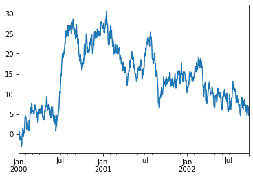
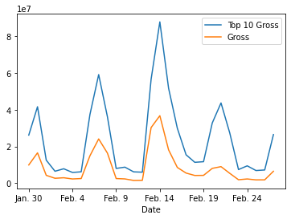
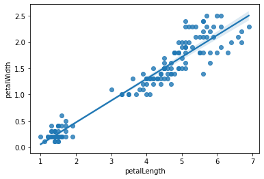

Pandas 学习笔记
===============

-  版本号： 0.3
-  创建时间： 2015年02月07日 星期六 10:26:33 CST
-  修改时间： 2020年08月24日
-  数据来源：
-  movies.csv http://boxofficemojo.com/daily/
-  iris.csv https://github.com/dsaber/py-viz-blog
-  titanic.csv https://github.com/dsaber/py-viz-blog
-  ts.csv https://github.com/dsaber/py-viz-blog

安装使用
--------

2020年1月更新:

-  jupyter 已经进化出 ``jupyter-lab`` 了。

2018年更新:

ipython notebook 已更名为 jupyter notebook 。安装使用方法如下： \* 安装
anaconda ，anaconda 是一个 Python 发行版。装好后就已经包含 ``pandas`` 和
``jupyter notebook`` 。 \* 运行 ``jupyter notebook`` 命令就可以使用
jupyter notebook 。 \* 要在 notebook 即时显示图表，可以使用在 notebook
中使用 ``%matplotlib inline`` 命令。

下面是以前的安装使用方法：

-  安装 pandas

.. code:: shell

   sudo apt-get install build-essential python-dev
   sudo apt-get install python-pandas python-tk
   sudo apt-get install python-scipy python-matplotlib python-tables
   sudo apt-get install python-numexpr python-xlrd python-statsmodels
   sudo apt-get install python-openpyxl python-xlwt python-bs4

if use virtualenv before install matplotlib should install libpng-dev,
libjpeg8-dev, libfreetype6-dev

-  安装 ipython-notebook

.. code:: shell

   sudo pip install "ipython[notebook]"
   sudo pip install pygments

-  使用\ ``ipython notebook``\ 运行 ipython-notebook
   。如果使用matplotlib内嵌进网页中,那么需要运行:``ipython notebook --matplotlib inline``
   ；或者在已经打开的 notebook 中运行 ``%matplotlib inline`` 命令。

Pandas
------

.. code:: ipython3

    import numpy as np
    import pandas as pd
    from pandas import Series, DataFrame
    import seaborn as sns
    # 辅助函数
    def get_movie_df():
        """
        获得 movie dataframe
        """
        return pd.read_csv('datas/movies.csv', sep='\t', encoding='utf-8',thousands=',',escapechar='$')
    
    def get_titanic_df():
        return pd.read_csv('datas/titanic.csv')
    
    def get_iris_df():
        return pd.read_csv('datas/iris.csv')
    
    def get_random_df():
        return pd.DataFrame(
            np.random.randn(6, 4),
            index=pd.date_range('20200101', periods=6),
            columns=list('ABCD'))

.. code:: ipython3

    # 查看 pandas 的版本
    pd.__version__

.. parsed-literal::

    '1.3.4'

.. code:: ipython3

    # 查看当前环境涉及软件的版本
    pd.show_versions()

.. parsed-literal::

    
    INSTALLED VERSIONS
    ------------------
    commit           : 945c9ed766a61c7d2c0a7cbb251b6edebf9cb7d5
    python           : 3.7.10.final.0
    python-bits      : 64
    OS               : Linux
    OS-release       : 5.4.0-42-generic
    Version          : #46~18.04.1-Ubuntu SMP Fri Jul 10 07:21:24 UTC 2020
    machine          : x86_64
    processor        : x86_64
    byteorder        : little
    LC_ALL           : None
    LANG             : zh_CN.UTF-8
    LOCALE           : zh_CN.UTF-8
    
    pandas           : 1.3.4
    numpy            : 1.21.2
    pytz             : 2021.3
    dateutil         : 2.8.2
    pip              : 21.1.1
    setuptools       : 58.0.4
    Cython           : 0.29.24
    pytest           : 6.2.3
    hypothesis       : None
    sphinx           : 4.2.0
    blosc            : None
    feather          : None
    xlsxwriter       : 3.0.1
    lxml.etree       : 4.6.3
    html5lib         : 1.1
    pymysql          : None
    psycopg2         : None
    jinja2           : 2.11.3
    IPython          : 7.22.0
    pandas_datareader: None
    bs4              : 4.10.0
    bottleneck       : 1.3.2
    fsspec           : 2021.08.1
    fastparquet      : None
    gcsfs            : None
    matplotlib       : 3.4.3
    numexpr          : 2.7.3
    odfpy            : None
    openpyxl         : 3.0.9
    pandas_gbq       : None
    pyarrow          : None
    pyxlsb           : None
    s3fs             : None
    scipy            : 1.7.1
    sqlalchemy       : 1.4.22
    tables           : 3.6.1
    tabulate         : None
    xarray           : None
    xlrd             : 2.0.1
    xlwt             : 1.3.0
    numba            : 0.51.2

DataFrame 速览
--------------

创建
~~~~

.. code:: ipython3

    data = {
        'fruit': ['Apple', 'Apple', 'Apple', 'Grape', 'Grape', 'Grape'],
        'year': [2017, 2018, 2019, 2017, 2018, 2019],
        'price': [20.5, 21.3, 25, 10.1, 10.9, 9.98]
    }
    frame = DataFrame(data)
    frame

.. raw:: html

    

    
    <table border="1" class="dataframe">
      <thead>
        <tr style="text-align: right;">
          <th></th>
          <th>fruit</th>
          <th>year</th>
          <th>price</th>
        </tr>
      </thead>
      <tbody>
        <tr>
          <th>0</th>
          <td>Apple</td>
          <td>2017</td>
          <td>20.50</td>
        </tr>
        <tr>
          <th>1</th>
          <td>Apple</td>
          <td>2018</td>
          <td>21.30</td>
        </tr>
        <tr>
          <th>2</th>
          <td>Apple</td>
          <td>2019</td>
          <td>25.00</td>
        </tr>
        <tr>
          <th>3</th>
          <td>Grape</td>
          <td>2017</td>
          <td>10.10</td>
        </tr>
        <tr>
          <th>4</th>
          <td>Grape</td>
          <td>2018</td>
          <td>10.90</td>
        </tr>
        <tr>
          <th>5</th>
          <td>Grape</td>
          <td>2019</td>
          <td>9.98</td>
        </tr>
      </tbody>
    </table>
    

生成时指定 columns 和 index ，index 的长度要与行数相匹配

.. code:: ipython3

    frame2 = DataFrame(
        data,
        columns = ['year', 'month', 'fruit', 'price'],
        index = ['one', 'two', 'three', 'four', 'five', 'six']
    )
    frame2

.. raw:: html

    

    
    <table border="1" class="dataframe">
      <thead>
        <tr style="text-align: right;">
          <th></th>
          <th>year</th>
          <th>month</th>
          <th>fruit</th>
          <th>price</th>
        </tr>
      </thead>
      <tbody>
        <tr>
          <th>one</th>
          <td>2017</td>
          <td>NaN</td>
          <td>Apple</td>
          <td>20.50</td>
        </tr>
        <tr>
          <th>two</th>
          <td>2018</td>
          <td>NaN</td>
          <td>Apple</td>
          <td>21.30</td>
        </tr>
        <tr>
          <th>three</th>
          <td>2019</td>
          <td>NaN</td>
          <td>Apple</td>
          <td>25.00</td>
        </tr>
        <tr>
          <th>four</th>
          <td>2017</td>
          <td>NaN</td>
          <td>Grape</td>
          <td>10.10</td>
        </tr>
        <tr>
          <th>five</th>
          <td>2018</td>
          <td>NaN</td>
          <td>Grape</td>
          <td>10.90</td>
        </tr>
        <tr>
          <th>six</th>
          <td>2019</td>
          <td>NaN</td>
          <td>Grape</td>
          <td>9.98</td>
        </tr>
      </tbody>
    </table>
    

查看数据
~~~~~~~~

通过类似字典标记的方式或属性的方式,可以将 ``DataFrame`` 的列获取为一个
``Series`` 。 IPython 提供了类似属性的访问(即frame2.year)和tab补全。
frame2[column] 适用于任何列的名,但是 frame2.column 只有在列名是一个合理
的 Python 变量名时才适用。 注意,返回的 Series 拥有原 DataFrame
相同的索引,且其 name 属性也已经被相应地 设置好了。

.. code:: ipython3

    frame2['fruit']

.. parsed-literal::

    one      Apple
    two      Apple
    three    Apple
    four     Grape
    five     Grape
    six      Grape
    Name: fruit, dtype: object

.. code:: ipython3

    frame2.year

.. parsed-literal::

    one      2017
    two      2018
    three    2019
    four     2017
    five     2018
    six      2019
    Name: year, dtype: int64

.. code:: ipython3

    frame2.loc['two']

.. parsed-literal::

    year      2018
    month      NaN
    fruit    Apple
    price     21.3
    Name: two, dtype: object

修改数据
~~~~~~~~

.. code:: ipython3

    frame2.month = 11
    frame2

.. raw:: html

    

    
    <table border="1" class="dataframe">
      <thead>
        <tr style="text-align: right;">
          <th></th>
          <th>year</th>
          <th>month</th>
          <th>fruit</th>
          <th>price</th>
        </tr>
      </thead>
      <tbody>
        <tr>
          <th>one</th>
          <td>2017</td>
          <td>11</td>
          <td>Apple</td>
          <td>20.50</td>
        </tr>
        <tr>
          <th>two</th>
          <td>2018</td>
          <td>11</td>
          <td>Apple</td>
          <td>21.30</td>
        </tr>
        <tr>
          <th>three</th>
          <td>2019</td>
          <td>11</td>
          <td>Apple</td>
          <td>25.00</td>
        </tr>
        <tr>
          <th>four</th>
          <td>2017</td>
          <td>11</td>
          <td>Grape</td>
          <td>10.10</td>
        </tr>
        <tr>
          <th>five</th>
          <td>2018</td>
          <td>11</td>
          <td>Grape</td>
          <td>10.90</td>
        </tr>
        <tr>
          <th>six</th>
          <td>2019</td>
          <td>11</td>
          <td>Grape</td>
          <td>9.98</td>
        </tr>
      </tbody>
    </table>
    

.. code:: ipython3

    frame2.month = np.arange(6)
    frame2

.. raw:: html

    

    
    <table border="1" class="dataframe">
      <thead>
        <tr style="text-align: right;">
          <th></th>
          <th>year</th>
          <th>month</th>
          <th>fruit</th>
          <th>price</th>
        </tr>
      </thead>
      <tbody>
        <tr>
          <th>one</th>
          <td>2017</td>
          <td>0</td>
          <td>Apple</td>
          <td>20.50</td>
        </tr>
        <tr>
          <th>two</th>
          <td>2018</td>
          <td>1</td>
          <td>Apple</td>
          <td>21.30</td>
        </tr>
        <tr>
          <th>three</th>
          <td>2019</td>
          <td>2</td>
          <td>Apple</td>
          <td>25.00</td>
        </tr>
        <tr>
          <th>four</th>
          <td>2017</td>
          <td>3</td>
          <td>Grape</td>
          <td>10.10</td>
        </tr>
        <tr>
          <th>five</th>
          <td>2018</td>
          <td>4</td>
          <td>Grape</td>
          <td>10.90</td>
        </tr>
        <tr>
          <th>six</th>
          <td>2019</td>
          <td>5</td>
          <td>Grape</td>
          <td>9.98</td>
        </tr>
      </tbody>
    </table>
    

.. code:: ipython3

    month = Series([1,3,5], index=['one', 'three', 'five'])
    frame2['month'] = month
    frame2

.. raw:: html

    

    
    <table border="1" class="dataframe">
      <thead>
        <tr style="text-align: right;">
          <th></th>
          <th>year</th>
          <th>month</th>
          <th>fruit</th>
          <th>price</th>
        </tr>
      </thead>
      <tbody>
        <tr>
          <th>one</th>
          <td>2017</td>
          <td>1.0</td>
          <td>Apple</td>
          <td>20.50</td>
        </tr>
        <tr>
          <th>two</th>
          <td>2018</td>
          <td>NaN</td>
          <td>Apple</td>
          <td>21.30</td>
        </tr>
        <tr>
          <th>three</th>
          <td>2019</td>
          <td>3.0</td>
          <td>Apple</td>
          <td>25.00</td>
        </tr>
        <tr>
          <th>four</th>
          <td>2017</td>
          <td>NaN</td>
          <td>Grape</td>
          <td>10.10</td>
        </tr>
        <tr>
          <th>five</th>
          <td>2018</td>
          <td>5.0</td>
          <td>Grape</td>
          <td>10.90</td>
        </tr>
        <tr>
          <th>six</th>
          <td>2019</td>
          <td>NaN</td>
          <td>Grape</td>
          <td>9.98</td>
        </tr>
      </tbody>
    </table>
    

DataFrame 的切片是 DataFrame 的视图，不是副本。对切片赋值会改变
DataFrame 本身。

.. code:: ipython3

    c_month = frame2['month']

.. code:: ipython3

    c_month

.. parsed-literal::

    one      1.0
    two      NaN
    three    3.0
    four     NaN
    five     5.0
    six      NaN
    Name: month, dtype: float64

.. code:: ipython3

    c_month['two'] = 2.2
    c_month

.. parsed-literal::

    /home/dormouse/anaconda3/lib/python3.7/site-packages/ipykernel_launcher.py:1: SettingWithCopyWarning: 
    A value is trying to be set on a copy of a slice from a DataFrame
    
    See the caveats in the documentation: https://pandas.pydata.org/pandas-docs/stable/user_guide/indexing.html#returning-a-view-versus-a-copy
      """Entry point for launching an IPython kernel.

.. parsed-literal::

    one      1.0
    two      2.2
    three    3.0
    four     NaN
    five     5.0
    six      NaN
    Name: month, dtype: float64

.. code:: ipython3

    frame2

.. raw:: html

    

    
    <table border="1" class="dataframe">
      <thead>
        <tr style="text-align: right;">
          <th></th>
          <th>year</th>
          <th>month</th>
          <th>fruit</th>
          <th>price</th>
        </tr>
      </thead>
      <tbody>
        <tr>
          <th>one</th>
          <td>2017</td>
          <td>1.0</td>
          <td>Apple</td>
          <td>20.50</td>
        </tr>
        <tr>
          <th>two</th>
          <td>2018</td>
          <td>2.2</td>
          <td>Apple</td>
          <td>21.30</td>
        </tr>
        <tr>
          <th>three</th>
          <td>2019</td>
          <td>3.0</td>
          <td>Apple</td>
          <td>25.00</td>
        </tr>
        <tr>
          <th>four</th>
          <td>2017</td>
          <td>NaN</td>
          <td>Grape</td>
          <td>10.10</td>
        </tr>
        <tr>
          <th>five</th>
          <td>2018</td>
          <td>5.0</td>
          <td>Grape</td>
          <td>10.90</td>
        </tr>
        <tr>
          <th>six</th>
          <td>2019</td>
          <td>NaN</td>
          <td>Grape</td>
          <td>9.98</td>
        </tr>
      </tbody>
    </table>
    

删除数据
~~~~~~~~

.. code:: ipython3

    del frame2['month'] #  删除 column
    frame2

.. raw:: html

    

    
    <table border="1" class="dataframe">
      <thead>
        <tr style="text-align: right;">
          <th></th>
          <th>year</th>
          <th>fruit</th>
          <th>price</th>
        </tr>
      </thead>
      <tbody>
        <tr>
          <th>one</th>
          <td>2017</td>
          <td>Apple</td>
          <td>20.50</td>
        </tr>
        <tr>
          <th>two</th>
          <td>2018</td>
          <td>Apple</td>
          <td>21.30</td>
        </tr>
        <tr>
          <th>three</th>
          <td>2019</td>
          <td>Apple</td>
          <td>25.00</td>
        </tr>
        <tr>
          <th>four</th>
          <td>2017</td>
          <td>Grape</td>
          <td>10.10</td>
        </tr>
        <tr>
          <th>five</th>
          <td>2018</td>
          <td>Grape</td>
          <td>10.90</td>
        </tr>
        <tr>
          <th>six</th>
          <td>2019</td>
          <td>Grape</td>
          <td>9.98</td>
        </tr>
      </tbody>
    </table>
    

pandas 的索引对象
-----------------

.. code:: ipython3

    nums = Series(range(3), index=['one', 'two', 'three'])

.. code:: ipython3

    num_index = nums.index

.. code:: ipython3

    num_index

.. parsed-literal::

    Index(['one', 'two', 'three'], dtype='object')

.. code:: ipython3

    num_index[1:]

.. parsed-literal::

    Index(['two', 'three'], dtype='object')

索引对象是不可变的，不能对其赋值

.. code:: ipython3

    num_index2 = pd.Index(['one', 'two', 'three'])

.. code:: ipython3

    num_index is num_index2

.. parsed-literal::

    False

.. code:: ipython3

    num_index == num_index2

.. parsed-literal::

    array([ True,  True,  True])

.. code:: ipython3

    nums2= Series(range(3), index = num_index2)

.. code:: ipython3

    nums2

.. parsed-literal::

    one      0
    two      1
    three    2
    dtype: int64

.. code:: ipython3

    nums2.index is num_index2

.. parsed-literal::

    True

.. code:: ipython3

    nums2.index == num_index2

.. parsed-literal::

    array([ True,  True,  True])

.. code:: ipython3

    frame3 = get_random_df()

.. code:: ipython3

    frame3.columns

.. parsed-literal::

    Index(['A', 'B', 'C', 'D'], dtype='object')

.. code:: ipython3

    frame3.index

.. parsed-literal::

    DatetimeIndex(['2020-01-01', '2020-01-02', '2020-01-03', '2020-01-04',
                   '2020-01-05', '2020-01-06'],
                  dtype='datetime64[ns]', freq='D')

reindex
~~~~~~~

Series reindex
^^^^^^^^^^^^^^

.. code:: ipython3

    obj = Series(range(4), index=['a', 'c', 'd', 'b'])
    obj

.. parsed-literal::

    a    0
    c    1
    d    2
    b    3
    dtype: int64

.. code:: ipython3

    obj2 = obj.reindex(['a', 'b', 'c', 'd'])

.. code:: ipython3

    obj2

.. parsed-literal::

    a    0
    b    3
    c    1
    d    2
    dtype: int64

自动填充
^^^^^^^^

.. code:: ipython3

    obj3 = Series(['red', 'blue', 'yellow'], index=[1,3,5])

.. code:: ipython3

    obj3

.. parsed-literal::

    1       red
    3      blue
    5    yellow
    dtype: object

.. code:: ipython3

    obj3.reindex(range(6), method='ffill')

.. parsed-literal::

    0       NaN
    1       red
    2       red
    3      blue
    4      blue
    5    yellow
    dtype: object

Frame reindex
^^^^^^^^^^^^^

.. code:: ipython3

    range(5)

.. parsed-literal::

    range(0, 5)

.. code:: ipython3

    df = pd.DataFrame(
            np.random.randn(6, 4),
            index=range(6),
            columns=list('ABCD'))
    df

.. raw:: html

    

    
    <table border="1" class="dataframe">
      <thead>
        <tr style="text-align: right;">
          <th></th>
          <th>A</th>
          <th>B</th>
          <th>C</th>
          <th>D</th>
        </tr>
      </thead>
      <tbody>
        <tr>
          <th>0</th>
          <td>-0.226843</td>
          <td>1.158647</td>
          <td>-0.502618</td>
          <td>-0.363415</td>
        </tr>
        <tr>
          <th>1</th>
          <td>-0.369415</td>
          <td>0.087376</td>
          <td>-0.273622</td>
          <td>-1.187780</td>
        </tr>
        <tr>
          <th>2</th>
          <td>1.494696</td>
          <td>0.733831</td>
          <td>-0.175294</td>
          <td>-0.066811</td>
        </tr>
        <tr>
          <th>3</th>
          <td>-0.034685</td>
          <td>-0.963611</td>
          <td>0.816663</td>
          <td>-1.962498</td>
        </tr>
        <tr>
          <th>4</th>
          <td>1.690612</td>
          <td>0.871066</td>
          <td>0.801409</td>
          <td>-1.061566</td>
        </tr>
        <tr>
          <th>5</th>
          <td>-0.210004</td>
          <td>-0.969129</td>
          <td>-1.239798</td>
          <td>-1.063891</td>
        </tr>
      </tbody>
    </table>
    

.. code:: ipython3

    df.reindex(range(5,-1,-1), columns=['A', 'C', 'DDD'])

.. raw:: html

    

    
    <table border="1" class="dataframe">
      <thead>
        <tr style="text-align: right;">
          <th></th>
          <th>A</th>
          <th>C</th>
          <th>DDD</th>
        </tr>
      </thead>
      <tbody>
        <tr>
          <th>5</th>
          <td>-0.210004</td>
          <td>-1.239798</td>
          <td>NaN</td>
        </tr>
        <tr>
          <th>4</th>
          <td>1.690612</td>
          <td>0.801409</td>
          <td>NaN</td>
        </tr>
        <tr>
          <th>3</th>
          <td>-0.034685</td>
          <td>0.816663</td>
          <td>NaN</td>
        </tr>
        <tr>
          <th>2</th>
          <td>1.494696</td>
          <td>-0.175294</td>
          <td>NaN</td>
        </tr>
        <tr>
          <th>1</th>
          <td>-0.369415</td>
          <td>-0.273622</td>
          <td>NaN</td>
        </tr>
        <tr>
          <th>0</th>
          <td>-0.226843</td>
          <td>-0.502618</td>
          <td>NaN</td>
        </tr>
      </tbody>
    </table>
    

drop
^^^^

.. code:: ipython3

    df.drop([0,5])

.. raw:: html

    

    
    <table border="1" class="dataframe">
      <thead>
        <tr style="text-align: right;">
          <th></th>
          <th>A</th>
          <th>B</th>
          <th>C</th>
          <th>D</th>
        </tr>
      </thead>
      <tbody>
        <tr>
          <th>1</th>
          <td>-0.369415</td>
          <td>0.087376</td>
          <td>-0.273622</td>
          <td>-1.187780</td>
        </tr>
        <tr>
          <th>2</th>
          <td>1.494696</td>
          <td>0.733831</td>
          <td>-0.175294</td>
          <td>-0.066811</td>
        </tr>
        <tr>
          <th>3</th>
          <td>-0.034685</td>
          <td>-0.963611</td>
          <td>0.816663</td>
          <td>-1.962498</td>
        </tr>
        <tr>
          <th>4</th>
          <td>1.690612</td>
          <td>0.871066</td>
          <td>0.801409</td>
          <td>-1.061566</td>
        </tr>
      </tbody>
    </table>
    

.. code:: ipython3

    df.drop('D', axis='columns') #  不修改对象

.. raw:: html

    

    
    <table border="1" class="dataframe">
      <thead>
        <tr style="text-align: right;">
          <th></th>
          <th>A</th>
          <th>B</th>
          <th>C</th>
        </tr>
      </thead>
      <tbody>
        <tr>
          <th>0</th>
          <td>-0.226843</td>
          <td>1.158647</td>
          <td>-0.502618</td>
        </tr>
        <tr>
          <th>1</th>
          <td>-0.369415</td>
          <td>0.087376</td>
          <td>-0.273622</td>
        </tr>
        <tr>
          <th>2</th>
          <td>1.494696</td>
          <td>0.733831</td>
          <td>-0.175294</td>
        </tr>
        <tr>
          <th>3</th>
          <td>-0.034685</td>
          <td>-0.963611</td>
          <td>0.816663</td>
        </tr>
        <tr>
          <th>4</th>
          <td>1.690612</td>
          <td>0.871066</td>
          <td>0.801409</td>
        </tr>
        <tr>
          <th>5</th>
          <td>-0.210004</td>
          <td>-0.969129</td>
          <td>-1.239798</td>
        </tr>
      </tbody>
    </table>
    

.. code:: ipython3

    df

.. raw:: html

    

    
    <table border="1" class="dataframe">
      <thead>
        <tr style="text-align: right;">
          <th></th>
          <th>A</th>
          <th>B</th>
          <th>C</th>
          <th>D</th>
        </tr>
      </thead>
      <tbody>
        <tr>
          <th>0</th>
          <td>-0.226843</td>
          <td>1.158647</td>
          <td>-0.502618</td>
          <td>-0.363415</td>
        </tr>
        <tr>
          <th>1</th>
          <td>-0.369415</td>
          <td>0.087376</td>
          <td>-0.273622</td>
          <td>-1.187780</td>
        </tr>
        <tr>
          <th>2</th>
          <td>1.494696</td>
          <td>0.733831</td>
          <td>-0.175294</td>
          <td>-0.066811</td>
        </tr>
        <tr>
          <th>3</th>
          <td>-0.034685</td>
          <td>-0.963611</td>
          <td>0.816663</td>
          <td>-1.962498</td>
        </tr>
        <tr>
          <th>4</th>
          <td>1.690612</td>
          <td>0.871066</td>
          <td>0.801409</td>
          <td>-1.061566</td>
        </tr>
        <tr>
          <th>5</th>
          <td>-0.210004</td>
          <td>-0.969129</td>
          <td>-1.239798</td>
          <td>-1.063891</td>
        </tr>
      </tbody>
    </table>
    

.. code:: ipython3

    df.drop('D', axis='columns', inplace=True) #  修改对象

.. code:: ipython3

    df

.. raw:: html

    

    
    <table border="1" class="dataframe">
      <thead>
        <tr style="text-align: right;">
          <th></th>
          <th>A</th>
          <th>B</th>
          <th>C</th>
        </tr>
      </thead>
      <tbody>
        <tr>
          <th>0</th>
          <td>-0.226843</td>
          <td>1.158647</td>
          <td>-0.502618</td>
        </tr>
        <tr>
          <th>1</th>
          <td>-0.369415</td>
          <td>0.087376</td>
          <td>-0.273622</td>
        </tr>
        <tr>
          <th>2</th>
          <td>1.494696</td>
          <td>0.733831</td>
          <td>-0.175294</td>
        </tr>
        <tr>
          <th>3</th>
          <td>-0.034685</td>
          <td>-0.963611</td>
          <td>0.816663</td>
        </tr>
        <tr>
          <th>4</th>
          <td>1.690612</td>
          <td>0.871066</td>
          <td>0.801409</td>
        </tr>
        <tr>
          <th>5</th>
          <td>-0.210004</td>
          <td>-0.969129</td>
          <td>-1.239798</td>
        </tr>
      </tbody>
    </table>
    

DataFrames 创建
---------------

.. code:: ipython3

    dates = pd.date_range('20180101', periods=6);dates

.. parsed-literal::

    DatetimeIndex(['2018-01-01', '2018-01-02', '2018-01-03', '2018-01-04',
                   '2018-01-05', '2018-01-06'],
                  dtype='datetime64[ns]', freq='D')

.. code:: ipython3

    df = pd.DataFrame(np.random.randn(6,4), index=dates, columns=list('ABCD'));df

.. raw:: html

    

    
    <table border="1" class="dataframe">
      <thead>
        <tr style="text-align: right;">
          <th></th>
          <th>A</th>
          <th>B</th>
          <th>C</th>
          <th>D</th>
        </tr>
      </thead>
      <tbody>
        <tr>
          <th>2018-01-01</th>
          <td>-0.505713</td>
          <td>-1.323337</td>
          <td>-1.056445</td>
          <td>0.804812</td>
        </tr>
        <tr>
          <th>2018-01-02</th>
          <td>-0.767402</td>
          <td>0.893677</td>
          <td>-1.315020</td>
          <td>0.163473</td>
        </tr>
        <tr>
          <th>2018-01-03</th>
          <td>0.837288</td>
          <td>0.126999</td>
          <td>-0.374810</td>
          <td>-2.253120</td>
        </tr>
        <tr>
          <th>2018-01-04</th>
          <td>1.358501</td>
          <td>0.233152</td>
          <td>-0.469011</td>
          <td>-0.033871</td>
        </tr>
        <tr>
          <th>2018-01-05</th>
          <td>0.657167</td>
          <td>-2.194573</td>
          <td>-0.880417</td>
          <td>0.165436</td>
        </tr>
        <tr>
          <th>2018-01-06</th>
          <td>-0.137834</td>
          <td>-0.467439</td>
          <td>1.357028</td>
          <td>-1.473897</td>
        </tr>
      </tbody>
    </table>
    

.. code:: ipython3

    # 可以使用字典来创建 DataFrame 。
    # 如果字典的 Value 是单一值，那么会自动扩展。
    # 如果字典的 Value 是列表或者 Series ，那么长度要保持一致。
    # 如果字典中只有一个值有 Index ，那么会使用这个 Index 作为整个 DataFrame 的 Index 。
    # 如果字典有多个 Index ，那么必须保持一致，否则会报错。
    df2 = pd.DataFrame(
        { 'A' : 1.,
          'B' : pd.Timestamp('20130102'),
          'C' : pd.Series(1,index=list(range(2,6)),dtype='float32'), 
          'D' : np.array([3] * 4,dtype='int32'), 
          'E' : pd.Categorical(["test","train","test","train"]), 
          'F' : 'foo' }
    )
    df2

.. raw:: html

    

    
    <table border="1" class="dataframe">
      <thead>
        <tr style="text-align: right;">
          <th></th>
          <th>A</th>
          <th>B</th>
          <th>C</th>
          <th>D</th>
          <th>E</th>
          <th>F</th>
        </tr>
      </thead>
      <tbody>
        <tr>
          <th>2</th>
          <td>1.0</td>
          <td>2013-01-02</td>
          <td>1.0</td>
          <td>3</td>
          <td>test</td>
          <td>foo</td>
        </tr>
        <tr>
          <th>3</th>
          <td>1.0</td>
          <td>2013-01-02</td>
          <td>1.0</td>
          <td>3</td>
          <td>train</td>
          <td>foo</td>
        </tr>
        <tr>
          <th>4</th>
          <td>1.0</td>
          <td>2013-01-02</td>
          <td>1.0</td>
          <td>3</td>
          <td>test</td>
          <td>foo</td>
        </tr>
        <tr>
          <th>5</th>
          <td>1.0</td>
          <td>2013-01-02</td>
          <td>1.0</td>
          <td>3</td>
          <td>train</td>
          <td>foo</td>
        </tr>
      </tbody>
    </table>
    

.. code:: ipython3

    data = {
        'fruit': ['Apple', 'Apple', 'Apple', 'Grape', 'Grape', 'Grape'],
        'year': [2017, 2018, 2019, 2017, 2018, 2019],
        'price': [20.5, 21.3, 25, 10.1, 10.9, 9.98]
    }
    frame = DataFrame(data)

DataFrame 全局操作
------------------

.. code:: ipython3

    df = get_random_df()

.. code:: ipython3

    df.dtypes

.. parsed-literal::

    A    float64
    B    float64
    C    float64
    D    float64
    dtype: object

.. code:: ipython3

    df.index

.. parsed-literal::

    DatetimeIndex(['2020-01-01', '2020-01-02', '2020-01-03', '2020-01-04',
                   '2020-01-05', '2020-01-06'],
                  dtype='datetime64[ns]', freq='D')

.. code:: ipython3

    df.columns

.. parsed-literal::

    Index(['A', 'B', 'C', 'D'], dtype='object')

.. code:: ipython3

    df.values

.. parsed-literal::

    array([[ 0.6299583 , -0.18556978,  2.15885328,  0.529414  ],
           [-0.39691601, -0.72288203,  0.93630284, -0.30947737],
           [-2.57781716,  1.79611764, -1.42998116,  1.61489144],
           [-0.69515181, -0.65765834, -0.36656572,  2.37444647],
           [-1.64081203, -1.25559697,  0.00749343,  0.25727969],
           [ 0.30799912,  0.35052124, -1.50562504,  0.33965452]])

.. code:: ipython3

    df.describe()

.. raw:: html

    

    
    <table border="1" class="dataframe">
      <thead>
        <tr style="text-align: right;">
          <th></th>
          <th>A</th>
          <th>B</th>
          <th>C</th>
          <th>D</th>
        </tr>
      </thead>
      <tbody>
        <tr>
          <th>count</th>
          <td>6.000000</td>
          <td>6.000000</td>
          <td>6.000000</td>
          <td>6.000000</td>
        </tr>
        <tr>
          <th>mean</th>
          <td>-0.728790</td>
          <td>-0.112511</td>
          <td>-0.033254</td>
          <td>0.801035</td>
        </tr>
        <tr>
          <th>std</th>
          <td>1.206904</td>
          <td>1.080646</td>
          <td>1.412576</td>
          <td>0.995343</td>
        </tr>
        <tr>
          <th>min</th>
          <td>-2.577817</td>
          <td>-1.255597</td>
          <td>-1.505625</td>
          <td>-0.309477</td>
        </tr>
        <tr>
          <th>25%</th>
          <td>-1.404397</td>
          <td>-0.706576</td>
          <td>-1.164127</td>
          <td>0.277873</td>
        </tr>
        <tr>
          <th>50%</th>
          <td>-0.546034</td>
          <td>-0.421614</td>
          <td>-0.179536</td>
          <td>0.434534</td>
        </tr>
        <tr>
          <th>75%</th>
          <td>0.131770</td>
          <td>0.216498</td>
          <td>0.704100</td>
          <td>1.343522</td>
        </tr>
        <tr>
          <th>max</th>
          <td>0.629958</td>
          <td>1.796118</td>
          <td>2.158853</td>
          <td>2.374446</td>
        </tr>
      </tbody>
    </table>
    

.. code:: ipython3

    df.T

.. raw:: html

    

    
    <table border="1" class="dataframe">
      <thead>
        <tr style="text-align: right;">
          <th></th>
          <th>2020-01-01</th>
          <th>2020-01-02</th>
          <th>2020-01-03</th>
          <th>2020-01-04</th>
          <th>2020-01-05</th>
          <th>2020-01-06</th>
        </tr>
      </thead>
      <tbody>
        <tr>
          <th>A</th>
          <td>0.629958</td>
          <td>-0.396916</td>
          <td>-2.577817</td>
          <td>-0.695152</td>
          <td>-1.640812</td>
          <td>0.307999</td>
        </tr>
        <tr>
          <th>B</th>
          <td>-0.185570</td>
          <td>-0.722882</td>
          <td>1.796118</td>
          <td>-0.657658</td>
          <td>-1.255597</td>
          <td>0.350521</td>
        </tr>
        <tr>
          <th>C</th>
          <td>2.158853</td>
          <td>0.936303</td>
          <td>-1.429981</td>
          <td>-0.366566</td>
          <td>0.007493</td>
          <td>-1.505625</td>
        </tr>
        <tr>
          <th>D</th>
          <td>0.529414</td>
          <td>-0.309477</td>
          <td>1.614891</td>
          <td>2.374446</td>
          <td>0.257280</td>
          <td>0.339655</td>
        </tr>
      </tbody>
    </table>
    

读入数据
--------

从 CSV 文件读入数据
~~~~~~~~~~~~~~~~~~~

.. code:: ipython3

    # 读入 CSV 格式数据
    df_movies = pd.read_csv('datas/movies.csv', sep='\t', encoding='utf-8')
    df_movies.head()

.. raw:: html

    

    
    <table border="1" class="dataframe">
      <thead>
        <tr style="text-align: right;">
          <th></th>
          <th>Row</th>
          <th>Date</th>
          <th>Day</th>
          <th>Day#</th>
          <th>Top 10 Gross</th>
          <th>#1 Movie</th>
          <th>Gross</th>
        </tr>
      </thead>
      <tbody>
        <tr>
          <th>0</th>
          <td>1</td>
          <td>Jan. 30</td>
          <td>Fri</td>
          <td>30</td>
          <td>$26,168,351</td>
          <td>American Sniper</td>
          <td>$9,905,616</td>
        </tr>
        <tr>
          <th>1</th>
          <td>2</td>
          <td>Jan. 31</td>
          <td>Sat</td>
          <td>31</td>
          <td>$41,633,588</td>
          <td>American Sniper</td>
          <td>$16,510,536</td>
        </tr>
        <tr>
          <th>2</th>
          <td>3</td>
          <td>Feb. 1</td>
          <td>Sun</td>
          <td>32</td>
          <td>$12,515,579</td>
          <td>American Sniper</td>
          <td>$4,244,376</td>
        </tr>
        <tr>
          <th>3</th>
          <td>4</td>
          <td>Feb. 2</td>
          <td>Mon</td>
          <td>33</td>
          <td>$6,475,068</td>
          <td>American Sniper</td>
          <td>$2,645,109</td>
        </tr>
        <tr>
          <th>4</th>
          <td>5</td>
          <td>Feb. 3</td>
          <td>Tue</td>
          <td>34</td>
          <td>$7,825,091</td>
          <td>American Sniper</td>
          <td>$2,923,141</td>
        </tr>
      </tbody>
    </table>
    

.. code:: ipython3

    df_movies = pd.read_csv('datas/movies.csv', sep='\t', encoding='utf-8',thousands=',',escapechar='$')
    df_movies.head()

.. raw:: html

    

    
    <table border="1" class="dataframe">
      <thead>
        <tr style="text-align: right;">
          <th></th>
          <th>Row</th>
          <th>Date</th>
          <th>Day</th>
          <th>Day#</th>
          <th>Top 10 Gross</th>
          <th>#1 Movie</th>
          <th>Gross</th>
        </tr>
      </thead>
      <tbody>
        <tr>
          <th>0</th>
          <td>1</td>
          <td>Jan. 30</td>
          <td>Fri</td>
          <td>30</td>
          <td>26168351</td>
          <td>American Sniper</td>
          <td>9905616</td>
        </tr>
        <tr>
          <th>1</th>
          <td>2</td>
          <td>Jan. 31</td>
          <td>Sat</td>
          <td>31</td>
          <td>41633588</td>
          <td>American Sniper</td>
          <td>16510536</td>
        </tr>
        <tr>
          <th>2</th>
          <td>3</td>
          <td>Feb. 1</td>
          <td>Sun</td>
          <td>32</td>
          <td>12515579</td>
          <td>American Sniper</td>
          <td>4244376</td>
        </tr>
        <tr>
          <th>3</th>
          <td>4</td>
          <td>Feb. 2</td>
          <td>Mon</td>
          <td>33</td>
          <td>6475068</td>
          <td>American Sniper</td>
          <td>2645109</td>
        </tr>
        <tr>
          <th>4</th>
          <td>5</td>
          <td>Feb. 3</td>
          <td>Tue</td>
          <td>34</td>
          <td>7825091</td>
          <td>American Sniper</td>
          <td>2923141</td>
        </tr>
      </tbody>
    </table>
    

从数据库读入数据
~~~~~~~~~~~~~~~~

参见：http://stackoverflow.com/questions/10065051/python-pandas-and-databases-like-mysql

从 Excel 文件读入数据
~~~~~~~~~~~~~~~~~~~~~

原型
^^^^

.. code:: python

   pandas.read_excel(io, sheet_name=0, header=0, skiprows=None, skip_footer=0,
                     index_col=None, names=None, usecols=None, parse_dates=False,
                     date_parser=None, na_values=None, thousands=None,
                     convert_float=True, converters=None, dtype=None,
                     true_values=None, false_values=None, engine=None,
                     squeeze=False, **kwds)

Read an Excel table into a pandas DataFrame

Parameters
^^^^^^^^^^

-  io : string, path object (pathlib.Path or py._path.local.LocalPath),
   file-like object, pandas ExcelFile, or xlrd workbook. The string
   could be a URL. Valid URL schemes include http, ftp, s3, and file.
   For file URLs, a host is expected. For instance, a local file could
   be file://localhost/path/to/workbook.xlsx

-  sheet_name : string, int, mixed list of strings/ints, or None,
   default 0 Strings are used for sheet names, Integers are used in
   zero-indexed sheet positions. Lists of strings/integers are used to
   request multiple sheets. Specify None to get all sheets. str|int ->
   DataFrame is returned. list|None -> Dict of DataFrames is returned,
   with keys representing sheets. Available Cases • Defaults to 0 -> 1st
   sheet as a DataFrame • 1 -> 2nd sheet as a DataFrame • “Sheet1” ->
   1st sheet as a DataFrame • [0,1,”Sheet5”] -> 1st, 2nd & 5th sheet as
   a dictionary of DataFrames • None -> All sheets as a dictionary of
   DataFrames

-  sheetname : string, int, mixed list of strings/ints, or None, default
   0 Deprecated since version 0.21.0: Use sheet_name instead

-  header : int, list of ints, default 0 Row (0-indexed) to use for the
   column labels of the parsed DataFrame. If a list of integers is
   passed those row positions will be combined into a MultiIndex. Use
   None if there is no header.

-  skiprows : list-like Rows to skip at the beginning (0-indexed)

-  skip_footer : int, default 0 Rows at the end to skip (0-indexed)

-  index_col : int, list of ints, default None Column (0-indexed) to use
   as the row labels of the DataFrame. Pass None if there is no such
   column. If a list is passed, those columns will be combined into a
   MultiIndex. If a subset of data is selected with usecols, index_col
   is based on the subset.

-  names : array-like, default None List of column names to use. If file
   contains no header row, then you should explicitly pass header=None

-  converters : dict, default None Dict of functions for converting
   values in certain columns. Keys can either be integers or column
   labels, values are functions that take one input argument, the Excel
   cell content, and return the transformed content.

-  dtype : Type name or dict of column -> type, default None Data type
   for data or columns. E.g. {‘a’: np.float64, ‘b’: np.int32} Use object
   to preserve data as stored in Excel and not interpret dtype. If
   converters are specified, they will be applied INSTEAD of dtype
   conversion. New in version 0.20.0. 例如：把数据都作为 str
   读入，那么可以使用 ``dtype=str`` 。

-  true_values : list, default None Values to consider as True New in
   version 0.19.0.

-  false_values : list, default None Values to consider as False New in
   version 0.19.0.

-  parse_cols : int or list, default None Deprecated since version
   0.21.0: Pass in usecols instead.

-  usecols : int or list, default None • If None then parse all columns,
   • If int then indicates last column to be parsed • If list of ints
   then indicates list of column numbers to be parsed • If string then
   indicates comma separated list of Excel column letters and column
   ranges (e.g. “A:E” or “A,C,E:F”). Ranges are inclusive of both sides.

-  squeeze : boolean, default False If the parsed data only contains one
   column then return a Series

-  na_values : scalar, str, list-like, or dict, default None Additional
   strings to recognize as NA/NaN. If dict passed, specific per-column
   NA values. By default the following values are interpreted as NaN:
   ‘’, ‘#N/A’, ‘#N/A N/A’, ‘#NA’, ‘-1.#IND’, ‘-1.#QNAN’, ‘-NaN’, ‘-nan’,
   ‘1.#IND’, ‘1.#QNAN’, ‘N/A’, ‘NA’, ‘NULL’, ‘NaN’, ‘n/a’, ‘nan’,
   ‘null’.

-  thousands : str, default None Thousands separator for parsing string
   columns to numeric. Note that this parameter is only necessary for
   columns stored as TEXT in Excel, any numeric columns will
   automatically be parsed, regardless of display format.

-  keep_default_na : bool, default True If na_values are specified and
   keep_default_na is False the default NaN values are over-ridden,
   otherwise they’re appended to.

-  verbose : boolean, default False Indicate number of NA values placed
   in non-numeric columns

-  engine: string, default None If io is not a buffer or path, this must
   be set to identify io. Acceptable values are None or xlrd

-  convert_float : boolean, default True convert integral floats to int
   (i.e., 1.0 –> 1). If False, all numeric data will be read in as
   floats: Excel stores all numbers as floats internally

Returns
^^^^^^^

parsed : DataFrame or Dict of DataFrames

DataFrame from the passed in Excel file. See notes in sheet_name
argument for more information on when a Dict of Dataframes is returned.

复制数据
--------

.. code:: ipython3

    df = df_movies.copy()
    df.head()

.. raw:: html

    

    
    <table border="1" class="dataframe">
      <thead>
        <tr style="text-align: right;">
          <th></th>
          <th>Row</th>
          <th>Date</th>
          <th>Day</th>
          <th>Day#</th>
          <th>Top 10 Gross</th>
          <th>#1 Movie</th>
          <th>Gross</th>
        </tr>
      </thead>
      <tbody>
        <tr>
          <th>0</th>
          <td>1</td>
          <td>Jan. 30</td>
          <td>Fri</td>
          <td>30</td>
          <td>26168351</td>
          <td>American Sniper</td>
          <td>9905616</td>
        </tr>
        <tr>
          <th>1</th>
          <td>2</td>
          <td>Jan. 31</td>
          <td>Sat</td>
          <td>31</td>
          <td>41633588</td>
          <td>American Sniper</td>
          <td>16510536</td>
        </tr>
        <tr>
          <th>2</th>
          <td>3</td>
          <td>Feb. 1</td>
          <td>Sun</td>
          <td>32</td>
          <td>12515579</td>
          <td>American Sniper</td>
          <td>4244376</td>
        </tr>
        <tr>
          <th>3</th>
          <td>4</td>
          <td>Feb. 2</td>
          <td>Mon</td>
          <td>33</td>
          <td>6475068</td>
          <td>American Sniper</td>
          <td>2645109</td>
        </tr>
        <tr>
          <th>4</th>
          <td>5</td>
          <td>Feb. 3</td>
          <td>Tue</td>
          <td>34</td>
          <td>7825091</td>
          <td>American Sniper</td>
          <td>2923141</td>
        </tr>
      </tbody>
    </table>
    

选择数据
--------

1. 行，列 –> df[]
2. 区域 –> df.loc[], df.iloc[], df.ix[]
3. 单元格 –> df.at[], df.iat[]

选择单个数据
~~~~~~~~~~~~

.. code:: ipython3

    df.at[1, 'Date']

.. parsed-literal::

    'Jan. 31'

.. code:: ipython3

    df.iat[1,1]

.. parsed-literal::

    'Jan. 31'

选择某个区域
~~~~~~~~~~~~

.. code:: ipython3

    #只显示指定的行和列
    df.iloc[[1,3,5],[0,1,2,3]]

.. raw:: html

    

    
    <table border="1" class="dataframe">
      <thead>
        <tr style="text-align: right;">
          <th></th>
          <th>Row</th>
          <th>Date</th>
          <th>Day</th>
          <th>Day#</th>
        </tr>
      </thead>
      <tbody>
        <tr>
          <th>1</th>
          <td>2</td>
          <td>Jan. 31</td>
          <td>Sat</td>
          <td>31</td>
        </tr>
        <tr>
          <th>3</th>
          <td>4</td>
          <td>Feb. 2</td>
          <td>Mon</td>
          <td>33</td>
        </tr>
        <tr>
          <th>5</th>
          <td>6</td>
          <td>Feb. 4</td>
          <td>Wed</td>
          <td>35</td>
        </tr>
      </tbody>
    </table>
    

.. code:: ipython3

    df.loc[[1,3,5],['Date', 'Gross']]

.. raw:: html

    

    
    <table border="1" class="dataframe">
      <thead>
        <tr style="text-align: right;">
          <th></th>
          <th>Date</th>
          <th>Gross</th>
        </tr>
      </thead>
      <tbody>
        <tr>
          <th>1</th>
          <td>Jan. 31</td>
          <td>16510536</td>
        </tr>
        <tr>
          <th>3</th>
          <td>Feb. 2</td>
          <td>2645109</td>
        </tr>
        <tr>
          <th>5</th>
          <td>Feb. 4</td>
          <td>2273342</td>
        </tr>
      </tbody>
    </table>
    

选择行
~~~~~~

.. code:: ipython3

    df[1:4] # 第2-4行

.. raw:: html

    

    
    <table border="1" class="dataframe">
      <thead>
        <tr style="text-align: right;">
          <th></th>
          <th>Row</th>
          <th>Date</th>
          <th>Day</th>
          <th>Day#</th>
          <th>Top 10 Gross</th>
          <th>#1 Movie</th>
          <th>Gross</th>
        </tr>
      </thead>
      <tbody>
        <tr>
          <th>1</th>
          <td>2</td>
          <td>Jan. 31</td>
          <td>Sat</td>
          <td>31</td>
          <td>41633588</td>
          <td>American Sniper</td>
          <td>16510536</td>
        </tr>
        <tr>
          <th>2</th>
          <td>3</td>
          <td>Feb. 1</td>
          <td>Sun</td>
          <td>32</td>
          <td>12515579</td>
          <td>American Sniper</td>
          <td>4244376</td>
        </tr>
        <tr>
          <th>3</th>
          <td>4</td>
          <td>Feb. 2</td>
          <td>Mon</td>
          <td>33</td>
          <td>6475068</td>
          <td>American Sniper</td>
          <td>2645109</td>
        </tr>
      </tbody>
    </table>
    

.. code:: ipython3

    # 查看头部数据
    df.head()

.. raw:: html

    

    
    <table border="1" class="dataframe">
      <thead>
        <tr style="text-align: right;">
          <th></th>
          <th>Row</th>
          <th>Date</th>
          <th>Day</th>
          <th>Day#</th>
          <th>Top 10 Gross</th>
          <th>#1 Movie</th>
          <th>Gross</th>
        </tr>
      </thead>
      <tbody>
        <tr>
          <th>0</th>
          <td>1</td>
          <td>Jan. 30</td>
          <td>Fri</td>
          <td>30</td>
          <td>26168351</td>
          <td>American Sniper</td>
          <td>9905616</td>
        </tr>
        <tr>
          <th>1</th>
          <td>2</td>
          <td>Jan. 31</td>
          <td>Sat</td>
          <td>31</td>
          <td>41633588</td>
          <td>American Sniper</td>
          <td>16510536</td>
        </tr>
        <tr>
          <th>2</th>
          <td>3</td>
          <td>Feb. 1</td>
          <td>Sun</td>
          <td>32</td>
          <td>12515579</td>
          <td>American Sniper</td>
          <td>4244376</td>
        </tr>
        <tr>
          <th>3</th>
          <td>4</td>
          <td>Feb. 2</td>
          <td>Mon</td>
          <td>33</td>
          <td>6475068</td>
          <td>American Sniper</td>
          <td>2645109</td>
        </tr>
        <tr>
          <th>4</th>
          <td>5</td>
          <td>Feb. 3</td>
          <td>Tue</td>
          <td>34</td>
          <td>7825091</td>
          <td>American Sniper</td>
          <td>2923141</td>
        </tr>
      </tbody>
    </table>
    

.. code:: ipython3

    # 查看尾部数据
    df.tail(2)
    #head 和 tail 接受一个整数参数，缺省值为 5 。

.. raw:: html

    

    
    <table border="1" class="dataframe">
      <thead>
        <tr style="text-align: right;">
          <th></th>
          <th>Row</th>
          <th>Date</th>
          <th>Day</th>
          <th>Day#</th>
          <th>Top 10 Gross</th>
          <th>#1 Movie</th>
          <th>Gross</th>
        </tr>
      </thead>
      <tbody>
        <tr>
          <th>27</th>
          <td>28</td>
          <td>Feb. 26</td>
          <td>Thu</td>
          <td>57</td>
          <td>7161773</td>
          <td>Fifty Shades of Grey</td>
          <td>1790520</td>
        </tr>
        <tr>
          <th>28</th>
          <td>29</td>
          <td>Feb. 27</td>
          <td>Fri</td>
          <td>58</td>
          <td>26457000</td>
          <td>Focus (2015)</td>
          <td>6465000</td>
        </tr>
      </tbody>
    </table>
    

选择列
~~~~~~

.. code:: ipython3

    df[['Date', 'Gross']].head()

.. raw:: html

    

    
    <table border="1" class="dataframe">
      <thead>
        <tr style="text-align: right;">
          <th></th>
          <th>Date</th>
          <th>Gross</th>
        </tr>
      </thead>
      <tbody>
        <tr>
          <th>0</th>
          <td>Jan. 30</td>
          <td>9905616</td>
        </tr>
        <tr>
          <th>1</th>
          <td>Jan. 31</td>
          <td>16510536</td>
        </tr>
        <tr>
          <th>2</th>
          <td>Feb. 1</td>
          <td>4244376</td>
        </tr>
        <tr>
          <th>3</th>
          <td>Feb. 2</td>
          <td>2645109</td>
        </tr>
        <tr>
          <th>4</th>
          <td>Feb. 3</td>
          <td>2923141</td>
        </tr>
      </tbody>
    </table>
    

.. code:: ipython3

    df.iloc[:,[1, 2, 6]].head()

.. raw:: html

    

    
    <table border="1" class="dataframe">
      <thead>
        <tr style="text-align: right;">
          <th></th>
          <th>Date</th>
          <th>Day</th>
          <th>Gross</th>
        </tr>
      </thead>
      <tbody>
        <tr>
          <th>0</th>
          <td>Jan. 30</td>
          <td>Fri</td>
          <td>9905616</td>
        </tr>
        <tr>
          <th>1</th>
          <td>Jan. 31</td>
          <td>Sat</td>
          <td>16510536</td>
        </tr>
        <tr>
          <th>2</th>
          <td>Feb. 1</td>
          <td>Sun</td>
          <td>4244376</td>
        </tr>
        <tr>
          <th>3</th>
          <td>Feb. 2</td>
          <td>Mon</td>
          <td>2645109</td>
        </tr>
        <tr>
          <th>4</th>
          <td>Feb. 3</td>
          <td>Tue</td>
          <td>2923141</td>
        </tr>
      </tbody>
    </table>
    

.. code:: ipython3

    # 只包含指定字符的列
    df = df_movies.copy()
    df.filter(regex='D', axis=1).head()

.. raw:: html

    

    
    <table border="1" class="dataframe">
      <thead>
        <tr style="text-align: right;">
          <th></th>
          <th>Date</th>
          <th>Day</th>
          <th>Day#</th>
        </tr>
      </thead>
      <tbody>
        <tr>
          <th>0</th>
          <td>Jan. 30</td>
          <td>Fri</td>
          <td>30</td>
        </tr>
        <tr>
          <th>1</th>
          <td>Jan. 31</td>
          <td>Sat</td>
          <td>31</td>
        </tr>
        <tr>
          <th>2</th>
          <td>Feb. 1</td>
          <td>Sun</td>
          <td>32</td>
        </tr>
        <tr>
          <th>3</th>
          <td>Feb. 2</td>
          <td>Mon</td>
          <td>33</td>
        </tr>
        <tr>
          <th>4</th>
          <td>Feb. 3</td>
          <td>Tue</td>
          <td>34</td>
        </tr>
      </tbody>
    </table>
    

.. code:: ipython3

    df = df_movies.copy()
    # 根据列类型过滤
    # 只选择字符串型的列
    df.loc[:, (df.dtypes == np.dtype('O')).values].head()

.. raw:: html

    

    
    <table border="1" class="dataframe">
      <thead>
        <tr style="text-align: right;">
          <th></th>
          <th>Date</th>
          <th>Day</th>
          <th>#1 Movie</th>
        </tr>
      </thead>
      <tbody>
        <tr>
          <th>0</th>
          <td>Jan. 30</td>
          <td>Fri</td>
          <td>American Sniper</td>
        </tr>
        <tr>
          <th>1</th>
          <td>Jan. 31</td>
          <td>Sat</td>
          <td>American Sniper</td>
        </tr>
        <tr>
          <th>2</th>
          <td>Feb. 1</td>
          <td>Sun</td>
          <td>American Sniper</td>
        </tr>
        <tr>
          <th>3</th>
          <td>Feb. 2</td>
          <td>Mon</td>
          <td>American Sniper</td>
        </tr>
        <tr>
          <th>4</th>
          <td>Feb. 3</td>
          <td>Tue</td>
          <td>American Sniper</td>
        </tr>
      </tbody>
    </table>
    

操作单元
--------

.. code:: ipython3

    df = df_movies.copy()
    # 单元格赋值
    # 单个单元格赋值
    df.iloc[0, 6] = '土豆之歌'
    df.loc[df.index[1], 'Gross']= 999
    df.head(3)

.. raw:: html

    

    
    <table border="1" class="dataframe">
      <thead>
        <tr style="text-align: right;">
          <th></th>
          <th>Row</th>
          <th>Date</th>
          <th>Day</th>
          <th>Day#</th>
          <th>Top 10 Gross</th>
          <th>#1 Movie</th>
          <th>Gross</th>
        </tr>
      </thead>
      <tbody>
        <tr>
          <th>0</th>
          <td>1</td>
          <td>Jan. 30</td>
          <td>Fri</td>
          <td>30</td>
          <td>26168351</td>
          <td>American Sniper</td>
          <td>土豆之歌</td>
        </tr>
        <tr>
          <th>1</th>
          <td>2</td>
          <td>Jan. 31</td>
          <td>Sat</td>
          <td>31</td>
          <td>41633588</td>
          <td>American Sniper</td>
          <td>999</td>
        </tr>
        <tr>
          <th>2</th>
          <td>3</td>
          <td>Feb. 1</td>
          <td>Sun</td>
          <td>32</td>
          <td>12515579</td>
          <td>American Sniper</td>
          <td>4244376</td>
        </tr>
      </tbody>
    </table>
    

.. code:: ipython3

    # 多单个单元格赋值
    df.loc[df.index[0:2], 'Gross'] = [100, 200]
    df.head(3)

.. raw:: html

    

    
    <table border="1" class="dataframe">
      <thead>
        <tr style="text-align: right;">
          <th></th>
          <th>Row</th>
          <th>Date</th>
          <th>Day</th>
          <th>Day#</th>
          <th>Top 10 Gross</th>
          <th>#1 Movie</th>
          <th>Gross</th>
        </tr>
      </thead>
      <tbody>
        <tr>
          <th>0</th>
          <td>1</td>
          <td>Jan. 30</td>
          <td>Fri</td>
          <td>30</td>
          <td>26168351</td>
          <td>American Sniper</td>
          <td>100</td>
        </tr>
        <tr>
          <th>1</th>
          <td>2</td>
          <td>Jan. 31</td>
          <td>Sat</td>
          <td>31</td>
          <td>41633588</td>
          <td>American Sniper</td>
          <td>200</td>
        </tr>
        <tr>
          <th>2</th>
          <td>3</td>
          <td>Feb. 1</td>
          <td>Sun</td>
          <td>32</td>
          <td>12515579</td>
          <td>American Sniper</td>
          <td>4244376</td>
        </tr>
      </tbody>
    </table>
    

操作列
------

调整列的顺序
~~~~~~~~~~~~

.. code:: ipython3

    # 构建 DataFrame
    df = pd.DataFrame({'a':[1,2], 'b': [3,4], 'c':[5,6], 'd':[7,8], 'e':[9,10]});df

.. raw:: html

    

    
    <table border="1" class="dataframe">
      <thead>
        <tr style="text-align: right;">
          <th></th>
          <th>a</th>
          <th>b</th>
          <th>c</th>
          <th>d</th>
          <th>e</th>
        </tr>
      </thead>
      <tbody>
        <tr>
          <th>0</th>
          <td>1</td>
          <td>3</td>
          <td>5</td>
          <td>7</td>
          <td>9</td>
        </tr>
        <tr>
          <th>1</th>
          <td>2</td>
          <td>4</td>
          <td>6</td>
          <td>8</td>
          <td>10</td>
        </tr>
      </tbody>
    </table>
    

方法一
^^^^^^

.. code:: ipython3

    col_order = ['c', 'a', 'b', 'd']
    df = df[col_order]
    df

.. raw:: html

    

    
    <table border="1" class="dataframe">
      <thead>
        <tr style="text-align: right;">
          <th></th>
          <th>c</th>
          <th>a</th>
          <th>b</th>
          <th>d</th>
        </tr>
      </thead>
      <tbody>
        <tr>
          <th>0</th>
          <td>5</td>
          <td>1</td>
          <td>3</td>
          <td>7</td>
        </tr>
        <tr>
          <th>1</th>
          <td>6</td>
          <td>2</td>
          <td>4</td>
          <td>8</td>
        </tr>
      </tbody>
    </table>
    

方法二
^^^^^^

.. code:: ipython3

    new_df = df.drop('c', axis=1)
    new_df.insert(2, 'c', df['c'])
    new_df

.. raw:: html

    

    
    <table border="1" class="dataframe">
      <thead>
        <tr style="text-align: right;">
          <th></th>
          <th>a</th>
          <th>b</th>
          <th>c</th>
          <th>d</th>
        </tr>
      </thead>
      <tbody>
        <tr>
          <th>0</th>
          <td>1</td>
          <td>3</td>
          <td>5</td>
          <td>7</td>
        </tr>
        <tr>
          <th>1</th>
          <td>2</td>
          <td>4</td>
          <td>6</td>
          <td>8</td>
        </tr>
      </tbody>
    </table>
    

修改一个列头
~~~~~~~~~~~~

.. code:: ipython3

    # 构建 DataFrame
    df = pd.DataFrame({'a':[1,2], 'b': [3,4], 'c':[5,6], 'd':[7,8], 'e':[9,10]});df

.. raw:: html

    

    
    <table border="1" class="dataframe">
      <thead>
        <tr style="text-align: right;">
          <th></th>
          <th>a</th>
          <th>b</th>
          <th>c</th>
          <th>d</th>
          <th>e</th>
        </tr>
      </thead>
      <tbody>
        <tr>
          <th>0</th>
          <td>1</td>
          <td>3</td>
          <td>5</td>
          <td>7</td>
          <td>9</td>
        </tr>
        <tr>
          <th>1</th>
          <td>2</td>
          <td>4</td>
          <td>6</td>
          <td>8</td>
          <td>10</td>
        </tr>
      </tbody>
    </table>
    

.. code:: ipython3

    df.rename(columns={'a':'AA'}, inplace=True);df

.. raw:: html

    

    
    <table border="1" class="dataframe">
      <thead>
        <tr style="text-align: right;">
          <th></th>
          <th>AA</th>
          <th>b</th>
          <th>c</th>
          <th>d</th>
          <th>e</th>
        </tr>
      </thead>
      <tbody>
        <tr>
          <th>0</th>
          <td>1</td>
          <td>3</td>
          <td>5</td>
          <td>7</td>
          <td>9</td>
        </tr>
        <tr>
          <th>1</th>
          <td>2</td>
          <td>4</td>
          <td>6</td>
          <td>8</td>
          <td>10</td>
        </tr>
      </tbody>
    </table>
    

修改全部列头
~~~~~~~~~~~~

转自：https://stackoverflow.com/questions/11346283/renaming-columns-in-pandas

Pandas 0.21+ Answer

There have been some significant updates to column renaming in version
0.21.

The rename method has added the axis parameter which may be set to
columns or 1. This update makes this method match the rest of the pandas
API. It still has the index and columns parameters but you are no longer
forced to use them.

The set_axis method with the inplace set to False enables you to rename
all the index or column labels with a list.

Examples for Pandas 0.21+

.. code:: ipython3

    # 构建 DataFrame
    df = pd.DataFrame({'$a':[1,2], '$b': [3,4], 
                       '$c':[5,6], '$d':[7,8], 
                       '$e':[9,10]})
    df

.. raw:: html

    

    
    <table border="1" class="dataframe">
      <thead>
        <tr style="text-align: right;">
          <th></th>
          <th>$a</th>
          <th>$b</th>
          <th>$c</th>
          <th>$d</th>
          <th>$e</th>
        </tr>
      </thead>
      <tbody>
        <tr>
          <th>0</th>
          <td>1</td>
          <td>3</td>
          <td>5</td>
          <td>7</td>
          <td>9</td>
        </tr>
        <tr>
          <th>1</th>
          <td>2</td>
          <td>4</td>
          <td>6</td>
          <td>8</td>
          <td>10</td>
        </tr>
      </tbody>
    </table>
    

方法一：使用 rename ，，并且设置 axis=‘columns’ 或者 axis=1
^^^^^^^^^^^^^^^^^^^^^^^^^^^^^^^^^^^^^^^^^^^^^^^^^^^^^^^^^^^

.. code:: ipython3

    df.rename({'$a':'a', '$b':'b', '$c':'c', '$d':'d', '$e':'e'}, axis='columns')

.. raw:: html

    

    
    <table border="1" class="dataframe">
      <thead>
        <tr style="text-align: right;">
          <th></th>
          <th>a</th>
          <th>b</th>
          <th>c</th>
          <th>d</th>
          <th>e</th>
        </tr>
      </thead>
      <tbody>
        <tr>
          <th>0</th>
          <td>1</td>
          <td>3</td>
          <td>5</td>
          <td>7</td>
          <td>9</td>
        </tr>
        <tr>
          <th>1</th>
          <td>2</td>
          <td>4</td>
          <td>6</td>
          <td>8</td>
          <td>10</td>
        </tr>
      </tbody>
    </table>
    

.. code:: ipython3

    # 下句与上句结果相同
    df.rename({'$a':'a', '$b':'b', '$c':'c', '$d':'d', '$e':'e'}, axis=1)

.. raw:: html

    

    
    <table border="1" class="dataframe">
      <thead>
        <tr style="text-align: right;">
          <th></th>
          <th>a</th>
          <th>b</th>
          <th>c</th>
          <th>d</th>
          <th>e</th>
        </tr>
      </thead>
      <tbody>
        <tr>
          <th>0</th>
          <td>1</td>
          <td>3</td>
          <td>5</td>
          <td>7</td>
          <td>9</td>
        </tr>
        <tr>
          <th>1</th>
          <td>2</td>
          <td>4</td>
          <td>6</td>
          <td>8</td>
          <td>10</td>
        </tr>
      </tbody>
    </table>
    

.. code:: ipython3

    # 老的方法，结果相同
    df.rename(columns={'$a':'a', '$b':'b', '$c':'c', '$d':'d', '$e':'e'})

.. raw:: html

    

    
    <table border="1" class="dataframe">
      <thead>
        <tr style="text-align: right;">
          <th></th>
          <th>a</th>
          <th>b</th>
          <th>c</th>
          <th>d</th>
          <th>e</th>
        </tr>
      </thead>
      <tbody>
        <tr>
          <th>0</th>
          <td>1</td>
          <td>3</td>
          <td>5</td>
          <td>7</td>
          <td>9</td>
        </tr>
        <tr>
          <th>1</th>
          <td>2</td>
          <td>4</td>
          <td>6</td>
          <td>8</td>
          <td>10</td>
        </tr>
      </tbody>
    </table>
    

.. code:: ipython3

    #rename 函数接受一个函数作为参数，作为参数的函数作用于每一个列名称。
    df.rename(lambda x: x[1:], axis='columns')

.. raw:: html

    

    
    <table border="1" class="dataframe">
      <thead>
        <tr style="text-align: right;">
          <th></th>
          <th>a</th>
          <th>b</th>
          <th>c</th>
          <th>d</th>
          <th>e</th>
        </tr>
      </thead>
      <tbody>
        <tr>
          <th>0</th>
          <td>1</td>
          <td>3</td>
          <td>5</td>
          <td>7</td>
          <td>9</td>
        </tr>
        <tr>
          <th>1</th>
          <td>2</td>
          <td>4</td>
          <td>6</td>
          <td>8</td>
          <td>10</td>
        </tr>
      </tbody>
    </table>
    

.. code:: ipython3

    df.rename(lambda x: x[1:], axis=1)

.. raw:: html

    

    
    <table border="1" class="dataframe">
      <thead>
        <tr style="text-align: right;">
          <th></th>
          <th>a</th>
          <th>b</th>
          <th>c</th>
          <th>d</th>
          <th>e</th>
        </tr>
      </thead>
      <tbody>
        <tr>
          <th>0</th>
          <td>1</td>
          <td>3</td>
          <td>5</td>
          <td>7</td>
          <td>9</td>
        </tr>
        <tr>
          <th>1</th>
          <td>2</td>
          <td>4</td>
          <td>6</td>
          <td>8</td>
          <td>10</td>
        </tr>
      </tbody>
    </table>
    

方法二：使用 set_axis ，把一个 list 作为列名称，并且设置 inplace=False
^^^^^^^^^^^^^^^^^^^^^^^^^^^^^^^^^^^^^^^^^^^^^^^^^^^^^^^^^^^^^^^^^^^^^^

list 的长度必须与列（或者索引）的数量一致。当前版本（0.24.2， inplace
参数的默认值为 True ，以后可能改为 False 。

.. code:: ipython3

    df.set_axis(['a', 'b', 'c', 'd', 'e'], axis='columns', inplace=False)

.. raw:: html

    

    
    <table border="1" class="dataframe">
      <thead>
        <tr style="text-align: right;">
          <th></th>
          <th>a</th>
          <th>b</th>
          <th>c</th>
          <th>d</th>
          <th>e</th>
        </tr>
      </thead>
      <tbody>
        <tr>
          <th>0</th>
          <td>1</td>
          <td>3</td>
          <td>5</td>
          <td>7</td>
          <td>9</td>
        </tr>
        <tr>
          <th>1</th>
          <td>2</td>
          <td>4</td>
          <td>6</td>
          <td>8</td>
          <td>10</td>
        </tr>
      </tbody>
    </table>
    

.. code:: ipython3

    df.set_axis(['a', 'b', 'c', 'd', 'e'], axis=1, inplace=False)

.. raw:: html

    

    
    <table border="1" class="dataframe">
      <thead>
        <tr style="text-align: right;">
          <th></th>
          <th>a</th>
          <th>b</th>
          <th>c</th>
          <th>d</th>
          <th>e</th>
        </tr>
      </thead>
      <tbody>
        <tr>
          <th>0</th>
          <td>1</td>
          <td>3</td>
          <td>5</td>
          <td>7</td>
          <td>9</td>
        </tr>
        <tr>
          <th>1</th>
          <td>2</td>
          <td>4</td>
          <td>6</td>
          <td>8</td>
          <td>10</td>
        </tr>
      </tbody>
    </table>
    

方法三：使用 columns 属性
^^^^^^^^^^^^^^^^^^^^^^^^^

.. code:: ipython3

    df.columns = ['a', 'b', 'c', 'd', 'e']
    df

.. raw:: html

    

    
    <table border="1" class="dataframe">
      <thead>
        <tr style="text-align: right;">
          <th></th>
          <th>a</th>
          <th>b</th>
          <th>c</th>
          <th>d</th>
          <th>e</th>
        </tr>
      </thead>
      <tbody>
        <tr>
          <th>0</th>
          <td>1</td>
          <td>3</td>
          <td>5</td>
          <td>7</td>
          <td>9</td>
        </tr>
        <tr>
          <th>1</th>
          <td>2</td>
          <td>4</td>
          <td>6</td>
          <td>8</td>
          <td>10</td>
        </tr>
      </tbody>
    </table>
    

Why not use df.columns = [‘a’, ‘b’, ‘c’, ‘d’, ‘e’]?

There is nothing wrong with assigning columns directly like this. It is
a perfectly good solution.

The advantage of using set_axis is that it can be used as part of a
method chain and that it returns a new copy of the DataFrame. Without
it, you would have to store your intermediate steps of the chain to
another variable before reassigning the columns.

::

   # new for pandas 0.21+
   df.some_method1()
     .some_method2()
     .set_axis()
     .some_method3()

   # old way
   df1 = df.some_method1()
           .some_method2()
   df1.columns = columns
   df1.some_method3()

打印列类型
~~~~~~~~~~

.. code:: ipython3

    df = df_movies.copy()
    df.columns.to_series().groupby(df.dtypes).groups

.. parsed-literal::

    {int64: ['Row', 'Day#', 'Top 10 Gross', 'Gross'], object: ['Date', 'Day', '#1 Movie']}

.. code:: ipython3

    # 打印列类型(清晰打印中文)
    types = df.columns.to_series().groupby(df.dtypes).groups
    for key, value in types.items():
        print(key,':\t', ','.join(value))

.. parsed-literal::

    int64 :	 Row,Day#,Top 10 Gross,Gross
    object :	 Date,Day,#1 Movie

插入列
~~~~~~

.. code:: ipython3

    df = df_movies.copy()
    # 方式一：在末尾添加
    df['memo'] = pd.Series('', index=df.index)
    df.head(3)

.. raw:: html

    

    
    <table border="1" class="dataframe">
      <thead>
        <tr style="text-align: right;">
          <th></th>
          <th>Row</th>
          <th>Date</th>
          <th>Day</th>
          <th>Day#</th>
          <th>Top 10 Gross</th>
          <th>#1 Movie</th>
          <th>Gross</th>
          <th>memo</th>
        </tr>
      </thead>
      <tbody>
        <tr>
          <th>0</th>
          <td>1</td>
          <td>Jan. 30</td>
          <td>Fri</td>
          <td>30</td>
          <td>26168351</td>
          <td>American Sniper</td>
          <td>9905616</td>
          <td></td>
        </tr>
        <tr>
          <th>1</th>
          <td>2</td>
          <td>Jan. 31</td>
          <td>Sat</td>
          <td>31</td>
          <td>41633588</td>
          <td>American Sniper</td>
          <td>16510536</td>
          <td></td>
        </tr>
        <tr>
          <th>2</th>
          <td>3</td>
          <td>Feb. 1</td>
          <td>Sun</td>
          <td>32</td>
          <td>12515579</td>
          <td>American Sniper</td>
          <td>4244376</td>
          <td></td>
        </tr>
      </tbody>
    </table>
    

.. code:: ipython3

    # 方式二：在中间插入
    df = df_movies.copy()
    df.insert(loc=1, column=u'year', value=u'2015')
    df.head(3)

.. raw:: html

    

    
    <table border="1" class="dataframe">
      <thead>
        <tr style="text-align: right;">
          <th></th>
          <th>Row</th>
          <th>year</th>
          <th>Date</th>
          <th>Day</th>
          <th>Day#</th>
          <th>Top 10 Gross</th>
          <th>#1 Movie</th>
          <th>Gross</th>
        </tr>
      </thead>
      <tbody>
        <tr>
          <th>0</th>
          <td>1</td>
          <td>2015</td>
          <td>Jan. 30</td>
          <td>Fri</td>
          <td>30</td>
          <td>26168351</td>
          <td>American Sniper</td>
          <td>9905616</td>
        </tr>
        <tr>
          <th>1</th>
          <td>2</td>
          <td>2015</td>
          <td>Jan. 31</td>
          <td>Sat</td>
          <td>31</td>
          <td>41633588</td>
          <td>American Sniper</td>
          <td>16510536</td>
        </tr>
        <tr>
          <th>2</th>
          <td>3</td>
          <td>2015</td>
          <td>Feb. 1</td>
          <td>Sun</td>
          <td>32</td>
          <td>12515579</td>
          <td>American Sniper</td>
          <td>4244376</td>
        </tr>
      </tbody>
    </table>
    

.. code:: ipython3

    # 根据现有值生成一个新的列
    df = df_movies.copy()
    df.insert(loc = 5 , column=u'OtherGross', value=df[u'Top 10 Gross'] - df[u'Gross'])
    df.head(3)

.. raw:: html

    

    
    <table border="1" class="dataframe">
      <thead>
        <tr style="text-align: right;">
          <th></th>
          <th>Row</th>
          <th>Date</th>
          <th>Day</th>
          <th>Day#</th>
          <th>Top 10 Gross</th>
          <th>OtherGross</th>
          <th>#1 Movie</th>
          <th>Gross</th>
        </tr>
      </thead>
      <tbody>
        <tr>
          <th>0</th>
          <td>1</td>
          <td>Jan. 30</td>
          <td>Fri</td>
          <td>30</td>
          <td>26168351</td>
          <td>16262735</td>
          <td>American Sniper</td>
          <td>9905616</td>
        </tr>
        <tr>
          <th>1</th>
          <td>2</td>
          <td>Jan. 31</td>
          <td>Sat</td>
          <td>31</td>
          <td>41633588</td>
          <td>25123052</td>
          <td>American Sniper</td>
          <td>16510536</td>
        </tr>
        <tr>
          <th>2</th>
          <td>3</td>
          <td>Feb. 1</td>
          <td>Sun</td>
          <td>32</td>
          <td>12515579</td>
          <td>8271203</td>
          <td>American Sniper</td>
          <td>4244376</td>
        </tr>
      </tbody>
    </table>
    

.. code:: ipython3

    # 根据现有值生成多个新的列
    df = df_movies.copy()
    def process_date_col(text):
        #根据日期生成月份和日两个新的列
        if pd.isnull(text):
            month = day = np.nan
        else:
            month, day = text.split('.')
        return pd.Series([month, day])
    
    df[[u'month', u'day']] = df.Date.apply(process_date_col)
    df.head()

.. raw:: html

    

    
    <table border="1" class="dataframe">
      <thead>
        <tr style="text-align: right;">
          <th></th>
          <th>Row</th>
          <th>Date</th>
          <th>Day</th>
          <th>Day#</th>
          <th>Top 10 Gross</th>
          <th>#1 Movie</th>
          <th>Gross</th>
          <th>month</th>
          <th>day</th>
        </tr>
      </thead>
      <tbody>
        <tr>
          <th>0</th>
          <td>1</td>
          <td>Jan. 30</td>
          <td>Fri</td>
          <td>30</td>
          <td>26168351</td>
          <td>American Sniper</td>
          <td>9905616</td>
          <td>Jan</td>
          <td>30</td>
        </tr>
        <tr>
          <th>1</th>
          <td>2</td>
          <td>Jan. 31</td>
          <td>Sat</td>
          <td>31</td>
          <td>41633588</td>
          <td>American Sniper</td>
          <td>16510536</td>
          <td>Jan</td>
          <td>31</td>
        </tr>
        <tr>
          <th>2</th>
          <td>3</td>
          <td>Feb. 1</td>
          <td>Sun</td>
          <td>32</td>
          <td>12515579</td>
          <td>American Sniper</td>
          <td>4244376</td>
          <td>Feb</td>
          <td>1</td>
        </tr>
        <tr>
          <th>3</th>
          <td>4</td>
          <td>Feb. 2</td>
          <td>Mon</td>
          <td>33</td>
          <td>6475068</td>
          <td>American Sniper</td>
          <td>2645109</td>
          <td>Feb</td>
          <td>2</td>
        </tr>
        <tr>
          <th>4</th>
          <td>5</td>
          <td>Feb. 3</td>
          <td>Tue</td>
          <td>34</td>
          <td>7825091</td>
          <td>American Sniper</td>
          <td>2923141</td>
          <td>Feb</td>
          <td>3</td>
        </tr>
      </tbody>
    </table>
    

.. code:: ipython3

    # 根据现有值生成多个新的列
    df = df_movies.copy()
    df.head()
    
    def process_date_col(se):
        #根据日期生成月份和日两个新的列
        if pd.isnull(se['Date']):
            se['month'] = se['day'] = np.nan
        else:
            se['month'], se['day'] = se['Date'].split('.')
        return se
    df['month'] = df['day'] = np.nan
    df_new = df.apply(process_date_col, axis=1)
    df_new.head()

.. raw:: html

    

    
    <table border="1" class="dataframe">
      <thead>
        <tr style="text-align: right;">
          <th></th>
          <th>Row</th>
          <th>Date</th>
          <th>Day</th>
          <th>Day#</th>
          <th>Top 10 Gross</th>
          <th>#1 Movie</th>
          <th>Gross</th>
          <th>month</th>
          <th>day</th>
        </tr>
      </thead>
      <tbody>
        <tr>
          <th>0</th>
          <td>1</td>
          <td>Jan. 30</td>
          <td>Fri</td>
          <td>30</td>
          <td>26168351</td>
          <td>American Sniper</td>
          <td>9905616</td>
          <td>Jan</td>
          <td>30</td>
        </tr>
        <tr>
          <th>1</th>
          <td>2</td>
          <td>Jan. 31</td>
          <td>Sat</td>
          <td>31</td>
          <td>41633588</td>
          <td>American Sniper</td>
          <td>16510536</td>
          <td>Jan</td>
          <td>31</td>
        </tr>
        <tr>
          <th>2</th>
          <td>3</td>
          <td>Feb. 1</td>
          <td>Sun</td>
          <td>32</td>
          <td>12515579</td>
          <td>American Sniper</td>
          <td>4244376</td>
          <td>Feb</td>
          <td>1</td>
        </tr>
        <tr>
          <th>3</th>
          <td>4</td>
          <td>Feb. 2</td>
          <td>Mon</td>
          <td>33</td>
          <td>6475068</td>
          <td>American Sniper</td>
          <td>2645109</td>
          <td>Feb</td>
          <td>2</td>
        </tr>
        <tr>
          <th>4</th>
          <td>5</td>
          <td>Feb. 3</td>
          <td>Tue</td>
          <td>34</td>
          <td>7825091</td>
          <td>American Sniper</td>
          <td>2923141</td>
          <td>Feb</td>
          <td>3</td>
        </tr>
      </tbody>
    </table>
    

改变列值
~~~~~~~~

.. code:: ipython3

    df = get_random_df()
    df

.. raw:: html

    

    
    <table border="1" class="dataframe">
      <thead>
        <tr style="text-align: right;">
          <th></th>
          <th>A</th>
          <th>B</th>
          <th>C</th>
          <th>D</th>
        </tr>
      </thead>
      <tbody>
        <tr>
          <th>2020-01-01</th>
          <td>-0.301754</td>
          <td>0.312629</td>
          <td>0.470351</td>
          <td>0.663042</td>
        </tr>
        <tr>
          <th>2020-01-02</th>
          <td>-1.172193</td>
          <td>-1.589058</td>
          <td>-0.863646</td>
          <td>1.167042</td>
        </tr>
        <tr>
          <th>2020-01-03</th>
          <td>0.069776</td>
          <td>0.690717</td>
          <td>-1.530472</td>
          <td>-0.851705</td>
        </tr>
        <tr>
          <th>2020-01-04</th>
          <td>-0.948720</td>
          <td>-0.427022</td>
          <td>1.322175</td>
          <td>-1.825546</td>
        </tr>
        <tr>
          <th>2020-01-05</th>
          <td>1.081163</td>
          <td>0.141194</td>
          <td>0.407674</td>
          <td>0.176009</td>
        </tr>
        <tr>
          <th>2020-01-06</th>
          <td>0.280026</td>
          <td>-0.745808</td>
          <td>-0.300293</td>
          <td>0.439330</td>
        </tr>
      </tbody>
    </table>
    

.. code:: ipython3

    # 根据一列的值改变本列的值
    # 方法一
    # 把 C 列小于 0 的数据设置为 0 
    df.loc[df.C < 0, 'C'] = 0
    df

.. raw:: html

    

    
    <table border="1" class="dataframe">
      <thead>
        <tr style="text-align: right;">
          <th></th>
          <th>A</th>
          <th>B</th>
          <th>C</th>
          <th>D</th>
        </tr>
      </thead>
      <tbody>
        <tr>
          <th>2020-01-01</th>
          <td>-0.301754</td>
          <td>0.312629</td>
          <td>0.470351</td>
          <td>0.663042</td>
        </tr>
        <tr>
          <th>2020-01-02</th>
          <td>-1.172193</td>
          <td>-1.589058</td>
          <td>0.000000</td>
          <td>1.167042</td>
        </tr>
        <tr>
          <th>2020-01-03</th>
          <td>0.069776</td>
          <td>0.690717</td>
          <td>0.000000</td>
          <td>-0.851705</td>
        </tr>
        <tr>
          <th>2020-01-04</th>
          <td>-0.948720</td>
          <td>-0.427022</td>
          <td>1.322175</td>
          <td>-1.825546</td>
        </tr>
        <tr>
          <th>2020-01-05</th>
          <td>1.081163</td>
          <td>0.141194</td>
          <td>0.407674</td>
          <td>0.176009</td>
        </tr>
        <tr>
          <th>2020-01-06</th>
          <td>0.280026</td>
          <td>-0.745808</td>
          <td>0.000000</td>
          <td>0.439330</td>
        </tr>
      </tbody>
    </table>
    

.. code:: ipython3

    # 根据一列的值改变本列的值
    # 方法二
    # 把 C 列小于 0 的数据设置为 0 
    df['D'] = df['D'].apply(lambda x : 0 if x<0 else x)
    df

.. raw:: html

    

    
    <table border="1" class="dataframe">
      <thead>
        <tr style="text-align: right;">
          <th></th>
          <th>A</th>
          <th>B</th>
          <th>C</th>
          <th>D</th>
        </tr>
      </thead>
      <tbody>
        <tr>
          <th>2020-01-01</th>
          <td>-0.301754</td>
          <td>0.312629</td>
          <td>0.470351</td>
          <td>0.663042</td>
        </tr>
        <tr>
          <th>2020-01-02</th>
          <td>-1.172193</td>
          <td>-1.589058</td>
          <td>0.000000</td>
          <td>1.167042</td>
        </tr>
        <tr>
          <th>2020-01-03</th>
          <td>0.069776</td>
          <td>0.690717</td>
          <td>0.000000</td>
          <td>0.000000</td>
        </tr>
        <tr>
          <th>2020-01-04</th>
          <td>-0.948720</td>
          <td>-0.427022</td>
          <td>1.322175</td>
          <td>0.000000</td>
        </tr>
        <tr>
          <th>2020-01-05</th>
          <td>1.081163</td>
          <td>0.141194</td>
          <td>0.407674</td>
          <td>0.176009</td>
        </tr>
        <tr>
          <th>2020-01-06</th>
          <td>0.280026</td>
          <td>-0.745808</td>
          <td>0.000000</td>
          <td>0.439330</td>
        </tr>
      </tbody>
    </table>
    

.. code:: ipython3

    # 同时改变多个列的值
    # 把 A B 两列数据均乘以 100
    cols = ['A', 'B']
    df[cols] = df[cols].applymap(lambda x: x*100)
    df

.. raw:: html

    

    
    <table border="1" class="dataframe">
      <thead>
        <tr style="text-align: right;">
          <th></th>
          <th>A</th>
          <th>B</th>
          <th>C</th>
          <th>D</th>
        </tr>
      </thead>
      <tbody>
        <tr>
          <th>2020-01-01</th>
          <td>-30.175387</td>
          <td>31.262911</td>
          <td>0.470351</td>
          <td>0.663042</td>
        </tr>
        <tr>
          <th>2020-01-02</th>
          <td>-117.219285</td>
          <td>-158.905841</td>
          <td>0.000000</td>
          <td>1.167042</td>
        </tr>
        <tr>
          <th>2020-01-03</th>
          <td>6.977601</td>
          <td>69.071740</td>
          <td>0.000000</td>
          <td>0.000000</td>
        </tr>
        <tr>
          <th>2020-01-04</th>
          <td>-94.871996</td>
          <td>-42.702220</td>
          <td>1.322175</td>
          <td>0.000000</td>
        </tr>
        <tr>
          <th>2020-01-05</th>
          <td>108.116332</td>
          <td>14.119431</td>
          <td>0.407674</td>
          <td>0.176009</td>
        </tr>
        <tr>
          <th>2020-01-06</th>
          <td>28.002627</td>
          <td>-74.580777</td>
          <td>0.000000</td>
          <td>0.439330</td>
        </tr>
      </tbody>
    </table>
    

删除列
~~~~~~

.. code:: ipython3

    df = get_movie_df()
    df.head()

.. raw:: html

    

    
    <table border="1" class="dataframe">
      <thead>
        <tr style="text-align: right;">
          <th></th>
          <th>Row</th>
          <th>Date</th>
          <th>Day</th>
          <th>Day#</th>
          <th>Top 10 Gross</th>
          <th>#1 Movie</th>
          <th>Gross</th>
        </tr>
      </thead>
      <tbody>
        <tr>
          <th>0</th>
          <td>1</td>
          <td>Jan. 30</td>
          <td>Fri</td>
          <td>30</td>
          <td>26168351</td>
          <td>American Sniper</td>
          <td>9905616</td>
        </tr>
        <tr>
          <th>1</th>
          <td>2</td>
          <td>Jan. 31</td>
          <td>Sat</td>
          <td>31</td>
          <td>41633588</td>
          <td>American Sniper</td>
          <td>16510536</td>
        </tr>
        <tr>
          <th>2</th>
          <td>3</td>
          <td>Feb. 1</td>
          <td>Sun</td>
          <td>32</td>
          <td>12515579</td>
          <td>American Sniper</td>
          <td>4244376</td>
        </tr>
        <tr>
          <th>3</th>
          <td>4</td>
          <td>Feb. 2</td>
          <td>Mon</td>
          <td>33</td>
          <td>6475068</td>
          <td>American Sniper</td>
          <td>2645109</td>
        </tr>
        <tr>
          <th>4</th>
          <td>5</td>
          <td>Feb. 3</td>
          <td>Tue</td>
          <td>34</td>
          <td>7825091</td>
          <td>American Sniper</td>
          <td>2923141</td>
        </tr>
      </tbody>
    </table>
    

.. code:: ipython3

    df.drop(df[['Date', 'Gross']], axis=1, inplace=True)
    df.head()

.. raw:: html

    

    
    <table border="1" class="dataframe">
      <thead>
        <tr style="text-align: right;">
          <th></th>
          <th>Row</th>
          <th>Day</th>
          <th>Day#</th>
          <th>Top 10 Gross</th>
          <th>#1 Movie</th>
        </tr>
      </thead>
      <tbody>
        <tr>
          <th>0</th>
          <td>1</td>
          <td>Fri</td>
          <td>30</td>
          <td>26168351</td>
          <td>American Sniper</td>
        </tr>
        <tr>
          <th>1</th>
          <td>2</td>
          <td>Sat</td>
          <td>31</td>
          <td>41633588</td>
          <td>American Sniper</td>
        </tr>
        <tr>
          <th>2</th>
          <td>3</td>
          <td>Sun</td>
          <td>32</td>
          <td>12515579</td>
          <td>American Sniper</td>
        </tr>
        <tr>
          <th>3</th>
          <td>4</td>
          <td>Mon</td>
          <td>33</td>
          <td>6475068</td>
          <td>American Sniper</td>
        </tr>
        <tr>
          <th>4</th>
          <td>5</td>
          <td>Tue</td>
          <td>34</td>
          <td>7825091</td>
          <td>American Sniper</td>
        </tr>
      </tbody>
    </table>
    

.. code:: ipython3

    df = get_movie_df()
    del df['Date']
    df.head()

.. raw:: html

    

    
    <table border="1" class="dataframe">
      <thead>
        <tr style="text-align: right;">
          <th></th>
          <th>Row</th>
          <th>Day</th>
          <th>Day#</th>
          <th>Top 10 Gross</th>
          <th>#1 Movie</th>
          <th>Gross</th>
        </tr>
      </thead>
      <tbody>
        <tr>
          <th>0</th>
          <td>1</td>
          <td>Fri</td>
          <td>30</td>
          <td>26168351</td>
          <td>American Sniper</td>
          <td>9905616</td>
        </tr>
        <tr>
          <th>1</th>
          <td>2</td>
          <td>Sat</td>
          <td>31</td>
          <td>41633588</td>
          <td>American Sniper</td>
          <td>16510536</td>
        </tr>
        <tr>
          <th>2</th>
          <td>3</td>
          <td>Sun</td>
          <td>32</td>
          <td>12515579</td>
          <td>American Sniper</td>
          <td>4244376</td>
        </tr>
        <tr>
          <th>3</th>
          <td>4</td>
          <td>Mon</td>
          <td>33</td>
          <td>6475068</td>
          <td>American Sniper</td>
          <td>2645109</td>
        </tr>
        <tr>
          <th>4</th>
          <td>5</td>
          <td>Tue</td>
          <td>34</td>
          <td>7825091</td>
          <td>American Sniper</td>
          <td>2923141</td>
        </tr>
      </tbody>
    </table>
    

.. code:: ipython3

    df.drop(columns=['Row', 'Gross'], axis=1).head()

.. raw:: html

    

    
    <table border="1" class="dataframe">
      <thead>
        <tr style="text-align: right;">
          <th></th>
          <th>Day</th>
          <th>Day#</th>
          <th>Top 10 Gross</th>
          <th>#1 Movie</th>
        </tr>
      </thead>
      <tbody>
        <tr>
          <th>0</th>
          <td>Fri</td>
          <td>30</td>
          <td>26168351</td>
          <td>American Sniper</td>
        </tr>
        <tr>
          <th>1</th>
          <td>Sat</td>
          <td>31</td>
          <td>41633588</td>
          <td>American Sniper</td>
        </tr>
        <tr>
          <th>2</th>
          <td>Sun</td>
          <td>32</td>
          <td>12515579</td>
          <td>American Sniper</td>
        </tr>
        <tr>
          <th>3</th>
          <td>Mon</td>
          <td>33</td>
          <td>6475068</td>
          <td>American Sniper</td>
        </tr>
        <tr>
          <th>4</th>
          <td>Tue</td>
          <td>34</td>
          <td>7825091</td>
          <td>American Sniper</td>
        </tr>
      </tbody>
    </table>
    

操作行
------

.. code:: ipython3

    df_movies = get_movie_df()
    df = df_movies.copy()
    df.head()

.. raw:: html

    

    
    <table border="1" class="dataframe">
      <thead>
        <tr style="text-align: right;">
          <th></th>
          <th>Row</th>
          <th>Date</th>
          <th>Day</th>
          <th>Day#</th>
          <th>Top 10 Gross</th>
          <th>#1 Movie</th>
          <th>Gross</th>
        </tr>
      </thead>
      <tbody>
        <tr>
          <th>0</th>
          <td>1</td>
          <td>Jan. 30</td>
          <td>Fri</td>
          <td>30</td>
          <td>26168351</td>
          <td>American Sniper</td>
          <td>9905616</td>
        </tr>
        <tr>
          <th>1</th>
          <td>2</td>
          <td>Jan. 31</td>
          <td>Sat</td>
          <td>31</td>
          <td>41633588</td>
          <td>American Sniper</td>
          <td>16510536</td>
        </tr>
        <tr>
          <th>2</th>
          <td>3</td>
          <td>Feb. 1</td>
          <td>Sun</td>
          <td>32</td>
          <td>12515579</td>
          <td>American Sniper</td>
          <td>4244376</td>
        </tr>
        <tr>
          <th>3</th>
          <td>4</td>
          <td>Feb. 2</td>
          <td>Mon</td>
          <td>33</td>
          <td>6475068</td>
          <td>American Sniper</td>
          <td>2645109</td>
        </tr>
        <tr>
          <th>4</th>
          <td>5</td>
          <td>Feb. 3</td>
          <td>Tue</td>
          <td>34</td>
          <td>7825091</td>
          <td>American Sniper</td>
          <td>2923141</td>
        </tr>
      </tbody>
    </table>
    

处理行 Index
~~~~~~~~~~~~

把行 Index 改成由1开始
^^^^^^^^^^^^^^^^^^^^^^

.. code:: ipython3

    df.index = range(1,len(df) + 1)
    df.head()

.. raw:: html

    

    
    <table border="1" class="dataframe">
      <thead>
        <tr style="text-align: right;">
          <th></th>
          <th>Row</th>
          <th>Date</th>
          <th>Day</th>
          <th>Day#</th>
          <th>Top 10 Gross</th>
          <th>#1 Movie</th>
          <th>Gross</th>
        </tr>
      </thead>
      <tbody>
        <tr>
          <th>1</th>
          <td>1</td>
          <td>Jan. 30</td>
          <td>Fri</td>
          <td>30</td>
          <td>26168351</td>
          <td>American Sniper</td>
          <td>9905616</td>
        </tr>
        <tr>
          <th>2</th>
          <td>2</td>
          <td>Jan. 31</td>
          <td>Sat</td>
          <td>31</td>
          <td>41633588</td>
          <td>American Sniper</td>
          <td>16510536</td>
        </tr>
        <tr>
          <th>3</th>
          <td>3</td>
          <td>Feb. 1</td>
          <td>Sun</td>
          <td>32</td>
          <td>12515579</td>
          <td>American Sniper</td>
          <td>4244376</td>
        </tr>
        <tr>
          <th>4</th>
          <td>4</td>
          <td>Feb. 2</td>
          <td>Mon</td>
          <td>33</td>
          <td>6475068</td>
          <td>American Sniper</td>
          <td>2645109</td>
        </tr>
        <tr>
          <th>5</th>
          <td>5</td>
          <td>Feb. 3</td>
          <td>Tue</td>
          <td>34</td>
          <td>7825091</td>
          <td>American Sniper</td>
          <td>2923141</td>
        </tr>
      </tbody>
    </table>
    

.. code:: ipython3

    df = df_movies.copy()
    # 添加一个空行
    df = df.append(pd.Series(
                    [np.nan]*len(df.columns), # Fill cells with NaNs
                    index=df.columns),
                    ignore_index=True)
    df.tail(3)

.. raw:: html

    

    
    <table border="1" class="dataframe">
      <thead>
        <tr style="text-align: right;">
          <th></th>
          <th>Row</th>
          <th>Date</th>
          <th>Day</th>
          <th>Day#</th>
          <th>Top 10 Gross</th>
          <th>#1 Movie</th>
          <th>Gross</th>
        </tr>
      </thead>
      <tbody>
        <tr>
          <th>27</th>
          <td>28.0</td>
          <td>Feb. 26</td>
          <td>Thu</td>
          <td>57.0</td>
          <td>7161773.0</td>
          <td>Fifty Shades of Grey</td>
          <td>1790520.0</td>
        </tr>
        <tr>
          <th>28</th>
          <td>29.0</td>
          <td>Feb. 27</td>
          <td>Fri</td>
          <td>58.0</td>
          <td>26457000.0</td>
          <td>Focus (2015)</td>
          <td>6465000.0</td>
        </tr>
        <tr>
          <th>29</th>
          <td>NaN</td>
          <td>NaN</td>
          <td>NaN</td>
          <td>NaN</td>
          <td>NaN</td>
          <td>NaN</td>
          <td>NaN</td>
        </tr>
      </tbody>
    </table>
    

apply, applymap, map 区别
-------------------------

-  apply：应用在DataFrame的行或列中；
-  applymap：应用在DataFrame的每个元素中；
-  map：应用在单独一列（Series）的每个元素中。

.. code:: ipython3

    df = pd.DataFrame(np.random.randn(2, 2), columns=list('AB'));df

.. raw:: html

    

    
    <table border="1" class="dataframe">
      <thead>
        <tr style="text-align: right;">
          <th></th>
          <th>A</th>
          <th>B</th>
        </tr>
      </thead>
      <tbody>
        <tr>
          <th>0</th>
          <td>-0.645648</td>
          <td>-0.380253</td>
        </tr>
        <tr>
          <th>1</th>
          <td>-0.414017</td>
          <td>0.240781</td>
        </tr>
      </tbody>
    </table>
    

.. code:: ipython3

    # 行的和
    df.apply(np.sum)

.. parsed-literal::

    A   -1.059665
    B   -0.139472
    dtype: float64

.. code:: ipython3

    # 列的和
    df.apply(np.sum, axis=1)

.. parsed-literal::

    0   -1.025901
    1   -0.173236
    dtype: float64

.. code:: ipython3

    # 保留两位小数
    df.applymap(lambda x: '%.2f'%x)

.. raw:: html

    

    
    <table border="1" class="dataframe">
      <thead>
        <tr style="text-align: right;">
          <th></th>
          <th>A</th>
          <th>B</th>
        </tr>
      </thead>
      <tbody>
        <tr>
          <th>0</th>
          <td>-0.65</td>
          <td>-0.38</td>
        </tr>
        <tr>
          <th>1</th>
          <td>-0.41</td>
          <td>0.24</td>
        </tr>
      </tbody>
    </table>
    

.. code:: ipython3

    # 保留两位小数，只处理某一列，返回一个 DataFrame
    df[['A']].applymap(lambda x: '%.2f'%x)

.. raw:: html

    

    
    <table border="1" class="dataframe">
      <thead>
        <tr style="text-align: right;">
          <th></th>
          <th>A</th>
        </tr>
      </thead>
      <tbody>
        <tr>
          <th>0</th>
          <td>-0.65</td>
        </tr>
        <tr>
          <th>1</th>
          <td>-0.41</td>
        </tr>
      </tbody>
    </table>
    

.. code:: ipython3

    # 保留两位小数，只处理某一列，返回一个 Series
    df['A'].map(lambda x: '%.2f'%x)

.. parsed-literal::

    0    -0.65
    1    -0.41
    Name: A, dtype: object

空值处理（NaN）
---------------

.. code:: ipython3

    # 计数有空值的行
    nans = df.shape[0] - df.dropna().shape[0]
    print(u'一共有 %d 行出现空值' % nans)
    
    # 填充空值为`无`
    df.fillna(value=u'无', inplace=True)
    df.tail()

.. parsed-literal::

    一共有 0 行出现空值

.. raw:: html

    

    
    <table border="1" class="dataframe">
      <thead>
        <tr style="text-align: right;">
          <th></th>
          <th>A</th>
          <th>B</th>
        </tr>
      </thead>
      <tbody>
        <tr>
          <th>0</th>
          <td>-0.645648</td>
          <td>-0.380253</td>
        </tr>
        <tr>
          <th>1</th>
          <td>-0.414017</td>
          <td>0.240781</td>
        </tr>
      </tbody>
    </table>
    

排序
----

.. code:: ipython3

    df = df_movies.copy()
    # 添加一个空行
    df = df.append(pd.Series(
                    [np.nan]*len(df.columns), # Fill cells with NaNs
                    index=df.columns),
                    ignore_index=True)
    # 根据某一列排序（由低到高）
    df.sort_values(u'Gross', ascending=True, inplace=True)
    df.head()

.. raw:: html

    

    
    <table border="1" class="dataframe">
      <thead>
        <tr style="text-align: right;">
          <th></th>
          <th>Row</th>
          <th>Date</th>
          <th>Day</th>
          <th>Day#</th>
          <th>Top 10 Gross</th>
          <th>#1 Movie</th>
          <th>Gross</th>
        </tr>
      </thead>
      <tbody>
        <tr>
          <th>12</th>
          <td>13.0</td>
          <td>Feb. 11</td>
          <td>Wed</td>
          <td>42.0</td>
          <td>6138013.0</td>
          <td>American Sniper</td>
          <td>1468160.0</td>
        </tr>
        <tr>
          <th>13</th>
          <td>14.0</td>
          <td>Feb. 12</td>
          <td>Thu</td>
          <td>43.0</td>
          <td>5969515.0</td>
          <td>SpongeBob</td>
          <td>1527552.0</td>
        </tr>
        <tr>
          <th>26</th>
          <td>27.0</td>
          <td>Feb. 25</td>
          <td>Wed</td>
          <td>56.0</td>
          <td>6862942.0</td>
          <td>Fifty Shades of Grey</td>
          <td>1772230.0</td>
        </tr>
        <tr>
          <th>27</th>
          <td>28.0</td>
          <td>Feb. 26</td>
          <td>Thu</td>
          <td>57.0</td>
          <td>7161773.0</td>
          <td>Fifty Shades of Grey</td>
          <td>1790520.0</td>
        </tr>
        <tr>
          <th>24</th>
          <td>25.0</td>
          <td>Feb. 23</td>
          <td>Mon</td>
          <td>54.0</td>
          <td>7385671.0</td>
          <td>Fifty Shades of Grey</td>
          <td>1846390.0</td>
        </tr>
      </tbody>
    </table>
    

.. code:: ipython3

    # 排序后重新编制索引
    df.index = range(1,len(df.index)+1)
    df.head()

.. raw:: html

    

    
    <table border="1" class="dataframe">
      <thead>
        <tr style="text-align: right;">
          <th></th>
          <th>Row</th>
          <th>Date</th>
          <th>Day</th>
          <th>Day#</th>
          <th>Top 10 Gross</th>
          <th>#1 Movie</th>
          <th>Gross</th>
        </tr>
      </thead>
      <tbody>
        <tr>
          <th>1</th>
          <td>13.0</td>
          <td>Feb. 11</td>
          <td>Wed</td>
          <td>42.0</td>
          <td>6138013.0</td>
          <td>American Sniper</td>
          <td>1468160.0</td>
        </tr>
        <tr>
          <th>2</th>
          <td>14.0</td>
          <td>Feb. 12</td>
          <td>Thu</td>
          <td>43.0</td>
          <td>5969515.0</td>
          <td>SpongeBob</td>
          <td>1527552.0</td>
        </tr>
        <tr>
          <th>3</th>
          <td>27.0</td>
          <td>Feb. 25</td>
          <td>Wed</td>
          <td>56.0</td>
          <td>6862942.0</td>
          <td>Fifty Shades of Grey</td>
          <td>1772230.0</td>
        </tr>
        <tr>
          <th>4</th>
          <td>28.0</td>
          <td>Feb. 26</td>
          <td>Thu</td>
          <td>57.0</td>
          <td>7161773.0</td>
          <td>Fifty Shades of Grey</td>
          <td>1790520.0</td>
        </tr>
        <tr>
          <th>5</th>
          <td>25.0</td>
          <td>Feb. 23</td>
          <td>Mon</td>
          <td>54.0</td>
          <td>7385671.0</td>
          <td>Fifty Shades of Grey</td>
          <td>1846390.0</td>
        </tr>
      </tbody>
    </table>
    

过滤
----

.. code:: ipython3

    df = get_titanic_df()

.. code:: ipython3

    # 选择 deck 为空值的行
    df[df['deck'].isnull()].head()

.. raw:: html

    

    
    <table border="1" class="dataframe">
      <thead>
        <tr style="text-align: right;">
          <th></th>
          <th>survived</th>
          <th>pclass</th>
          <th>sex</th>
          <th>age</th>
          <th>sibsp</th>
          <th>parch</th>
          <th>fare</th>
          <th>embarked</th>
          <th>class</th>
          <th>who</th>
          <th>adult_male</th>
          <th>deck</th>
          <th>embark_town</th>
          <th>alive</th>
          <th>alone</th>
        </tr>
      </thead>
      <tbody>
        <tr>
          <th>0</th>
          <td>0</td>
          <td>3</td>
          <td>male</td>
          <td>22.0</td>
          <td>1</td>
          <td>0</td>
          <td>7.2500</td>
          <td>S</td>
          <td>Third</td>
          <td>man</td>
          <td>True</td>
          <td>NaN</td>
          <td>Southampton</td>
          <td>no</td>
          <td>False</td>
        </tr>
        <tr>
          <th>2</th>
          <td>1</td>
          <td>3</td>
          <td>female</td>
          <td>26.0</td>
          <td>0</td>
          <td>0</td>
          <td>7.9250</td>
          <td>S</td>
          <td>Third</td>
          <td>woman</td>
          <td>False</td>
          <td>NaN</td>
          <td>Southampton</td>
          <td>yes</td>
          <td>True</td>
        </tr>
        <tr>
          <th>4</th>
          <td>0</td>
          <td>3</td>
          <td>male</td>
          <td>35.0</td>
          <td>0</td>
          <td>0</td>
          <td>8.0500</td>
          <td>S</td>
          <td>Third</td>
          <td>man</td>
          <td>True</td>
          <td>NaN</td>
          <td>Southampton</td>
          <td>no</td>
          <td>True</td>
        </tr>
        <tr>
          <th>5</th>
          <td>0</td>
          <td>3</td>
          <td>male</td>
          <td>NaN</td>
          <td>0</td>
          <td>0</td>
          <td>8.4583</td>
          <td>Q</td>
          <td>Third</td>
          <td>man</td>
          <td>True</td>
          <td>NaN</td>
          <td>Queenstown</td>
          <td>no</td>
          <td>True</td>
        </tr>
        <tr>
          <th>7</th>
          <td>0</td>
          <td>3</td>
          <td>male</td>
          <td>2.0</td>
          <td>3</td>
          <td>1</td>
          <td>21.0750</td>
          <td>S</td>
          <td>Third</td>
          <td>child</td>
          <td>False</td>
          <td>NaN</td>
          <td>Southampton</td>
          <td>no</td>
          <td>False</td>
        </tr>
      </tbody>
    </table>
    

.. code:: ipython3

    df[df.deck.isna()].head()

.. raw:: html

    

    
    <table border="1" class="dataframe">
      <thead>
        <tr style="text-align: right;">
          <th></th>
          <th>survived</th>
          <th>pclass</th>
          <th>sex</th>
          <th>age</th>
          <th>sibsp</th>
          <th>parch</th>
          <th>fare</th>
          <th>embarked</th>
          <th>class</th>
          <th>who</th>
          <th>adult_male</th>
          <th>deck</th>
          <th>embark_town</th>
          <th>alive</th>
          <th>alone</th>
        </tr>
      </thead>
      <tbody>
        <tr>
          <th>0</th>
          <td>0</td>
          <td>3</td>
          <td>male</td>
          <td>22.0</td>
          <td>1</td>
          <td>0</td>
          <td>7.2500</td>
          <td>S</td>
          <td>Third</td>
          <td>man</td>
          <td>True</td>
          <td>NaN</td>
          <td>Southampton</td>
          <td>no</td>
          <td>False</td>
        </tr>
        <tr>
          <th>2</th>
          <td>1</td>
          <td>3</td>
          <td>female</td>
          <td>26.0</td>
          <td>0</td>
          <td>0</td>
          <td>7.9250</td>
          <td>S</td>
          <td>Third</td>
          <td>woman</td>
          <td>False</td>
          <td>NaN</td>
          <td>Southampton</td>
          <td>yes</td>
          <td>True</td>
        </tr>
        <tr>
          <th>4</th>
          <td>0</td>
          <td>3</td>
          <td>male</td>
          <td>35.0</td>
          <td>0</td>
          <td>0</td>
          <td>8.0500</td>
          <td>S</td>
          <td>Third</td>
          <td>man</td>
          <td>True</td>
          <td>NaN</td>
          <td>Southampton</td>
          <td>no</td>
          <td>True</td>
        </tr>
        <tr>
          <th>5</th>
          <td>0</td>
          <td>3</td>
          <td>male</td>
          <td>NaN</td>
          <td>0</td>
          <td>0</td>
          <td>8.4583</td>
          <td>Q</td>
          <td>Third</td>
          <td>man</td>
          <td>True</td>
          <td>NaN</td>
          <td>Queenstown</td>
          <td>no</td>
          <td>True</td>
        </tr>
        <tr>
          <th>7</th>
          <td>0</td>
          <td>3</td>
          <td>male</td>
          <td>2.0</td>
          <td>3</td>
          <td>1</td>
          <td>21.0750</td>
          <td>S</td>
          <td>Third</td>
          <td>child</td>
          <td>False</td>
          <td>NaN</td>
          <td>Southampton</td>
          <td>no</td>
          <td>False</td>
        </tr>
      </tbody>
    </table>
    

.. code:: ipython3

    # 选择 deck 为非空值的行
    df[df.deck.notnull()].head()

.. raw:: html

    

    
    <table border="1" class="dataframe">
      <thead>
        <tr style="text-align: right;">
          <th></th>
          <th>survived</th>
          <th>pclass</th>
          <th>sex</th>
          <th>age</th>
          <th>sibsp</th>
          <th>parch</th>
          <th>fare</th>
          <th>embarked</th>
          <th>class</th>
          <th>who</th>
          <th>adult_male</th>
          <th>deck</th>
          <th>embark_town</th>
          <th>alive</th>
          <th>alone</th>
        </tr>
      </thead>
      <tbody>
        <tr>
          <th>1</th>
          <td>1</td>
          <td>1</td>
          <td>female</td>
          <td>38.0</td>
          <td>1</td>
          <td>0</td>
          <td>71.2833</td>
          <td>C</td>
          <td>First</td>
          <td>woman</td>
          <td>False</td>
          <td>C</td>
          <td>Cherbourg</td>
          <td>yes</td>
          <td>False</td>
        </tr>
        <tr>
          <th>3</th>
          <td>1</td>
          <td>1</td>
          <td>female</td>
          <td>35.0</td>
          <td>1</td>
          <td>0</td>
          <td>53.1000</td>
          <td>S</td>
          <td>First</td>
          <td>woman</td>
          <td>False</td>
          <td>C</td>
          <td>Southampton</td>
          <td>yes</td>
          <td>False</td>
        </tr>
        <tr>
          <th>6</th>
          <td>0</td>
          <td>1</td>
          <td>male</td>
          <td>54.0</td>
          <td>0</td>
          <td>0</td>
          <td>51.8625</td>
          <td>S</td>
          <td>First</td>
          <td>man</td>
          <td>True</td>
          <td>E</td>
          <td>Southampton</td>
          <td>no</td>
          <td>True</td>
        </tr>
        <tr>
          <th>10</th>
          <td>1</td>
          <td>3</td>
          <td>female</td>
          <td>4.0</td>
          <td>1</td>
          <td>1</td>
          <td>16.7000</td>
          <td>S</td>
          <td>Third</td>
          <td>child</td>
          <td>False</td>
          <td>G</td>
          <td>Southampton</td>
          <td>yes</td>
          <td>False</td>
        </tr>
        <tr>
          <th>11</th>
          <td>1</td>
          <td>1</td>
          <td>female</td>
          <td>58.0</td>
          <td>0</td>
          <td>0</td>
          <td>26.5500</td>
          <td>S</td>
          <td>First</td>
          <td>woman</td>
          <td>False</td>
          <td>C</td>
          <td>Southampton</td>
          <td>yes</td>
          <td>True</td>
        </tr>
      </tbody>
    </table>
    

.. code:: ipython3

    # 根据条件过滤
    df[(df['class'] == 'First') | (df.deck == 'E') ].head()

.. raw:: html

    

    
    <table border="1" class="dataframe">
      <thead>
        <tr style="text-align: right;">
          <th></th>
          <th>survived</th>
          <th>pclass</th>
          <th>sex</th>
          <th>age</th>
          <th>sibsp</th>
          <th>parch</th>
          <th>fare</th>
          <th>embarked</th>
          <th>class</th>
          <th>who</th>
          <th>adult_male</th>
          <th>deck</th>
          <th>embark_town</th>
          <th>alive</th>
          <th>alone</th>
        </tr>
      </thead>
      <tbody>
        <tr>
          <th>1</th>
          <td>1</td>
          <td>1</td>
          <td>female</td>
          <td>38.0</td>
          <td>1</td>
          <td>0</td>
          <td>71.2833</td>
          <td>C</td>
          <td>First</td>
          <td>woman</td>
          <td>False</td>
          <td>C</td>
          <td>Cherbourg</td>
          <td>yes</td>
          <td>False</td>
        </tr>
        <tr>
          <th>3</th>
          <td>1</td>
          <td>1</td>
          <td>female</td>
          <td>35.0</td>
          <td>1</td>
          <td>0</td>
          <td>53.1000</td>
          <td>S</td>
          <td>First</td>
          <td>woman</td>
          <td>False</td>
          <td>C</td>
          <td>Southampton</td>
          <td>yes</td>
          <td>False</td>
        </tr>
        <tr>
          <th>6</th>
          <td>0</td>
          <td>1</td>
          <td>male</td>
          <td>54.0</td>
          <td>0</td>
          <td>0</td>
          <td>51.8625</td>
          <td>S</td>
          <td>First</td>
          <td>man</td>
          <td>True</td>
          <td>E</td>
          <td>Southampton</td>
          <td>no</td>
          <td>True</td>
        </tr>
        <tr>
          <th>11</th>
          <td>1</td>
          <td>1</td>
          <td>female</td>
          <td>58.0</td>
          <td>0</td>
          <td>0</td>
          <td>26.5500</td>
          <td>S</td>
          <td>First</td>
          <td>woman</td>
          <td>False</td>
          <td>C</td>
          <td>Southampton</td>
          <td>yes</td>
          <td>True</td>
        </tr>
        <tr>
          <th>23</th>
          <td>1</td>
          <td>1</td>
          <td>male</td>
          <td>28.0</td>
          <td>0</td>
          <td>0</td>
          <td>35.5000</td>
          <td>S</td>
          <td>First</td>
          <td>man</td>
          <td>True</td>
          <td>A</td>
          <td>Southampton</td>
          <td>yes</td>
          <td>True</td>
        </tr>
      </tbody>
    </table>
    

.. code:: ipython3

    df[ (df['class'] == 'First') & (df.sex == 'female') & (df.age < 30)].head()

.. raw:: html

    

    
    <table border="1" class="dataframe">
      <thead>
        <tr style="text-align: right;">
          <th></th>
          <th>survived</th>
          <th>pclass</th>
          <th>sex</th>
          <th>age</th>
          <th>sibsp</th>
          <th>parch</th>
          <th>fare</th>
          <th>embarked</th>
          <th>class</th>
          <th>who</th>
          <th>adult_male</th>
          <th>deck</th>
          <th>embark_town</th>
          <th>alive</th>
          <th>alone</th>
        </tr>
      </thead>
      <tbody>
        <tr>
          <th>88</th>
          <td>1</td>
          <td>1</td>
          <td>female</td>
          <td>23.0</td>
          <td>3</td>
          <td>2</td>
          <td>263.0000</td>
          <td>S</td>
          <td>First</td>
          <td>woman</td>
          <td>False</td>
          <td>C</td>
          <td>Southampton</td>
          <td>yes</td>
          <td>False</td>
        </tr>
        <tr>
          <th>136</th>
          <td>1</td>
          <td>1</td>
          <td>female</td>
          <td>19.0</td>
          <td>0</td>
          <td>2</td>
          <td>26.2833</td>
          <td>S</td>
          <td>First</td>
          <td>woman</td>
          <td>False</td>
          <td>D</td>
          <td>Southampton</td>
          <td>yes</td>
          <td>False</td>
        </tr>
        <tr>
          <th>151</th>
          <td>1</td>
          <td>1</td>
          <td>female</td>
          <td>22.0</td>
          <td>1</td>
          <td>0</td>
          <td>66.6000</td>
          <td>S</td>
          <td>First</td>
          <td>woman</td>
          <td>False</td>
          <td>C</td>
          <td>Southampton</td>
          <td>yes</td>
          <td>False</td>
        </tr>
        <tr>
          <th>290</th>
          <td>1</td>
          <td>1</td>
          <td>female</td>
          <td>26.0</td>
          <td>0</td>
          <td>0</td>
          <td>78.8500</td>
          <td>S</td>
          <td>First</td>
          <td>woman</td>
          <td>False</td>
          <td>NaN</td>
          <td>Southampton</td>
          <td>yes</td>
          <td>True</td>
        </tr>
        <tr>
          <th>291</th>
          <td>1</td>
          <td>1</td>
          <td>female</td>
          <td>19.0</td>
          <td>1</td>
          <td>0</td>
          <td>91.0792</td>
          <td>C</td>
          <td>First</td>
          <td>woman</td>
          <td>False</td>
          <td>B</td>
          <td>Cherbourg</td>
          <td>yes</td>
          <td>False</td>
        </tr>
      </tbody>
    </table>
    

合并
----

append
~~~~~~

.. code:: ipython3

    df_a = get_random_df()
    df_b = get_random_df()
    df_a.append(df_b)

.. raw:: html

    

    
    <table border="1" class="dataframe">
      <thead>
        <tr style="text-align: right;">
          <th></th>
          <th>A</th>
          <th>B</th>
          <th>C</th>
          <th>D</th>
        </tr>
      </thead>
      <tbody>
        <tr>
          <th>2020-01-01</th>
          <td>0.494922</td>
          <td>-0.224030</td>
          <td>-0.746029</td>
          <td>-0.247138</td>
        </tr>
        <tr>
          <th>2020-01-02</th>
          <td>-0.251526</td>
          <td>-0.659848</td>
          <td>-0.640088</td>
          <td>-0.796820</td>
        </tr>
        <tr>
          <th>2020-01-03</th>
          <td>-0.884604</td>
          <td>-1.419526</td>
          <td>-0.453942</td>
          <td>0.084406</td>
        </tr>
        <tr>
          <th>2020-01-04</th>
          <td>1.921669</td>
          <td>0.710321</td>
          <td>0.897249</td>
          <td>-0.824313</td>
        </tr>
        <tr>
          <th>2020-01-05</th>
          <td>-1.471776</td>
          <td>1.414213</td>
          <td>0.524960</td>
          <td>0.222142</td>
        </tr>
        <tr>
          <th>2020-01-06</th>
          <td>-1.883648</td>
          <td>0.171647</td>
          <td>-0.306301</td>
          <td>-0.784412</td>
        </tr>
        <tr>
          <th>2020-01-01</th>
          <td>0.476238</td>
          <td>1.613003</td>
          <td>-1.026390</td>
          <td>-1.501116</td>
        </tr>
        <tr>
          <th>2020-01-02</th>
          <td>-0.684580</td>
          <td>-2.065137</td>
          <td>0.325007</td>
          <td>-1.586730</td>
        </tr>
        <tr>
          <th>2020-01-03</th>
          <td>-2.134206</td>
          <td>-2.763041</td>
          <td>-0.947888</td>
          <td>0.869361</td>
        </tr>
        <tr>
          <th>2020-01-04</th>
          <td>-1.619085</td>
          <td>-1.628924</td>
          <td>0.689769</td>
          <td>1.164203</td>
        </tr>
        <tr>
          <th>2020-01-05</th>
          <td>-0.357914</td>
          <td>-0.737719</td>
          <td>1.117398</td>
          <td>-0.230982</td>
        </tr>
        <tr>
          <th>2020-01-06</th>
          <td>0.902593</td>
          <td>0.363705</td>
          <td>-1.333352</td>
          <td>-1.184695</td>
        </tr>
      </tbody>
    </table>
    

join
~~~~

.. code:: ipython3

    # 列名相同的话，要指定后缀
    df_a.join(df_b, lsuffix='_left')

.. raw:: html

    

    
    <table border="1" class="dataframe">
      <thead>
        <tr style="text-align: right;">
          <th></th>
          <th>A_left</th>
          <th>B_left</th>
          <th>C_left</th>
          <th>D_left</th>
          <th>A</th>
          <th>B</th>
          <th>C</th>
          <th>D</th>
        </tr>
      </thead>
      <tbody>
        <tr>
          <th>2020-01-01</th>
          <td>0.494922</td>
          <td>-0.224030</td>
          <td>-0.746029</td>
          <td>-0.247138</td>
          <td>0.476238</td>
          <td>1.613003</td>
          <td>-1.026390</td>
          <td>-1.501116</td>
        </tr>
        <tr>
          <th>2020-01-02</th>
          <td>-0.251526</td>
          <td>-0.659848</td>
          <td>-0.640088</td>
          <td>-0.796820</td>
          <td>-0.684580</td>
          <td>-2.065137</td>
          <td>0.325007</td>
          <td>-1.586730</td>
        </tr>
        <tr>
          <th>2020-01-03</th>
          <td>-0.884604</td>
          <td>-1.419526</td>
          <td>-0.453942</td>
          <td>0.084406</td>
          <td>-2.134206</td>
          <td>-2.763041</td>
          <td>-0.947888</td>
          <td>0.869361</td>
        </tr>
        <tr>
          <th>2020-01-04</th>
          <td>1.921669</td>
          <td>0.710321</td>
          <td>0.897249</td>
          <td>-0.824313</td>
          <td>-1.619085</td>
          <td>-1.628924</td>
          <td>0.689769</td>
          <td>1.164203</td>
        </tr>
        <tr>
          <th>2020-01-05</th>
          <td>-1.471776</td>
          <td>1.414213</td>
          <td>0.524960</td>
          <td>0.222142</td>
          <td>-0.357914</td>
          <td>-0.737719</td>
          <td>1.117398</td>
          <td>-0.230982</td>
        </tr>
        <tr>
          <th>2020-01-06</th>
          <td>-1.883648</td>
          <td>0.171647</td>
          <td>-0.306301</td>
          <td>-0.784412</td>
          <td>0.902593</td>
          <td>0.363705</td>
          <td>-1.333352</td>
          <td>-1.184695</td>
        </tr>
      </tbody>
    </table>
    

concat
~~~~~~

.. code:: ipython3

    # 纵向合并
    pd.concat([df_a, df_b])

.. raw:: html

    

    
    <table border="1" class="dataframe">
      <thead>
        <tr style="text-align: right;">
          <th></th>
          <th>A</th>
          <th>B</th>
          <th>C</th>
          <th>D</th>
        </tr>
      </thead>
      <tbody>
        <tr>
          <th>2020-01-01</th>
          <td>0.494922</td>
          <td>-0.224030</td>
          <td>-0.746029</td>
          <td>-0.247138</td>
        </tr>
        <tr>
          <th>2020-01-02</th>
          <td>-0.251526</td>
          <td>-0.659848</td>
          <td>-0.640088</td>
          <td>-0.796820</td>
        </tr>
        <tr>
          <th>2020-01-03</th>
          <td>-0.884604</td>
          <td>-1.419526</td>
          <td>-0.453942</td>
          <td>0.084406</td>
        </tr>
        <tr>
          <th>2020-01-04</th>
          <td>1.921669</td>
          <td>0.710321</td>
          <td>0.897249</td>
          <td>-0.824313</td>
        </tr>
        <tr>
          <th>2020-01-05</th>
          <td>-1.471776</td>
          <td>1.414213</td>
          <td>0.524960</td>
          <td>0.222142</td>
        </tr>
        <tr>
          <th>2020-01-06</th>
          <td>-1.883648</td>
          <td>0.171647</td>
          <td>-0.306301</td>
          <td>-0.784412</td>
        </tr>
        <tr>
          <th>2020-01-01</th>
          <td>0.476238</td>
          <td>1.613003</td>
          <td>-1.026390</td>
          <td>-1.501116</td>
        </tr>
        <tr>
          <th>2020-01-02</th>
          <td>-0.684580</td>
          <td>-2.065137</td>
          <td>0.325007</td>
          <td>-1.586730</td>
        </tr>
        <tr>
          <th>2020-01-03</th>
          <td>-2.134206</td>
          <td>-2.763041</td>
          <td>-0.947888</td>
          <td>0.869361</td>
        </tr>
        <tr>
          <th>2020-01-04</th>
          <td>-1.619085</td>
          <td>-1.628924</td>
          <td>0.689769</td>
          <td>1.164203</td>
        </tr>
        <tr>
          <th>2020-01-05</th>
          <td>-0.357914</td>
          <td>-0.737719</td>
          <td>1.117398</td>
          <td>-0.230982</td>
        </tr>
        <tr>
          <th>2020-01-06</th>
          <td>0.902593</td>
          <td>0.363705</td>
          <td>-1.333352</td>
          <td>-1.184695</td>
        </tr>
      </tbody>
    </table>
    

.. code:: ipython3

    # 横向合并
    pd.concat([df_a, df_b], axis=1)

.. raw:: html

    

    
    <table border="1" class="dataframe">
      <thead>
        <tr style="text-align: right;">
          <th></th>
          <th>A</th>
          <th>B</th>
          <th>C</th>
          <th>D</th>
          <th>A</th>
          <th>B</th>
          <th>C</th>
          <th>D</th>
        </tr>
      </thead>
      <tbody>
        <tr>
          <th>2020-01-01</th>
          <td>0.494922</td>
          <td>-0.224030</td>
          <td>-0.746029</td>
          <td>-0.247138</td>
          <td>0.476238</td>
          <td>1.613003</td>
          <td>-1.026390</td>
          <td>-1.501116</td>
        </tr>
        <tr>
          <th>2020-01-02</th>
          <td>-0.251526</td>
          <td>-0.659848</td>
          <td>-0.640088</td>
          <td>-0.796820</td>
          <td>-0.684580</td>
          <td>-2.065137</td>
          <td>0.325007</td>
          <td>-1.586730</td>
        </tr>
        <tr>
          <th>2020-01-03</th>
          <td>-0.884604</td>
          <td>-1.419526</td>
          <td>-0.453942</td>
          <td>0.084406</td>
          <td>-2.134206</td>
          <td>-2.763041</td>
          <td>-0.947888</td>
          <td>0.869361</td>
        </tr>
        <tr>
          <th>2020-01-04</th>
          <td>1.921669</td>
          <td>0.710321</td>
          <td>0.897249</td>
          <td>-0.824313</td>
          <td>-1.619085</td>
          <td>-1.628924</td>
          <td>0.689769</td>
          <td>1.164203</td>
        </tr>
        <tr>
          <th>2020-01-05</th>
          <td>-1.471776</td>
          <td>1.414213</td>
          <td>0.524960</td>
          <td>0.222142</td>
          <td>-0.357914</td>
          <td>-0.737719</td>
          <td>1.117398</td>
          <td>-0.230982</td>
        </tr>
        <tr>
          <th>2020-01-06</th>
          <td>-1.883648</td>
          <td>0.171647</td>
          <td>-0.306301</td>
          <td>-0.784412</td>
          <td>0.902593</td>
          <td>0.363705</td>
          <td>-1.333352</td>
          <td>-1.184695</td>
        </tr>
      </tbody>
    </table>
    

merge
~~~~~

-  left与right：两个不同的DataFrame
-  how：指的是合并(连接)的方式有\ `inner(内连接) <https://www.jianshu.com/p/b07bc5c650ea#内连接>`__,\ `left(左外连接) <https://www.jianshu.com/p/b07bc5c650ea#左外连接>`__,\ `right(右外连接) <https://www.jianshu.com/p/b07bc5c650ea#右外连接>`__,\ `outer(全外连接) <https://www.jianshu.com/p/b07bc5c650ea#全外连接>`__;默认为inner
-  on :
   指的是用于连接的列索引名称。必须存在右右两个DataFrame对象中，如果没有指定且其他参数也未指定则以两个DataFrame的列名交集做为连接键
-  left_on：左则DataFrame中用作连接键的列名;这个参数中左右列名不相同，但代表的含义相同时非常有用。
-  right_on：右则DataFrame中用作 连接键的列名
-  left_index：使用左则DataFrame中的行索引做为连接键
-  right_index：使用右则DataFrame中的行索引做为连接键
-  sort：默认为True，将合并的数据进行排序。在大多数情况下设置为False可以提高性能
-  suffixes：字符串值组成的元组，用于指定当左右DataFrame存在相同列名时在列名后面附加的后缀名称，默认为(’_x’,’_y’)
-  copy：默认为True,总是将数据复制到数据结构中；大多数情况下设置为False可以提高性能
-  indicator：在
   0.17.0中还增加了一个显示合并数据中来源情况；如只来自己于左边(left_only)、两者(both)

.. code:: ipython3

    data1 = {
        'id': ['001','002','003', '004'],
        'xm': ['小明', '小王', '小李', '小明'],
        'xb': ['男', '男', '男', '女'],
    }
    data2 = {
        'id': ['001','002','003'],
        '数学': [100, 95, 99],
    }
    df1 = DataFrame(data1)
    df2 = DataFrame(data2)
    pd.merge(df1, df2)

.. raw:: html

    

    
    <table border="1" class="dataframe">
      <thead>
        <tr style="text-align: right;">
          <th></th>
          <th>id</th>
          <th>xm</th>
          <th>xb</th>
          <th>数学</th>
        </tr>
      </thead>
      <tbody>
        <tr>
          <th>0</th>
          <td>001</td>
          <td>小明</td>
          <td>男</td>
          <td>100</td>
        </tr>
        <tr>
          <th>1</th>
          <td>002</td>
          <td>小王</td>
          <td>男</td>
          <td>95</td>
        </tr>
        <tr>
          <th>2</th>
          <td>003</td>
          <td>小李</td>
          <td>男</td>
          <td>99</td>
        </tr>
      </tbody>
    </table>
    

.. code:: ipython3

    # 使用多个 key
    data2 = {
        'xm': ['小王', '小李', '小明'],
        'xb': ['男', '男', '女'],    
    }
    df2 = DataFrame(data2)
    pd.merge(df1, df2, on=['xm', 'xb'])

.. raw:: html

    

    
    <table border="1" class="dataframe">
      <thead>
        <tr style="text-align: right;">
          <th></th>
          <th>id</th>
          <th>xm</th>
          <th>xb</th>
        </tr>
      </thead>
      <tbody>
        <tr>
          <th>0</th>
          <td>002</td>
          <td>小王</td>
          <td>男</td>
        </tr>
        <tr>
          <th>1</th>
          <td>003</td>
          <td>小李</td>
          <td>男</td>
        </tr>
        <tr>
          <th>2</th>
          <td>004</td>
          <td>小明</td>
          <td>女</td>
        </tr>
      </tbody>
    </table>
    

.. code:: ipython3

    pd.merge(df1, df2, on=['xm', 'xb'], how='left')

.. raw:: html

    

    
    <table border="1" class="dataframe">
      <thead>
        <tr style="text-align: right;">
          <th></th>
          <th>id</th>
          <th>xm</th>
          <th>xb</th>
        </tr>
      </thead>
      <tbody>
        <tr>
          <th>0</th>
          <td>001</td>
          <td>小明</td>
          <td>男</td>
        </tr>
        <tr>
          <th>1</th>
          <td>002</td>
          <td>小王</td>
          <td>男</td>
        </tr>
        <tr>
          <th>2</th>
          <td>003</td>
          <td>小李</td>
          <td>男</td>
        </tr>
        <tr>
          <th>3</th>
          <td>004</td>
          <td>小明</td>
          <td>女</td>
        </tr>
      </tbody>
    </table>
    

.. code:: ipython3

    # 指定合并的 key
    data1 = {
        '序号': ['001','002','003', '004'],
        'xm': ['小明', '小王', '小李', '小明'],
        'xb': ['男', '男', '男', '女'],
    }
    data2 = {
        'id': ['001','002','003'],
        '数学': [100, 95, 99],
    }
    df1 = DataFrame(data1)
    df2 = DataFrame(data2)
    pd.merge(df1, df2, left_on='序号', right_on='id')

.. raw:: html

    

    
    <table border="1" class="dataframe">
      <thead>
        <tr style="text-align: right;">
          <th></th>
          <th>序号</th>
          <th>xm</th>
          <th>xb</th>
          <th>id</th>
          <th>数学</th>
        </tr>
      </thead>
      <tbody>
        <tr>
          <th>0</th>
          <td>001</td>
          <td>小明</td>
          <td>男</td>
          <td>001</td>
          <td>100</td>
        </tr>
        <tr>
          <th>1</th>
          <td>002</td>
          <td>小王</td>
          <td>男</td>
          <td>002</td>
          <td>95</td>
        </tr>
        <tr>
          <th>2</th>
          <td>003</td>
          <td>小李</td>
          <td>男</td>
          <td>003</td>
          <td>99</td>
        </tr>
      </tbody>
    </table>
    

.. code:: ipython3

    pd.merge(df1, df2, left_on='序号', right_on='id', how='left')

.. raw:: html

    

    
    <table border="1" class="dataframe">
      <thead>
        <tr style="text-align: right;">
          <th></th>
          <th>序号</th>
          <th>xm</th>
          <th>xb</th>
          <th>id</th>
          <th>数学</th>
        </tr>
      </thead>
      <tbody>
        <tr>
          <th>0</th>
          <td>001</td>
          <td>小明</td>
          <td>男</td>
          <td>001</td>
          <td>100.0</td>
        </tr>
        <tr>
          <th>1</th>
          <td>002</td>
          <td>小王</td>
          <td>男</td>
          <td>002</td>
          <td>95.0</td>
        </tr>
        <tr>
          <th>2</th>
          <td>003</td>
          <td>小李</td>
          <td>男</td>
          <td>003</td>
          <td>99.0</td>
        </tr>
        <tr>
          <th>3</th>
          <td>004</td>
          <td>小明</td>
          <td>女</td>
          <td>NaN</td>
          <td>NaN</td>
        </tr>
      </tbody>
    </table>
    

统计：计数，平均，最大，最小，方差，标准差，同比，环比
------------------------------------------------------

总体描述
~~~~~~~~

.. code:: ipython3

    df=get_titanic_df()
    df.describe()  # 总体数据描述，只包括数值型数据

.. raw:: html

    

    
    <table border="1" class="dataframe">
      <thead>
        <tr style="text-align: right;">
          <th></th>
          <th>survived</th>
          <th>pclass</th>
          <th>age</th>
          <th>sibsp</th>
          <th>parch</th>
          <th>fare</th>
        </tr>
      </thead>
      <tbody>
        <tr>
          <th>count</th>
          <td>891.000000</td>
          <td>891.000000</td>
          <td>714.000000</td>
          <td>891.000000</td>
          <td>891.000000</td>
          <td>891.000000</td>
        </tr>
        <tr>
          <th>mean</th>
          <td>0.383838</td>
          <td>2.308642</td>
          <td>29.699118</td>
          <td>0.523008</td>
          <td>0.381594</td>
          <td>32.204208</td>
        </tr>
        <tr>
          <th>std</th>
          <td>0.486592</td>
          <td>0.836071</td>
          <td>14.526497</td>
          <td>1.102743</td>
          <td>0.806057</td>
          <td>49.693429</td>
        </tr>
        <tr>
          <th>min</th>
          <td>0.000000</td>
          <td>1.000000</td>
          <td>0.420000</td>
          <td>0.000000</td>
          <td>0.000000</td>
          <td>0.000000</td>
        </tr>
        <tr>
          <th>25%</th>
          <td>0.000000</td>
          <td>2.000000</td>
          <td>20.125000</td>
          <td>0.000000</td>
          <td>0.000000</td>
          <td>7.910400</td>
        </tr>
        <tr>
          <th>50%</th>
          <td>0.000000</td>
          <td>3.000000</td>
          <td>28.000000</td>
          <td>0.000000</td>
          <td>0.000000</td>
          <td>14.454200</td>
        </tr>
        <tr>
          <th>75%</th>
          <td>1.000000</td>
          <td>3.000000</td>
          <td>38.000000</td>
          <td>1.000000</td>
          <td>0.000000</td>
          <td>31.000000</td>
        </tr>
        <tr>
          <th>max</th>
          <td>1.000000</td>
          <td>3.000000</td>
          <td>80.000000</td>
          <td>8.000000</td>
          <td>6.000000</td>
          <td>512.329200</td>
        </tr>
      </tbody>
    </table>
    

.. code:: ipython3

    df.describe(include='all')  # 总体数据描述，包括所有类型数据

.. raw:: html

    

    
    <table border="1" class="dataframe">
      <thead>
        <tr style="text-align: right;">
          <th></th>
          <th>survived</th>
          <th>pclass</th>
          <th>sex</th>
          <th>age</th>
          <th>sibsp</th>
          <th>parch</th>
          <th>fare</th>
          <th>embarked</th>
          <th>class</th>
          <th>who</th>
          <th>adult_male</th>
          <th>deck</th>
          <th>embark_town</th>
          <th>alive</th>
          <th>alone</th>
        </tr>
      </thead>
      <tbody>
        <tr>
          <th>count</th>
          <td>891.000000</td>
          <td>891.000000</td>
          <td>891</td>
          <td>714.000000</td>
          <td>891.000000</td>
          <td>891.000000</td>
          <td>891.000000</td>
          <td>889</td>
          <td>891</td>
          <td>891</td>
          <td>891</td>
          <td>203</td>
          <td>889</td>
          <td>891</td>
          <td>891</td>
        </tr>
        <tr>
          <th>unique</th>
          <td>NaN</td>
          <td>NaN</td>
          <td>2</td>
          <td>NaN</td>
          <td>NaN</td>
          <td>NaN</td>
          <td>NaN</td>
          <td>3</td>
          <td>3</td>
          <td>3</td>
          <td>2</td>
          <td>7</td>
          <td>3</td>
          <td>2</td>
          <td>2</td>
        </tr>
        <tr>
          <th>top</th>
          <td>NaN</td>
          <td>NaN</td>
          <td>male</td>
          <td>NaN</td>
          <td>NaN</td>
          <td>NaN</td>
          <td>NaN</td>
          <td>S</td>
          <td>Third</td>
          <td>man</td>
          <td>True</td>
          <td>C</td>
          <td>Southampton</td>
          <td>no</td>
          <td>True</td>
        </tr>
        <tr>
          <th>freq</th>
          <td>NaN</td>
          <td>NaN</td>
          <td>577</td>
          <td>NaN</td>
          <td>NaN</td>
          <td>NaN</td>
          <td>NaN</td>
          <td>644</td>
          <td>491</td>
          <td>537</td>
          <td>537</td>
          <td>59</td>
          <td>644</td>
          <td>549</td>
          <td>537</td>
        </tr>
        <tr>
          <th>mean</th>
          <td>0.383838</td>
          <td>2.308642</td>
          <td>NaN</td>
          <td>29.699118</td>
          <td>0.523008</td>
          <td>0.381594</td>
          <td>32.204208</td>
          <td>NaN</td>
          <td>NaN</td>
          <td>NaN</td>
          <td>NaN</td>
          <td>NaN</td>
          <td>NaN</td>
          <td>NaN</td>
          <td>NaN</td>
        </tr>
        <tr>
          <th>std</th>
          <td>0.486592</td>
          <td>0.836071</td>
          <td>NaN</td>
          <td>14.526497</td>
          <td>1.102743</td>
          <td>0.806057</td>
          <td>49.693429</td>
          <td>NaN</td>
          <td>NaN</td>
          <td>NaN</td>
          <td>NaN</td>
          <td>NaN</td>
          <td>NaN</td>
          <td>NaN</td>
          <td>NaN</td>
        </tr>
        <tr>
          <th>min</th>
          <td>0.000000</td>
          <td>1.000000</td>
          <td>NaN</td>
          <td>0.420000</td>
          <td>0.000000</td>
          <td>0.000000</td>
          <td>0.000000</td>
          <td>NaN</td>
          <td>NaN</td>
          <td>NaN</td>
          <td>NaN</td>
          <td>NaN</td>
          <td>NaN</td>
          <td>NaN</td>
          <td>NaN</td>
        </tr>
        <tr>
          <th>25%</th>
          <td>0.000000</td>
          <td>2.000000</td>
          <td>NaN</td>
          <td>20.125000</td>
          <td>0.000000</td>
          <td>0.000000</td>
          <td>7.910400</td>
          <td>NaN</td>
          <td>NaN</td>
          <td>NaN</td>
          <td>NaN</td>
          <td>NaN</td>
          <td>NaN</td>
          <td>NaN</td>
          <td>NaN</td>
        </tr>
        <tr>
          <th>50%</th>
          <td>0.000000</td>
          <td>3.000000</td>
          <td>NaN</td>
          <td>28.000000</td>
          <td>0.000000</td>
          <td>0.000000</td>
          <td>14.454200</td>
          <td>NaN</td>
          <td>NaN</td>
          <td>NaN</td>
          <td>NaN</td>
          <td>NaN</td>
          <td>NaN</td>
          <td>NaN</td>
          <td>NaN</td>
        </tr>
        <tr>
          <th>75%</th>
          <td>1.000000</td>
          <td>3.000000</td>
          <td>NaN</td>
          <td>38.000000</td>
          <td>1.000000</td>
          <td>0.000000</td>
          <td>31.000000</td>
          <td>NaN</td>
          <td>NaN</td>
          <td>NaN</td>
          <td>NaN</td>
          <td>NaN</td>
          <td>NaN</td>
          <td>NaN</td>
          <td>NaN</td>
        </tr>
        <tr>
          <th>max</th>
          <td>1.000000</td>
          <td>3.000000</td>
          <td>NaN</td>
          <td>80.000000</td>
          <td>8.000000</td>
          <td>6.000000</td>
          <td>512.329200</td>
          <td>NaN</td>
          <td>NaN</td>
          <td>NaN</td>
          <td>NaN</td>
          <td>NaN</td>
          <td>NaN</td>
          <td>NaN</td>
          <td>NaN</td>
        </tr>
      </tbody>
    </table>
    

.. code:: ipython3

    df.info()

.. parsed-literal::

    <class 'pandas.core.frame.DataFrame'>
    RangeIndex: 891 entries, 0 to 890
    Data columns (total 15 columns):
     #   Column       Non-Null Count  Dtype  
    ---  ------       --------------  -----  
     0   survived     891 non-null    int64  
     1   pclass       891 non-null    int64  
     2   sex          891 non-null    object 
     3   age          714 non-null    float64
     4   sibsp        891 non-null    int64  
     5   parch        891 non-null    int64  
     6   fare         891 non-null    float64
     7   embarked     889 non-null    object 
     8   class        891 non-null    object 
     9   who          891 non-null    object 
     10  adult_male   891 non-null    bool   
     11  deck         203 non-null    object 
     12  embark_town  889 non-null    object 
     13  alive        891 non-null    object 
     14  alone        891 non-null    bool   
    dtypes: bool(2), float64(2), int64(4), object(7)
    memory usage: 92.4+ KB

计数
~~~~

.. code:: ipython3

    df.groupby('deck').size()

.. parsed-literal::

    deck
    A    15
    B    47
    C    59
    D    33
    E    32
    F    13
    G     4
    dtype: int64

.. code:: ipython3

    df.groupby('deck').count()  # 因为age有空值，count不会统计空值行，所以数字会有所不同。

.. raw:: html

    

    
    <table border="1" class="dataframe">
      <thead>
        <tr style="text-align: right;">
          <th></th>
          <th>survived</th>
          <th>pclass</th>
          <th>sex</th>
          <th>age</th>
          <th>sibsp</th>
          <th>parch</th>
          <th>fare</th>
          <th>embarked</th>
          <th>class</th>
          <th>who</th>
          <th>adult_male</th>
          <th>embark_town</th>
          <th>alive</th>
          <th>alone</th>
        </tr>
        <tr>
          <th>deck</th>
          <th></th>
          <th></th>
          <th></th>
          <th></th>
          <th></th>
          <th></th>
          <th></th>
          <th></th>
          <th></th>
          <th></th>
          <th></th>
          <th></th>
          <th></th>
          <th></th>
        </tr>
      </thead>
      <tbody>
        <tr>
          <th>A</th>
          <td>15</td>
          <td>15</td>
          <td>15</td>
          <td>12</td>
          <td>15</td>
          <td>15</td>
          <td>15</td>
          <td>15</td>
          <td>15</td>
          <td>15</td>
          <td>15</td>
          <td>15</td>
          <td>15</td>
          <td>15</td>
        </tr>
        <tr>
          <th>B</th>
          <td>47</td>
          <td>47</td>
          <td>47</td>
          <td>45</td>
          <td>47</td>
          <td>47</td>
          <td>47</td>
          <td>45</td>
          <td>47</td>
          <td>47</td>
          <td>47</td>
          <td>45</td>
          <td>47</td>
          <td>47</td>
        </tr>
        <tr>
          <th>C</th>
          <td>59</td>
          <td>59</td>
          <td>59</td>
          <td>51</td>
          <td>59</td>
          <td>59</td>
          <td>59</td>
          <td>59</td>
          <td>59</td>
          <td>59</td>
          <td>59</td>
          <td>59</td>
          <td>59</td>
          <td>59</td>
        </tr>
        <tr>
          <th>D</th>
          <td>33</td>
          <td>33</td>
          <td>33</td>
          <td>31</td>
          <td>33</td>
          <td>33</td>
          <td>33</td>
          <td>33</td>
          <td>33</td>
          <td>33</td>
          <td>33</td>
          <td>33</td>
          <td>33</td>
          <td>33</td>
        </tr>
        <tr>
          <th>E</th>
          <td>32</td>
          <td>32</td>
          <td>32</td>
          <td>30</td>
          <td>32</td>
          <td>32</td>
          <td>32</td>
          <td>32</td>
          <td>32</td>
          <td>32</td>
          <td>32</td>
          <td>32</td>
          <td>32</td>
          <td>32</td>
        </tr>
        <tr>
          <th>F</th>
          <td>13</td>
          <td>13</td>
          <td>13</td>
          <td>11</td>
          <td>13</td>
          <td>13</td>
          <td>13</td>
          <td>13</td>
          <td>13</td>
          <td>13</td>
          <td>13</td>
          <td>13</td>
          <td>13</td>
          <td>13</td>
        </tr>
        <tr>
          <th>G</th>
          <td>4</td>
          <td>4</td>
          <td>4</td>
          <td>4</td>
          <td>4</td>
          <td>4</td>
          <td>4</td>
          <td>4</td>
          <td>4</td>
          <td>4</td>
          <td>4</td>
          <td>4</td>
          <td>4</td>
          <td>4</td>
        </tr>
      </tbody>
    </table>
    

.. code:: ipython3

    df.groupby('deck')['age'].count()  # 因为age有空值，count不会统计空值行，所以数字会有所不同。

.. parsed-literal::

    deck
    A    12
    B    45
    C    51
    D    31
    E    30
    F    11
    G     4
    Name: age, dtype: int64

合计
~~~~

.. code:: ipython3

    data = {
        '序号': ['001','002','003', '004'],
        '姓名': ['小明', '小王', '小李', '小明'],
        '性别': ['男', '男', '男', '女'],
        '数学': [100, 95, 99, 66],
        '语文': [97, 88, 89, 76],
    }
    df = DataFrame(data)
    df

.. raw:: html

    

    
    <table border="1" class="dataframe">
      <thead>
        <tr style="text-align: right;">
          <th></th>
          <th>序号</th>
          <th>姓名</th>
          <th>性别</th>
          <th>数学</th>
          <th>语文</th>
        </tr>
      </thead>
      <tbody>
        <tr>
          <th>0</th>
          <td>001</td>
          <td>小明</td>
          <td>男</td>
          <td>100</td>
          <td>97</td>
        </tr>
        <tr>
          <th>1</th>
          <td>002</td>
          <td>小王</td>
          <td>男</td>
          <td>95</td>
          <td>88</td>
        </tr>
        <tr>
          <th>2</th>
          <td>003</td>
          <td>小李</td>
          <td>男</td>
          <td>99</td>
          <td>89</td>
        </tr>
        <tr>
          <th>3</th>
          <td>004</td>
          <td>小明</td>
          <td>女</td>
          <td>66</td>
          <td>76</td>
        </tr>
      </tbody>
    </table>
    

.. code:: ipython3

    # 统计成绩
    # 按行统计
    df["个人总成绩"] = df[['数学', '语文']].apply(lambda x:x.sum(),axis =1)
    # 按列统计
    df.loc["科目总成绩"] = df[['数学', '语文']].apply(lambda x:x.sum(),axis = 0)
    df

.. raw:: html

    

    
    <table border="1" class="dataframe">
      <thead>
        <tr style="text-align: right;">
          <th></th>
          <th>序号</th>
          <th>姓名</th>
          <th>性别</th>
          <th>数学</th>
          <th>语文</th>
          <th>个人总成绩</th>
        </tr>
      </thead>
      <tbody>
        <tr>
          <th>0</th>
          <td>001</td>
          <td>小明</td>
          <td>男</td>
          <td>100.0</td>
          <td>97.0</td>
          <td>197.0</td>
        </tr>
        <tr>
          <th>1</th>
          <td>002</td>
          <td>小王</td>
          <td>男</td>
          <td>95.0</td>
          <td>88.0</td>
          <td>183.0</td>
        </tr>
        <tr>
          <th>2</th>
          <td>003</td>
          <td>小李</td>
          <td>男</td>
          <td>99.0</td>
          <td>89.0</td>
          <td>188.0</td>
        </tr>
        <tr>
          <th>3</th>
          <td>004</td>
          <td>小明</td>
          <td>女</td>
          <td>66.0</td>
          <td>76.0</td>
          <td>142.0</td>
        </tr>
        <tr>
          <th>科目总成绩</th>
          <td>NaN</td>
          <td>NaN</td>
          <td>NaN</td>
          <td>360.0</td>
          <td>350.0</td>
          <td>NaN</td>
        </tr>
      </tbody>
    </table>
    

图形化
------

.. code:: ipython3

    ts = pd.Series(np.random.randn(1000), index=pd.date_range('1/1/2000', periods=1000))
    ts = ts.cumsum()
    ts.plot()

.. parsed-literal::

    <AxesSubplot:>

.. code:: ipython3

    df = df_movies.copy()
    df.head()

.. raw:: html

    

    
    <table border="1" class="dataframe">
      <thead>
        <tr style="text-align: right;">
          <th></th>
          <th>Row</th>
          <th>Date</th>
          <th>Day</th>
          <th>Day#</th>
          <th>Top 10 Gross</th>
          <th>#1 Movie</th>
          <th>Gross</th>
        </tr>
      </thead>
      <tbody>
        <tr>
          <th>0</th>
          <td>1</td>
          <td>Jan. 30</td>
          <td>Fri</td>
          <td>30</td>
          <td>26168351</td>
          <td>American Sniper</td>
          <td>9905616</td>
        </tr>
        <tr>
          <th>1</th>
          <td>2</td>
          <td>Jan. 31</td>
          <td>Sat</td>
          <td>31</td>
          <td>41633588</td>
          <td>American Sniper</td>
          <td>16510536</td>
        </tr>
        <tr>
          <th>2</th>
          <td>3</td>
          <td>Feb. 1</td>
          <td>Sun</td>
          <td>32</td>
          <td>12515579</td>
          <td>American Sniper</td>
          <td>4244376</td>
        </tr>
        <tr>
          <th>3</th>
          <td>4</td>
          <td>Feb. 2</td>
          <td>Mon</td>
          <td>33</td>
          <td>6475068</td>
          <td>American Sniper</td>
          <td>2645109</td>
        </tr>
        <tr>
          <th>4</th>
          <td>5</td>
          <td>Feb. 3</td>
          <td>Tue</td>
          <td>34</td>
          <td>7825091</td>
          <td>American Sniper</td>
          <td>2923141</td>
        </tr>
      </tbody>
    </table>
    

.. code:: ipython3

    df.plot(x='Date', y=['Top 10 Gross', 'Gross'])

.. parsed-literal::

    <AxesSubplot:xlabel='Date'>

.. code:: ipython3

    df_iris = get_iris_df()
    df_iris.sample(5)

.. raw:: html

    

    
    <table border="1" class="dataframe">
      <thead>
        <tr style="text-align: right;">
          <th></th>
          <th>petalLength</th>
          <th>petalWidth</th>
          <th>sepalLength</th>
          <th>sepalWidth</th>
          <th>species</th>
        </tr>
      </thead>
      <tbody>
        <tr>
          <th>100</th>
          <td>6.0</td>
          <td>2.5</td>
          <td>6.3</td>
          <td>3.3</td>
          <td>virginica</td>
        </tr>
        <tr>
          <th>142</th>
          <td>5.1</td>
          <td>1.9</td>
          <td>5.8</td>
          <td>2.7</td>
          <td>virginica</td>
        </tr>
        <tr>
          <th>64</th>
          <td>3.6</td>
          <td>1.3</td>
          <td>5.6</td>
          <td>2.9</td>
          <td>versicolor</td>
        </tr>
        <tr>
          <th>8</th>
          <td>1.4</td>
          <td>0.2</td>
          <td>4.4</td>
          <td>2.9</td>
          <td>setosa</td>
        </tr>
        <tr>
          <th>1</th>
          <td>1.4</td>
          <td>0.2</td>
          <td>4.9</td>
          <td>3.0</td>
          <td>setosa</td>
        </tr>
      </tbody>
    </table>
    

.. code:: ipython3

    # 线性回归
    sns.regplot(x='petalLength', y='petalWidth',data=df_iris)

.. parsed-literal::

    <AxesSubplot:xlabel='petalLength', ylabel='petalWidth'>

使用另一个 DataFrame 来更新数据
-------------------------------

.. code:: ipython3

    df_1 = df_movies.copy()
    df_2 = pd.DataFrame({u'#1 Movie':[u'American Sniper',
                                u'SpongeBob',
                                u'Fifty Shades of Grey'],
                                u'chs':[u'美国阻击手',
                                        u'海绵宝宝',
                                        u'五十度灰']})
    df_1.head()

.. raw:: html

    

    
    <table border="1" class="dataframe">
      <thead>
        <tr style="text-align: right;">
          <th></th>
          <th>Row</th>
          <th>Date</th>
          <th>Day</th>
          <th>Day#</th>
          <th>Top 10 Gross</th>
          <th>#1 Movie</th>
          <th>Gross</th>
        </tr>
      </thead>
      <tbody>
        <tr>
          <th>0</th>
          <td>1</td>
          <td>Jan. 30</td>
          <td>Fri</td>
          <td>30</td>
          <td>26168351</td>
          <td>American Sniper</td>
          <td>9905616</td>
        </tr>
        <tr>
          <th>1</th>
          <td>2</td>
          <td>Jan. 31</td>
          <td>Sat</td>
          <td>31</td>
          <td>41633588</td>
          <td>American Sniper</td>
          <td>16510536</td>
        </tr>
        <tr>
          <th>2</th>
          <td>3</td>
          <td>Feb. 1</td>
          <td>Sun</td>
          <td>32</td>
          <td>12515579</td>
          <td>American Sniper</td>
          <td>4244376</td>
        </tr>
        <tr>
          <th>3</th>
          <td>4</td>
          <td>Feb. 2</td>
          <td>Mon</td>
          <td>33</td>
          <td>6475068</td>
          <td>American Sniper</td>
          <td>2645109</td>
        </tr>
        <tr>
          <th>4</th>
          <td>5</td>
          <td>Feb. 3</td>
          <td>Tue</td>
          <td>34</td>
          <td>7825091</td>
          <td>American Sniper</td>
          <td>2923141</td>
        </tr>
      </tbody>
    </table>
    

.. code:: ipython3

    df_2.head()

.. raw:: html

    

    
    <table border="1" class="dataframe">
      <thead>
        <tr style="text-align: right;">
          <th></th>
          <th>#1 Movie</th>
          <th>chs</th>
        </tr>
      </thead>
      <tbody>
        <tr>
          <th>0</th>
          <td>American Sniper</td>
          <td>美国阻击手</td>
        </tr>
        <tr>
          <th>1</th>
          <td>SpongeBob</td>
          <td>海绵宝宝</td>
        </tr>
        <tr>
          <th>2</th>
          <td>Fifty Shades of Grey</td>
          <td>五十度灰</td>
        </tr>
      </tbody>
    </table>
    

.. code:: ipython3

    pd.merge(df_1, df_2, on=u'#1 Movie').head()

.. raw:: html

    

    
    <table border="1" class="dataframe">
      <thead>
        <tr style="text-align: right;">
          <th></th>
          <th>Row</th>
          <th>Date</th>
          <th>Day</th>
          <th>Day#</th>
          <th>Top 10 Gross</th>
          <th>#1 Movie</th>
          <th>Gross</th>
          <th>chs</th>
        </tr>
      </thead>
      <tbody>
        <tr>
          <th>0</th>
          <td>1</td>
          <td>Jan. 30</td>
          <td>Fri</td>
          <td>30</td>
          <td>26168351</td>
          <td>American Sniper</td>
          <td>9905616</td>
          <td>美国阻击手</td>
        </tr>
        <tr>
          <th>1</th>
          <td>2</td>
          <td>Jan. 31</td>
          <td>Sat</td>
          <td>31</td>
          <td>41633588</td>
          <td>American Sniper</td>
          <td>16510536</td>
          <td>美国阻击手</td>
        </tr>
        <tr>
          <th>2</th>
          <td>3</td>
          <td>Feb. 1</td>
          <td>Sun</td>
          <td>32</td>
          <td>12515579</td>
          <td>American Sniper</td>
          <td>4244376</td>
          <td>美国阻击手</td>
        </tr>
        <tr>
          <th>3</th>
          <td>4</td>
          <td>Feb. 2</td>
          <td>Mon</td>
          <td>33</td>
          <td>6475068</td>
          <td>American Sniper</td>
          <td>2645109</td>
          <td>美国阻击手</td>
        </tr>
        <tr>
          <th>4</th>
          <td>5</td>
          <td>Feb. 3</td>
          <td>Tue</td>
          <td>34</td>
          <td>7825091</td>
          <td>American Sniper</td>
          <td>2923141</td>
          <td>美国阻击手</td>
        </tr>
      </tbody>
    </table>
    

导出数据
--------

CSV
~~~

.. code:: ipython3

    # 导出周六的数据，格式为 CSV
    # df[ (df['Day'] == 'Sat') ].to_csv('test_tmp.csv', mode='w', encoding='utf-8', index=False)
    
    #在前面的文件中追加周日的数据
    # df[ (df['Day'] == 'Sun') ].to_csv('test_output.csv', mode='a', header=False, encoding='utf-8', index=False)

Dict
~~~~

.. code:: ipython3

    # 输出为 dict 格式
    # DataFrame.to_dict可以接受 ‘dict’, ‘list’, ‘series’, ‘split’, ‘records’, ‘index’
    df = pd.DataFrame({'AAA' : [4,5,6,7], 'BBB' : [10,20,30,40],'CCC' : [100,50,-30,-50]}); df

.. raw:: html

    

    
    <table border="1" class="dataframe">
      <thead>
        <tr style="text-align: right;">
          <th></th>
          <th>AAA</th>
          <th>BBB</th>
          <th>CCC</th>
        </tr>
      </thead>
      <tbody>
        <tr>
          <th>0</th>
          <td>4</td>
          <td>10</td>
          <td>100</td>
        </tr>
        <tr>
          <th>1</th>
          <td>5</td>
          <td>20</td>
          <td>50</td>
        </tr>
        <tr>
          <th>2</th>
          <td>6</td>
          <td>30</td>
          <td>-30</td>
        </tr>
        <tr>
          <th>3</th>
          <td>7</td>
          <td>40</td>
          <td>-50</td>
        </tr>
      </tbody>
    </table>
    

.. code:: ipython3

    import pprint
    for p in ['dict', 'list', 'series', 'split', 'records', 'index']:
        print(f'Parameters:{p}')
        pprint.pprint(df.to_dict(p))
        print('-----------------------------------------------------')

.. parsed-literal::

    Parameters:dict
    {'AAA': {0: 4, 1: 5, 2: 6, 3: 7},
     'BBB': {0: 10, 1: 20, 2: 30, 3: 40},
     'CCC': {0: 100, 1: 50, 2: -30, 3: -50}}
    -----------------------------------------------------
    Parameters:list
    {'AAA': [4, 5, 6, 7], 'BBB': [10, 20, 30, 40], 'CCC': [100, 50, -30, -50]}
    -----------------------------------------------------
    Parameters:series
    {'AAA': 0    4
    1    5
    2    6
    3    7
    Name: AAA, dtype: int64,
     'BBB': 0    10
    1    20
    2    30
    3    40
    Name: BBB, dtype: int64,
     'CCC': 0    100
    1     50
    2    -30
    3    -50
    Name: CCC, dtype: int64}
    -----------------------------------------------------
    Parameters:split
    {'columns': ['AAA', 'BBB', 'CCC'],
     'data': [[4, 10, 100], [5, 20, 50], [6, 30, -30], [7, 40, -50]],
     'index': [0, 1, 2, 3]}
    -----------------------------------------------------
    Parameters:records
    [{'AAA': 4, 'BBB': 10, 'CCC': 100},
     {'AAA': 5, 'BBB': 20, 'CCC': 50},
     {'AAA': 6, 'BBB': 30, 'CCC': -30},
     {'AAA': 7, 'BBB': 40, 'CCC': -50}]
    -----------------------------------------------------
    Parameters:index
    {0: {'AAA': 4, 'BBB': 10, 'CCC': 100},
     1: {'AAA': 5, 'BBB': 20, 'CCC': 50},
     2: {'AAA': 6, 'BBB': 30, 'CCC': -30},
     3: {'AAA': 7, 'BBB': 40, 'CCC': -50}}
    -----------------------------------------------------

Cheat Sheet
-----------

英文：https://www.dataquest.io/blog/pandas-cheat-sheet/

中文翻译：http://blog.csdn.net/qq_33399185/article/details/60872853

相关资源
--------

-  pandas 英文最新文档
   https://pandas.pydata.org/pandas-docs/stable/pandas.pdf

